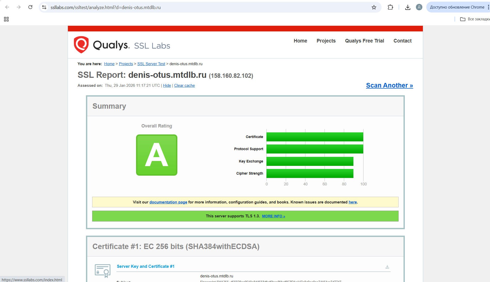

### В качестве основы возьмем конфигурацию Angie из задания с TLS где уже настроен HTTPS на тестовую страницу, но добавим в дополнение к Angie развернутому на хосте
### контейнеры с wordpress и базой данных mysql с помощью docker-compose

#### Создаем необходимые для docker-compose файлы в директории проекта:

Создаем папку проекта:
```
zubahin@compute-vm-3:~$ mkdir project
zubahin@compute-vm-3:~$ ls -la
total 60
drwxr-x--- 6 zubahin zubahin  4096 Feb  5 11:49 .
drwxr-xr-x 3 root    root     4096 Jan 23 15:09 ..
-rw------- 1 zubahin zubahin 11058 Feb  4 20:47 .bash_history
-rw-r--r-- 1 zubahin zubahin   220 Mar 31  2024 .bash_logout
-rw-r--r-- 1 zubahin zubahin  3771 Mar 31  2024 .bashrc
drwx------ 2 zubahin zubahin  4096 Jan 23 15:28 .cache
-rw-r--r-- 1 zubahin zubahin   807 Mar 31  2024 .profile
drwx------ 2 zubahin zubahin  4096 Feb  5 06:30 .ssh
-rw------- 1 zubahin zubahin  9607 Feb  4 20:47 .viminfo
drwxrwxr-x 2 zubahin zubahin  4096 Feb  5 11:49 project
drwx------ 3 zubahin zubahin  4096 Jan 23 17:36 snap
zubahin@compute-vm-3:~$ cd project/
zubahin@compute-vm-3:~/project$ 
```

В папке проекта создаем YAML -файл docker-compose.yml
```
sudo vim docker-compose.yml
```

```
version: '3.8'

services:
  wordpress-db:
    image: mysql:8.0
    container_name: wordpress-db
    restart: unless-stopped
    environment:
      MYSQL_DATABASE: wordpress
      MYSQL_USER: wordpress
      MYSQL_PASSWORD: ${DB_PASSWORD:-Gh56Tyfg091df}
      MYSQL_ROOT_PASSWORD: ${DB_ROOT_PASSWORD:-Gh56Tyfg091df_root}
    volumes:
      - wordpress_db_data:/var/lib/mysql
    networks:
      - wordpress_network
    command: 
      - --default-authentication-plugin=mysql_native_password
      - --character-set-server=utf8mb4
      - --collation-server=utf8mb4_unicode_ci

  wordpress-app:
    image: wordpress:latest
    container_name: wordpress-app
    restart: unless-stopped
    ports:
      - "127.0.0.1:8080:80"
    environment:
      WORDPRESS_DB_HOST: wordpress-db:3306
      WORDPRESS_DB_USER: wordpress
      WORDPRESS_DB_PASSWORD: ${DB_PASSWORD:-Gh56Tyfg091df}
      WORDPRESS_DB_NAME: wordpress
      # УДАЛИТЕ WORDPRESS_CONFIG_EXTRA отсюда
    volumes:
      - wordpress_data:/var/www/html
      - ./uploads.ini:/usr/local/etc/php/conf.d/uploads.ini
    networks:
      - wordpress_network
    depends_on:
      - wordpress-db

networks:
  wordpress_network:
    driver: bridge

volumes:
  wordpress_db_data:
    name: wordpress_db_data
  wordpress_data:
    name: wordpress_data

```

Создаем файл uploads.ini для увеличения лимитов загрузки файлов:

```
sudo vim uploads.ini

file_uploads = On
memory_limit = 256M
upload_max_filesize = 64M
post_max_size = 64M
max_execution_time = 300
```

### Шаг 2.  Меняем конфигурацию Angie

Меняем содержимое конфигурации в /etc/angie/http.d/wordpress.conf

```
server {
    listen 443 ssl http2;
    listen [::]:443 ssl http2;
    
    server_name denis-otus.mtdlb.ru www.denis-otus.mtdlb.ru;
    
    # SSL конфигурация (остается без изменений)
    ssl_certificate /etc/letsencrypt/live/denis-otus.mtdlb.ru/fullchain.pem;
    ssl_certificate_key /etc/letsencrypt/live/denis-otus.mtdlb.ru/privkey.pem;
    ssl_protocols TLSv1.2 TLSv1.3;
    ssl_ciphers 'ECDHE-ECDSA-AES256-GCM-SHA384:ECDHE-RSA-AES256-GCM-SHA384:ECDHE-ECDSA-CHACHA20-POLY1305:ECDHE-RSA-CHACHA20-POLY1305:ECDHE-ECDSA-AES128-GCM-SHA256:ECDHE-RSA-AES128-GCM-SHA256';
    ssl_session_timeout 1d;
    ssl_session_cache shared:SSL:50m;
    ssl_session_tickets off;
    ssl_dhparam /etc/ssl/certs/dhparam.pem;
    ssl_stapling on;
    ssl_stapling_verify on;
    resolver 8.8.8.8 8.8.4.4 1.1.1.1 valid=300s;
    resolver_timeout 5s;
        
    # Корневая директория теперь не нужна для статики - ее убираем
    # WordPress будет обслуживать файлы через контейнер
    
    # Проксирование на WordPress контейнер
location / {
        proxy_pass http://127.0.0.1:8080;
        proxy_set_header Host $host;
        proxy_set_header X-Real-IP $remote_addr;
        proxy_set_header X-Forwarded-For $proxy_add_x_forwarded_for;
        proxy_set_header X-Forwarded-Proto $scheme;
        proxy_set_header X-Forwarded-Host $host;
        
        # Простые настройки без сложных опций
        proxy_redirect off;
        
        # Важно: Добавляем заголовок для WordPress
        proxy_set_header HTTPS on;
    }
    
    # Кэширование статических файлов WordPress
    location ~* \.(jpg|jpeg|png|gif|ico|css|js|svg|woff|woff2|ttf|eot|webp)$ {
        proxy_pass http://127.0.0.1:8080;
        proxy_set_header Host $host;
        proxy_set_header X-Real-IP $remote_addr;
        proxy_set_header X-Forwarded-For $proxy_add_x_forwarded_for;
        proxy_set_header X-Forwarded-Proto $scheme;
        
        expires 1y;
        add_header Cache-Control "public, immutable";
        add_header X-Content-Type-Options "nosniff";
        
        # Более быстрая обработка статики
        proxy_buffering on;
        proxy_cache_valid 200 301 302 30d;
        proxy_cache_use_stale error timeout updating http_500 http_502 http_503 http_504;
    }
    
    # Локация для Let's Encrypt сохраняется
    location ^~ /.well-known/acme-challenge/ {
        root /var/www/denis-otus.mtdlb.ru/html;
        allow all;
        try_files $uri =404;
        access_log off;
    }
    
    # Блокировка доступа к системным файлам WordPress
    location ~* /(wp-config\.php|readme\.html|license\.txt|wp-includes/.*|wp-admin/install\.php) {
        deny all;
        return 404;
    }
    
    # Блокируем доступ к скрытым файлам
    location ~ /\. {
        deny all;
        access_log off;
        log_not_found off;
        return 404;
    }
    
    # Блокируем доступ к чувствительным файлам
    location ~* (\.log$|\.sql$|\.env$|composer\.json$|composer\.lock$) {
        deny all;
        return 404;
    }
    
    # Логирование
    access_log /var/log/angie/denis-otus.https.access.log extended;
    error_log /var/log/angie/denis-otus.https.error.log notice;
}

# Перенаправление HTTP -> HTTPS
server {
    listen 80;
    listen [::]:80;
    server_name denis-otus.mtdlb.ru www.denis-otus.mtdlb.ru;
    
    # Let's Encrypt verification
    location ^~ /.well-known/acme-challenge/ {
        root /var/www/denis-otus.mtdlb.ru/html;
        allow all;
        try_files $uri =404;
    }
    
    # Перенаправляем все остальное на HTTPS
    location / {
        return 301 https://$server_name$request_uri;
    }
}
```

Смотрим две конфигурации:
```
zubahin@compute-vm-3:/etc/angie/http.d$ ls -la
total 32
drwxr-xr-x 4 root root 4096 Feb  5 12:05 .
drwxr-xr-x 4 root root 4096 Jan 28 11:17 ..
drwxr-xr-x 2 root root 4096 Jan 28 11:30 arc
-rw-r--r-- 1 root root 5023 Jan 29 13:11 denis-otus.mtdlb.ru-ssl2.conf
drwxr-xr-x 2 root root 4096 Jan 27 19:21 sites-enabled
-rw-r--r-- 1 root root 5093 Feb  5 12:05 wordpress.conf
```
Старую конфигурацию переносим в архив (arc):
```
sudo mv /etc/angie/http.d/denis-otus.mtdlb.ru-ssl2.conf /etc/angie/http.d/arc
```

### Шаг 3.  Создаем .env файл в папке проекта, устанавливаем docker-compose  и запускаем docker-compose:

```
zubahin@compute-vm-3:~/project$ sudo vim .env

DB_PASSWORD=Gh56Tyfg091df
DB_ROOT_PASSWORD=Gh56Tyfg091df_root

```

Обновляем индексы репозиториев,устанавливаем Docker и docker-compose:
```
sudo apt-get update

sudo apt install docker.io

sudo apt update

sudo apt install docker-compose

```

Запускаем docker-compose:

```
sudo docker-compose up -d
```

### Шаг 4.  Проверяем результаты:

```
zubahin@compute-vm-3:~/project$ sudo docker ps -a
CONTAINER ID   IMAGE              COMMAND                  CREATED          STATUS          PORTS                    NAMES
238a66cc4c55   wordpress:latest   "docker-entrypoint.s…"   13 minutes ago   Up 13 minutes   127.0.0.1:8080->80/tcp   wordpress-app
5f462c30f52a   mysql:8.0          "docker-entrypoint.s…"   13 minutes ago   Up 13 minutes   3306/tcp, 33060/tcp      wordpress-db
```
И идем донастраивать Wordpress:


### Подготовительные шаги:

#### Шаг 1:
Устанавливаем пакет Angie на машину с Ubuntu:

```
sudo apt-get update
sudo apt-get install -y ca-certificates curl
```

Скачайте открытый ключ репозитория Angie для проверки подлинности пакетов:
```
sudo curl -o /etc/apt/trusted.gpg.d/angie-signing.gpg \
            https://angie.software/keys/angie-signing.gpg
```
Подключите репозиторий Angie:
```
echo "deb https://download.angie.software/angie/$(. /etc/os-release && echo "$ID/$VERSION\_ID $VERSION\_CODENAME") main" \\ | sudo tee /etc/apt/sources.list.d/angie.list > /dev/null
```
Обновите индексы репозиториев:
```
sudo apt-get update
```
Установите пакет Angie:
```
sudo apt-get install -y angie
```
Проверяем установку:
```
zubahin@compute-vm-2-tls:~$ angie -v
Angie version: Angie/1.11.2
zubahin@compute-vm-2-tls:~$ sudo angie -t
angie: the configuration file /etc/angie/angie.conf syntax is ok
angie: configuration file /etc/angie/angie.conf test is successful
zubahin@compute-vm-2-tls:~$ 
```

#### Шаг 2: Установка certbot через snap (рекомендуется Let's Encrypt)

Сначала ставим Snap и из него certbot, делаем ссылку в /usr/bin
```
sudo apt install snap
sudo apt install snapd

sudo snap install core
sudo snap refresh core

sudo snap install --classic certbot

sudo ln -s /snap/bin/certbot /usr/bin/certbot
```
Проверяем версию certbot:

```
zubahin@compute-vm-3:~$ certbot --version
certbot 5.2.2
```

#### Шаг 3: Настройка сайта в Angie (тестовая страница) для HTTP-валидации

Создаем директорию для сайта и для ACME
```
sudo mkdir -p /var/www/denis-otus.mtdlb.ru/html
sudo mkdir -p /usr/share/angie/html/.well-known/acme-challenge
sudo chown -R $USER:$USER /var/www/denis-otus.mtdlb.ru
sudo chmod -R 755 /var/www/denis-otus.mtdlb.ru
```
Создаем тестовую страницу
```
echo "<h1>denis-otus.mtdlb.ru</h1>" | sudo tee /var/www/denis-otus.mtdlb.ru/html/index.html
```
Создаем конфигурационный файл сайта
```
sudo vim /etc/angie/http.d/denis-otus.mtdlb.ru
```
В конфигурационном файле создаем конфигурацию сервера:
```
server {
    listen 80;
    listen [::]:80;
    
    server_name denis-otus.mtdlb.ru www.denis-otus.mtdlb.ru;
    root /var/www/denis-otus.mtdlb.ru/html;
    
    index index.html index.htm;
    
    # Критически важно для HTTP-01 challenge!
    location /.well-known/acme-challenge/ {
        allow all;
        root /var/www/denis-otus.mtdlb.ru/html;
        try_files $uri =404;
    }
    
    location / {
        try_files $uri $uri/ =404;
    }
}
```

Активируем сайт
```
sudo mkdir /etc/angie/http.d/sites-enabled/
sudo ln -s /etc/angie/http.d/denis-otus.mtdlb.ru /etc/angie/http.d/sites-enabled/
```
Проверяем синтаксис конфигурации
```
sudo angie -t
```
Запускаем и включаем автозагрузку Angie
```
sudo systemctl start angie
sudo systemctl enable angie
```
Перезапускаем для применения изменений
```
sudo systemctl reload angie
```


##### Шаг 4 Настройка фаервола 
```
# Открываем HTTP порт (обязательно!)
sudo ufw allow 80/tcp
sudo ufw allow 'Angie HTTP'
sudo ufw reload

# Проверяем статус фаервола
sudo ufw status
```
 
#### Шаг 5 Вносим изменения в DNS (запросил А-запись   denis-otus.mtdlb.ru  158.160.82.102 ) и проверяем доступность сайта по HTTP:


#### Шаг 6: Получение сертификата через HTTP-01 Challenge

Конфигурация для валидации Let's Encrypt через HTTP-01 Challenge
Получаем сертификат (веб-сервер будет временно остановлен)
```
sudo certbot certonly --webroot \
    --webroot-path /var/www/denis-otus.mtdlb.ru/html \
    -d denis-otus.mtdlb.ru\
    --agree-tos \
    --no-eff-email \
    --non-interactive
```
Запускаем команду и смотрим:

```
zubahin@compute-vm-3:~$ sudo certbot certonly --webroot \
    --webroot-path /var/www/denis-otus.mtdlb.ru/html \
    -d denis-otus.mtdlb.ru\
    --agree-tos \
    --no-eff-email \
    --non-interactive
Saving debug log to /var/log/letsencrypt/letsencrypt.log
Requesting a certificate for denis-otus.mtdlb.ru

Successfully received certificate.
Certificate is saved at: /etc/letsencrypt/live/denis-otus.mtdlb.ru/fullchain.pem
Key is saved at:         /etc/letsencrypt/live/denis-otus.mtdlb.ru/privkey.pem
This certificate expires on 2026-04-28.
These files will be updated when the certificate renews.
Certbot has set up a scheduled task to automatically renew this certificate in the background.

- - - - - - - - - - - - - - - - - - - - - - - - - - - - - - - - - - - - - - - -
If you like Certbot, please consider supporting our work by:
 * Donating to ISRG / Let's Encrypt:   https://letsencrypt.org/donate
 * Donating to EFF:                    https://eff.org/donate-le
- - - - - - - - - - - - - - - - - - - - - - - - - - - - - - - - - - - - - - - -
zubahin@compute-vm-3:~$ 
```


### Шаг 5 Ручная настройка SSL (если не использовался --angie плагин).  Сразу настроим HTTP2

Создаем SSL конфигурацию
```
sudo vim /etc/angie/http.d/denis-otus.mtdlb.ru-ssl
```

И вносим конфигурационный файл:

<details>
          
```

server {
    listen 80;
    listen [::]:80;
    server_name denis-otus.mtdlb.ru www.denis-otus.mtdlb.ru;
    
    # Редирект на HTTPS
    return 301 https://$server_name$request_uri;
    
    # Сохраняем доступ к ACME challenge для обновления
    location /.well-known/acme-challenge/ {
        allow all;
        root /var/www/denis-otus.mtdlb.ru/html;
    }
}

server {
    listen 443 ssl http2;
    listen [::]:443 ssl http2;
    
    server_name denis-otus.mtdlb.ru www.denis-otus.mtdlb.ru;
    root /var/www/denis-otus.mtdlb.ru/html;

    http2 on;
    http2_max_concurrent_streams 128;
    http2_chunk_size 8k;

    # Пути к сертификатам Let's Encrypt
    ssl_certificate /etc/letsencrypt/live/denis-otus.mtdlb.ru/fullchain.pem;
    ssl_certificate_key /etc/letsencrypt/live/denis-otus.mtdlb.ru/privkey.pem;
    
    # Настройки SSL (рекомендованные Let's Encrypt)
    ssl_session_cache shared:le_nginx_SSL:10m;
    ssl_session_timeout 1440m;
    ssl_session_tickets off;
    
    ssl_protocols TLSv1.2 TLSv1.3;
    ssl_prefer_server_ciphers off;
    
    ssl_ciphers "ECDHE-ECDSA-AES128-GCM-SHA256:ECDHE-RSA-AES128-GCM-SHA256:ECDHE-ECDSA-AES256-GCM-SHA384:ECDHE-RSA-AES256-GCM-SHA384:ECDHE-ECDSA-CHACHA20-POLY1305:ECDHE-RSA-CHACHA20-POLY1305:DHE-RSA-AES128-GCM-SHA256:DHE-RSA-AES256-GCM-SHA384";
    
    # DH параметры (генерируем если нужно)
    # sudo openssl dhparam -out /etc/ssl/certs/dhparam.pem 2048
    # ssl_dhparam /etc/ssl/certs/dhparam.pem;
    
    # HSTS (осторожно - нельзя отключить в течение 6 месяцев)
    # add_header Strict-Transport-Security "max-age=63072000" always;
    
    index index.html index.htm;
    
    location / {
        try_files $uri $uri/ =404;
    }
    
    # Разрешаем доступ к файлам Let's Encrypt для обновления
    location ^~ /.well-known/acme-challenge/ {
        allow all;
        root /var/www/denis-otus.mtdlb.ru/html;
    }
}

```
</details>


Активируем SSL конфигурацию
```
zubahin@compute-vm-3:~$ sudo cp /etc/angie/http.d/arc/denis-otus.mtdlb.ru-ssl.conf /etc/angie/http.d/denis-otus.mtdlb.ru-ssl.conf
zubahin@compute-vm-3:~$ sudo cp /etc/angie/http.d/denis-otus.mtdlb.ru.conf /etc/angie/http.d/arc/denis-otus.mtdlb.ru-ssl.conf
zubahin@compute-vm-3:~$ sudo rm /etc/angie/http.d/denis-otus.mtdlb.ru.conf
```

Открываем HTTPS порт в фаерволе
```
sudo ufw allow 443/tcp
sudo ufw reload
sudo ufw enable
```

Проверяем синтаксис
```
sudo angie -t
```

Перезапускаем Angie
```
sudo systemctl reload angie
```

### Шаг 6 Проверяем перенаправление HTTP на HTTPS и работу сайта:


Или используем Curl (проверяем подключение по HTTPS и перенаправление HTTP->HTTPS:
```
zubahin@compute-vm-3:~$ curl -I https://denis-otus.mtdlb.ru
HTTP/1.1 200 OK
Server: Angie/1.11.2
Date: Thu, 29 Jan 2026 10:55:44 GMT
Content-Type: text/html
Content-Length: 29
Last-Modified: Fri, 23 Jan 2026 17:42:10 GMT
Connection: keep-alive
ETag: "6973b2f2-1d"
Accept-Ranges: bytes

zubahin@compute-vm-3:~$ curl -I http://denis-otus.mtdlb.ru
HTTP/1.1 301 Moved Permanently
Server: Angie/1.11.2
Date: Thu, 29 Jan 2026 10:55:51 GMT
Content-Type: text/html
Content-Length: 169
Connection: keep-alive
Location: https://denis-otus.mtdlb.ru/
```


### Шаг 7: Автоматическое обновление сертификатов

Тестируем обновление
```
sudo certbot renew --dry-run

Saving debug log to /var/log/letsencrypt/letsencrypt.log

- - - - - - - - - - - - - - - - - - - - - - - - - - - - - - - - - - - - - - - -
Processing /etc/letsencrypt/renewal/denis-otus.mtdlb.ru.conf
- - - - - - - - - - - - - - - - - - - - - - - - - - - - - - - - - - - - - - - -
Account registered.
Simulating renewal of an existing certificate for denis-otus.mtdlb.ru

- - - - - - - - - - - - - - - - - - - - - - - - - - - - - - - - - - - - - - - -
Congratulations, all simulated renewals succeeded: 
  /etc/letsencrypt/live/denis-otus.mtdlb.ru/fullchain.pem (success)
- - - - - - - - - - - - - - - - - - - - - - - - - - - - - - - - - - - - - - - -
```

Настраиваем автообновление через systemd timer (рекомендовано для snap)
```
sudo vim /etc/systemd/system/certbot-renew.service

```

Содержимое файла сервиса:

```
[Unit]
Description=Certbot Renewal

[Service]
Type=oneshot
ExecStart=/snap/bin/certbot renew --quiet --post-hook "systemctl reload angie"
```
Содержимое файла таймера:
```
sudo vim /etc/systemd/system/certbot-renew.timer
```

```
[Unit]
Description=Timer for Certbot Renewal

[Timer]
OnCalendar=*-*-* 03:00:00
Persistent=true

[Install]
WantedBy=timers.target

```

Активируем таймер
```
sudo systemctl enable --now certbot-renew.timer

Created symlink /etc/systemd/system/timers.target.wants/certbot-renew.timer → /etc/systemd/system/certbot-renew.timer.
```

Проверяем таймер
```
sudo systemctl list-timers | grep certbot

zubahin@compute-vm-3:~$ sudo systemctl list-timers | grep certbot
Thu 2026-01-29 18:19:00 UTC       7h -                                   - snap.certbot.renew.timer       snap.certbot.renew.service
Fri 2026-01-30 03:00:00 UTC      16h -                                   - certbot-renew.timer            certbot-renew.service
```

Или можно настроить таймер в cron (альтернативный вариант)
```
sudo crontab -e
```

Донастраиваем Cron:
```
0 3 * * * /snap/bin/certbot renew --quiet --post-hook "systemctl reload angie"
```


### Шаг 8  Делаем промежуточное сканирование:
```
https://www.ssllabs.com/ssltest/analyze.html?d=denis-otus.mtdlb.ru
```




### Шаг 9  Добавляем в конфигурацию заголовки HSTS и другие дополнительные Security заголовки, а также настроми CSP:


# HTTP сервер - редирект на HTTPS
server {
    listen 80;
    listen [::]:80;
    
    server_name denis-otus.mtdlb.ru www.denis-otus.mtdlb.ru;
    
    # Редирект на HTTPS с сохранением метода запроса
    return 301 https://$server_name$request_uri;
    
    # Сохраняем доступ к ACME challenge для обновления
    location /.well-known/acme-challenge/ {
        root /var/www/denis-otus.mtdlb.ru/html;
        allow all;
        try_files $uri =404;
        access_log off;
    }
    
    # Логирование для HTTP (опционально)
    access_log /var/log/angie/denis-otus.http.access.log;
    error_log /var/log/angie/denis-otus.http.error.log;
}

# HTTPS сервер - основная конфигурация
```
sudo vim /etc/angie/http.d/denis-otus.mtdlb.ru-ssl2
```

И вносим конфигурационный файл:

<details>

```
server {
    listen 443 ssl http2;
    listen [::]:443 ssl http2;
    
    server_name denis-otus.mtdlb.ru www.denis-otus.mtdlb.ru;
    
    root /var/www/denis-otus.mtdlb.ru/html;
    index index.html index.htm;
    
    # Пути к сертификатам Let's Encrypt
    ssl_certificate /etc/letsencrypt/live/denis-otus.mtdlb.ru/fullchain.pem;
    ssl_certificate_key /etc/letsencrypt/live/denis-otus.mtdlb.ru/privkey.pem;
    
    # Протоколы TLS (отключаем старые версии)
    ssl_protocols TLSv1.2 TLSv1.3;
    
    # Современный набор шифров (убираем DHE)
    ssl_ciphers 'ECDHE-ECDSA-AES256-GCM-SHA384:ECDHE-RSA-AES256-GCM-SHA384:ECDHE-ECDSA-CHACHA20-POLY1305:ECDHE-RSA-CHACHA20-POLY1305:ECDHE-ECDSA-AES128-GCM-SHA256:ECDHE-RSA-AES128-GCM-SHA256';
    
    # Предпочтение серверных шифров можно отключить...
    # ssl_prefer_server_ciphers off;
    
    # Настройки SSL сессий (кеширование)
    ssl_session_timeout 1d;
    ssl_session_cache shared:SSL:50m;
    ssl_session_tickets off;
    
    # DH параметры для Perfect Forward Secrecy
    # Выполняем заранее: sudo openssl dhparam -out /etc/ssl/certs/dhparam.pem 2048  потом раскомментируем:
    # ssl_dhparam /etc/ssl/certs/dhparam.pem;
    
    # OCSP Stapling для ускорения проверки сертификатов
    ssl_stapling on;
    ssl_stapling_verify on;
    resolver 8.8.8.8 8.8.4.4 1.1.1.1 valid=300s;
    resolver_timeout 5s;
       
    # HSTS ЗАГОЛОВКИ
     
    # ВНИМАНИЕ: Рекомендуется тестировать без includeSubDomains и preload
    # После уверенности можно добавить:
    # add_header Strict-Transport-Security "max-age=63072000; includeSubDomains; preload" always;
    
    # Начнем с базовой версии:
    add_header Strict-Transport-Security "max-age=63072000" always;

    # ДОПОЛНИТЕЛЬНЫЕ SECURITY ЗАГОЛОВКИ
   
    # Защита от MIME-type sniffing
    add_header X-Content-Type-Options "nosniff" always;
    
    # Защита от XSS (устарело в современных браузерах, но полезно для старых)
    add_header X-XSS-Protection "1; mode=block" always;
    
    # Защита от clickjacking
    add_header X-Frame-Options "SAMEORIGIN" always;
    
    # Referrer Policy
    add_header Referrer-Policy "strict-origin-when-cross-origin" always;
    
    # Permissions Policy (Feature Policy)
    add_header Permissions-Policy "geolocation=(), microphone=(), camera=(), payment=()" always;
    
    # Content Security Policy (настройте под ваш сайт!)
    # Для начала можно использовать report-only режим
    # add_header Content-Security-Policy-Report-Only "default-src 'self'; script-src 'self'; style-src 'self'; img-src 'self'; font-src 'self'; connect-src 'self';" always;
    
    # Для простого статического сайта рекомендуется:
    add_header Content-Security-Policy "default-src 'self'; script-src 'self'; style-src 'self' 'unsafe-inline'; img-src 'self' data:; font-src 'self';" always;
    
  
    # ОПТИМИЗАЦИЯ И БЕЗОПАСНОСТЬ
  
    
    # Безопасные заголовки для статических файлов
    location ~* \.(jpg|jpeg|png|gif|ico|css|js|svg|woff|woff2|ttf|eot)$ {
        expires 1y;
        add_header Cache-Control "public, immutable";
        add_header X-Content-Type-Options "nosniff";
    }
    
    # Разрешаем доступ к файлам Let's Encrypt для обновления
    location ^~ /.well-known/acme-challenge/ {
        root /var/www/denis-otus.mtdlb.ru/html;
        allow all;
        try_files $uri =404;
        access_log off;
    }
    
    # Основное местоположение
    location / {
        try_files $uri $uri/ =404;
        
        # Защитные заголовки для всех остальных запросов
        add_header X-Frame-Options "SAMEORIGIN" always;
        add_header X-Content-Type-Options "nosniff" always;
    }
    
    # Блокируем доступ к скрытым файлам (.htaccess, .git и т.д.)
    location ~ /\. {
        deny all;
        access_log off;
        log_not_found off;
        return 404;
    }
    
    # Блокируем доступ к чувствительным файлам
    location ~* (\.log$|\.sql$|\.env$|composer\.json$|composer\.lock$) {
        deny all;
        return 404;
    }
    
    # Отключаем ненужные HTTP методы
    if ($request_method !~ ^(GET|HEAD|POST)$) {
        return 405;
    }
    
    # Логирование
    access_log /var/log/angie/denis-otus.https.access.log;
    error_log /var/log/angie/denis-otus.https.error.log;
}

```
</details>


Сгенерируем DH параметры (рекомендую 2048 бит для баланса безопасности и производительности)
```
sudo openssl dhparam -out /etc/ssl/certs/dhparam.pem 2048
```
Раскомментируем строку с ssl_dhparam в конфигурации
ssl_dhparam /etc/ssl/certs/dhparam.pem;

Проверяем синтаксис
```
sudo angie -t
```
Перезапускаем Angie
```
sudo systemctl reload angie
```


### Шаг 10  Включаем HTTP3:

Для этого в конфигурацию http.d нужно добавить:

```
    # HTTP/3 НАСТРОЙКИ
       
    # Заголовок для поддержки HTTP/3
    add_header Alt-Svc 'h3=":443"; ma=86400, h3-29=":443"; ma=86400' always;
    
    # Включение HTTP/3
    http3 on;
    http3_hq on;  # Для совместимости с старыми клиентами QUIC
    
    # Настройки QUIC
    quic_retry on;
    http3_max_concurrent_streams 128;
    http3_stream_buffer_size 65536;
```

Не забываем разрешить 443 UDP (для HTTP/3):

```
sudo ufw allow 443/udp
sudo ufw reload
```

Также добавляем в основной конфиг строки оптимизации Quic:

```
sudo vim /etc/angie/angie.conf
```

```
    quic_retry on;
    http3_max_table_capacity 65536;
    http3_max_blocked_streams 128;
```

### Опциональные команды (справочно)

Просмотр всех доменов
```
sudo certbot certificates
```
Добавление нового домена к существующему сертификату
```
sudo certbot certonly --webroot \
    --webroot-path /var/www/example.com/html \
    -d example.com -d www.example.com -d newsubdomain.example.com
```
Отзыв сертификата
```
sudo certbot revoke --cert-name example.com
```
Удаление сертификата
```
sudo certbot delete --cert-name example.com
```
Просмотр логов Certbot
```
sudo tail -f /var/log/letsencrypt/letsencrypt.log
```
