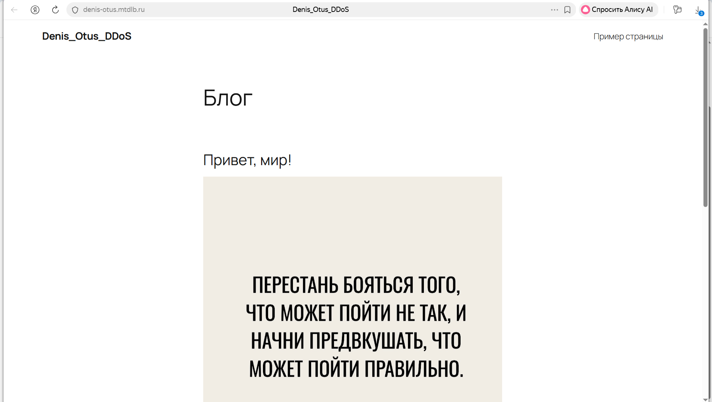
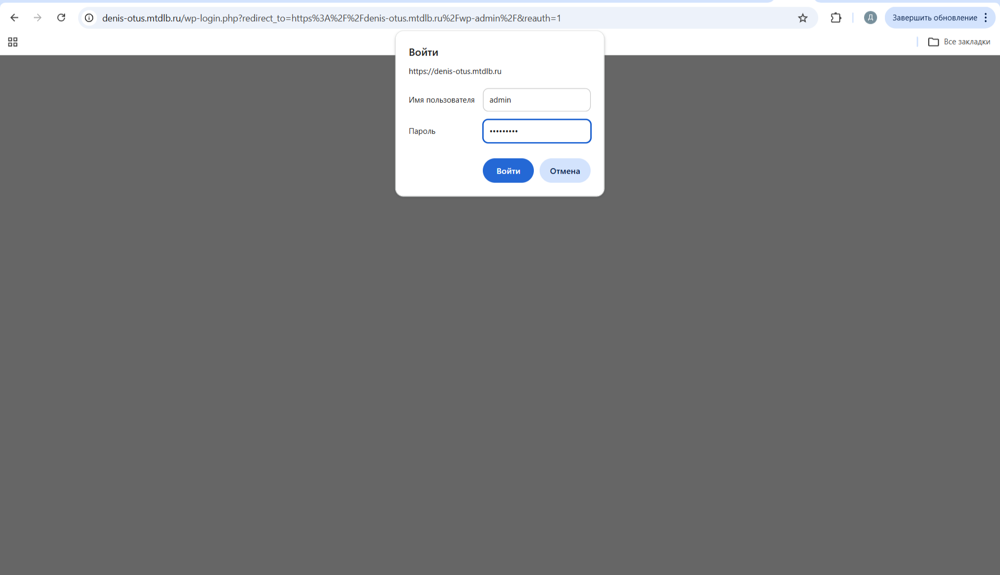
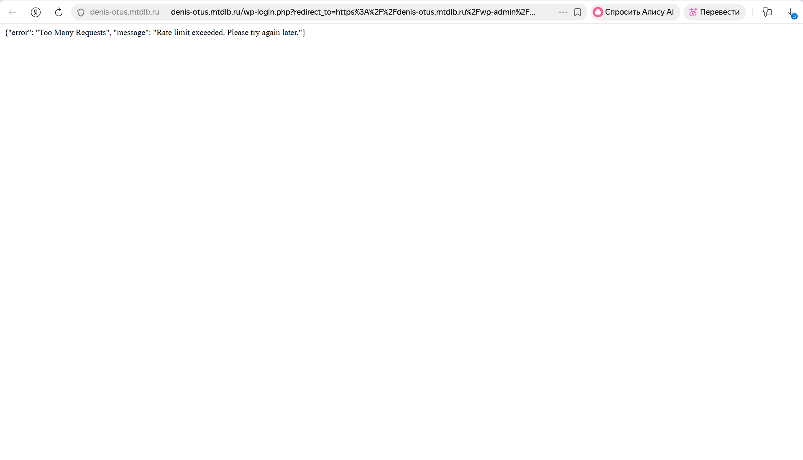
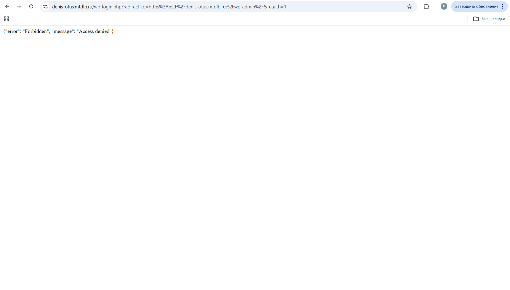

# Настраиваем систему, где балансировщик будет выступать в качестве обратного HTTPS прокси, терминируя на себе TLS и пробрасывая HTTP в сторону одного из трех бэкендов на базе CMS  Wordpress, работающих с единой базой данных.

#### В качестве основы возьмем конфигурацию Angie из задания с TLS где уже настроен HTTPS на тестовую страницу, но добавим в дополнение к Angie развернутому на хосте контейнеры с wordpress и базой данных mysql с помощью docker-compose, а также настроим балансировку между ними.

#### Создаем необходимые для docker-compose файлы в директории проекта:

Создаем папку проекта:
```
zubahin@compute-vm-3:~$ mkdir project
zubahin@compute-vm-3:~$ ls -la
total 60
drwxr-x--- 6 zubahin zubahin  4096 Feb  5 11:49 .
drwxr-xr-x 3 root    root     4096 Jan 23 15:09 ..
-rw------- 1 zubahin zubahin 11058 Feb  4 20:47 .bash_history
-rw-r--r-- 1 zubahin zubahin   220 Mar 31  2024 .bash_logout
-rw-r--r-- 1 zubahin zubahin  3771 Mar 31  2024 .bashrc
drwx------ 2 zubahin zubahin  4096 Jan 23 15:28 .cache
-rw-r--r-- 1 zubahin zubahin   807 Mar 31  2024 .profile
drwx------ 2 zubahin zubahin  4096 Feb  5 06:30 .ssh
-rw------- 1 zubahin zubahin  9607 Feb  4 20:47 .viminfo
drwxrwxr-x 2 zubahin zubahin  4096 Feb  5 11:49 project
drwx------ 3 zubahin zubahin  4096 Jan 23 17:36 snap
zubahin@compute-vm-3:~$ cd project/
zubahin@compute-vm-3:~/project$ 
```

### Шаг 1: В папке проекта создаем YAML -файл docker-compose.yml c тремя репликами wordpress и единой БД
```
sudo vim docker-compose.yml
```

```
version: '3.8'

services:
  # Единая база данных для всех WordPress
  wordpress-db:
    image: mysql:8.0
    container_name: wordpress-db
    restart: unless-stopped
    environment:
      MYSQL_DATABASE: wordpress
      MYSQL_USER: wordpress
      MYSQL_PASSWORD: ${DB_PASSWORD:-Gh56Tyfg091df}
      MYSQL_ROOT_PASSWORD: ${DB_ROOT_PASSWORD:-Gh56Tyfg091df_root}
    volumes:
      - wordpress_db_data:/var/lib/mysql
    networks:
      - wordpress_network
    command:
      - --default-authentication-plugin=mysql_native_password
      - --character-set-server=utf8mb4
      - --collation-server=utf8mb4_unicode_ci
      - --max_connections=500      # Увеличено для трёх приложений
    healthcheck:
      test: ["CMD", "mysqladmin", "ping", "-h", "localhost"]
      timeout: 10s
      retries: 5

  # Первая реплика WordPress
  wordpress-app-1:
    image: wordpress:latest
    container_name: wordpress-app-1
    restart: unless-stopped
    ports:
      - "127.0.0.1:8081:80"        # Доступна только с localhost:8081
    environment:
      WORDPRESS_DB_HOST: wordpress-db:3306
      WORDPRESS_DB_USER: wordpress
      WORDPRESS_DB_PASSWORD: ${DB_PASSWORD:-Gh56Tyfg091df}
      WORDPRESS_DB_NAME: wordpress
      # Рекомендуемые константы для мультисерверной среды
      WORDPRESS_CONFIG_EXTRA: |
        define('WP_CACHE', true);
        define('WP_MEMORY_LIMIT', '256M');
        define('WP_MAX_MEMORY_LIMIT', '512M');
        define('DISABLE_WP_CRON', true);
    volumes:
      - wordpress_data:/var/www/html
      - ./uploads.ini:/usr/local/etc/php/conf.d/uploads.ini
    networks:
      - wordpress_network
    depends_on:
      - wordpress-db
    healthcheck:
      test: ["CMD", "curl", "-f", "http://localhost/wp-admin/install.php"]
      interval: 30s
      timeout: 10s
      retries: 3

  # Вторая реплика WordPress
  wordpress-app-2:
    image: wordpress:latest
    container_name: wordpress-app-2
    restart: unless-stopped
    ports:
      - "127.0.0.1:8082:80"
    environment:
      WORDPRESS_DB_HOST: wordpress-db:3306
      WORDPRESS_DB_USER: wordpress
      WORDPRESS_DB_PASSWORD: ${DB_PASSWORD:-Gh56Tyfg091df}
      WORDPRESS_DB_NAME: wordpress
      WORDPRESS_CONFIG_EXTRA: |
        define('WP_CACHE', true);
        define('WP_MEMORY_LIMIT', '256M');
        define('WP_MAX_MEMORY_LIMIT', '512M');
        define('DISABLE_WP_CRON', true);
    volumes:
      - wordpress_data:/var/www/html
      - ./uploads.ini:/usr/local/etc/php/conf.d/uploads.ini
    networks:
      - wordpress_network
    depends_on:
      - wordpress-db
    healthcheck:
      test: ["CMD", "curl", "-f", "http://localhost/wp-admin/install.php"]
      interval: 30s
      timeout: 10s
      retries: 3

  # Третья реплика WordPress
  wordpress-app-3:
    image: wordpress:latest
    container_name: wordpress-app-3
    restart: unless-stopped
    ports:
      - "127.0.0.1:8083:80"
    environment:
      WORDPRESS_DB_HOST: wordpress-db:3306
      WORDPRESS_DB_USER: wordpress
      WORDPRESS_DB_PASSWORD: ${DB_PASSWORD:-Gh56Tyfg091df}
      WORDPRESS_DB_NAME: wordpress
      WORDPRESS_CONFIG_EXTRA: |
        define('WP_CACHE', true);
        define('WP_MEMORY_LIMIT', '256M');
        define('WP_MAX_MEMORY_LIMIT', '512M');
        define('DISABLE_WP_CRON', true);
    volumes:
      - wordpress_data:/var/www/html
      - ./uploads.ini:/usr/local/etc/php/conf.d/uploads.ini
    networks:
      - wordpress_network
    depends_on:
      - wordpress-db
    healthcheck:
      test: ["CMD", "curl", "-f", "http://localhost/wp-admin/install.php"]
      interval: 30s
      timeout: 10s
      retries: 3

networks:
  wordpress_network:
    driver: bridge
    name: wordpress_network

volumes:
  wordpress_db_data:
    name: wordpress_db_data
  wordpress_data:
    name: wordpress_data      # Общий volume для файлов WordPress
```

Создаем файл uploads.ini для увеличения лимитов загрузки файлов:

```
sudo vim uploads.ini

file_uploads = On
memory_limit = 256M
upload_max_filesize = 64M
post_max_size = 64M
max_execution_time = 300
```

###  Шаг 2 Настройка для работы wordpress с несколькими репликами

Сделаем скрипт:
```
sudo vim init-wordpress.sh
```


```
#!/bin/bash

# Функция для установки WP-CLI в контейнер
install_wp_cli() {
    local container=$1
    echo "Installing WP-CLI in $container..."
    
    # Скачиваем wp-cli.phar
    docker exec $container curl -s -O https://raw.githubusercontent.com/wp-cli/builds/gh-pages/phar/wp-cli.phar
    
    # Делаем исполняемым и перемещаем в PATH
    docker exec $container chmod +x wp-cli.phar
    docker exec $container mv wp-cli.phar /usr/local/bin/wp
    
    # Проверяем установку
    docker exec $container wp --info --allow-root
}

# Ожидаем полной загрузки всех контейнеров
echo "Waiting for containers to be ready..."
sleep 15

# Для каждой реплики WordPress
for i in 1 2 3; do
    container_name="wordpress-app-$i"
    
    echo "Configuring WordPress replica $i..."
    
    # Устанавливаем WP-CLI, если его нет
    if ! docker exec $container_name which wp &>/dev/null; then
        install_wp_cli $container_name
    fi
    
    # Настройка параметров WordPress 
    docker exec $container_name wp config set WP_CACHE true --type=constant --allow-root
     
    # Устанавливаем URL сайта
    docker exec $container_name wp option update siteurl "https://denis-otus.mtdlb.ru" --allow-root
    docker exec $container_name wp option update home "https://denis-otus.mtdlb.ru" --allow-root
    
    echo "WordPress replica $i configured."
done

echo "All WordPress replicas are ready!"

```

###  Шаг 3.  Базовую конфигурацию Angie оставляем без изменений:

```
# Задает пользователя, от имени которого будут запускаться рабочие процессы.Будем использовать системного пользователя 'angie' для минимизации прав доступа.
user  angie;
# Определяем количество рабочих процессов.
# Значение 'auto' позволяет Angie автоматически определить оптимальное количество
# (обычно равное количеству ядер процессора) для максимальной производительности.
worker_processes  auto;
# Устанавливаем максимальное количество файловых дескрипторов (открытых файлов),
# которое может открыть один рабочий процесс. 65536 - это высокая нагрузка,
# необходимая для обработки большого количества одновременных соединений.
worker_rlimit_nofile 65536;

# Загружаем модуль GeoIP
# Директива load_module подключает динамический модуль GeoIP2,
# который позволяет определять географическое положение клиента по IP-адресу.
load_module modules/angie-module-geoip2;

# Настройка логирования ошибок.
# Указывает файл для записи ошибок и уровень логирования 'notice'.
# Уровень notice записывает важные уведомления, но не захламляет лог отладочной информацией.
error_log  /var/log/angie/error.log notice;
# Указывает путь к файлу, в котором хранится PID (идентификатор процесса) основного процесса Angie.
# Этот файл используется для управления процессом (остановка, перезагрузка).
pid        /run/angie.pid;

# Блок events отвечает за настройки работы соединений и механизма обработки событий.
events {

    # Максимальное количество одновременных соединений для одного рабочего процесса.
    # При worker_processes auto (допустим, 8 ядер) общее максимальное количество соединений
    # составит 8 * 65536 = 524288.
    worker_connections  65536;
}

# Основной блок http содержит настройки для работы веб-сервера, прокси и обработки HTTP-трафика.
http {

  # Подключает файл mime.types, который содержит соответствие между расширениями файлов
    # и MIME-типами (например, .html -> text/html, .css -> text/css).
    include       /etc/angie/mime.types;
   # MIME-тип по умолчанию. Если расширение файла не найдено в mime.types,
   # сервер будет отдавать файл как application/octet-stream (загрузка файла, а не отображение).
    default_type  application/octet-stream;

    # Путь к базе стран GeoIP
    # load_module modules/angie-module-geoip2; -неверная запись хотя у angie так пакет и называется
    
    # Правильная загрузка модуля GeoIP2 для работы внутри блока http.
    # Модуль ngx_http_geoip2_module.so предоставляет переменные для геолокации.
    load_module modules/ngx_http_geoip2_module.so;

    # Создаём переменную $allowed_country: 1 для RU, 0 для остальных
    # Если код страны (из переменной $geoip_country_code) равен RU, переменная получает значение 1,
    # иначе (по умолчанию) — 0. Используется для фильтрации трафика по странам.
    geo $allowed_country {
        default 0;
        $geoip_country_code RU 1;
    }

    # Базовый формат лога 'main'. Содержит стандартную информацию:
    # IP клиента, пользователь (если есть аутентификация), время запроса, сам запрос,
    # статус ответа, размер ответа, referer, user-agent и заголовок X-Forwarded-For.
    log_format  main  '$remote_addr - $remote_user [$time_local] "$request" '
                      '$status $body_bytes_sent "$http_referer" '
                      '"$http_user_agent" "$http_x_forwarded_for"';

    # Расширенный формат лога 'extended'. Добавляет информацию о кэшировании,
    # имени сервера, времени выполнения запроса ($request_time),
    # времени соединения с upstream ($upstream_connect_time) и другие детали,
    # критически важные для отладки и анализа производительности.
    log_format extended '$remote_addr - $remote_user [$time_local] "$request" '
                        '$status $body_bytes_sent "$http_referer" rt="$request_time" '
                       '"$http_user_agent" "$http_x_forwarded_for" '
                        'h="$host" sn="$server_name" ru="$request_uri" u="$uri" '
                        'ucs="$upstream_cache_status" ua="$upstream_addr" us="$upstream_status" '
                        'uct="$upstream_connect_time" urt="$upstream_response_time"';

    # Новый формат лога security
    # Специализированный формат лога 'security' для отслеживания безопасности.
    # Включает статусы ограничений запросов (limit_req_status) и соединений (limit_conn_status),
    # что помогает анализировать срабатывания защиты от DDoS и брутфорса.
    log_format security '$remote_addr - $remote_user [$time_local] '
                       '"$request" $status $body_bytes_sent '
                       '"$http_referer" "$http_user_agent" '
                       'rt=$request_time uct=$upstream_connect_time '
                       'urt=$upstream_response_time '
                       'cache=$upstream_cache_status '
                       'limit_req_status=$limit_req_status '
                       'limit_conn_status=$limit_conn_status';

    # Указывает файл для access-логов и использует формат 'main' по умолчанию.
    access_log  /var/log/angie/access.log  main;

    # Глобальные лимиты соединений

    # Определяет зону разделяемой памяти (10 МБ) для ограничения количества соединений.
    # Ключом является IP-адрес клиента ($binary_remote_addr). Используется для ограничения
    # максимального числа одновременных соединений с одного IP.
    limit_conn_zone $binary_remote_addr zone=conn_limit_per_ip:10m;

    # Определяет зону для ограничения частоты запросов (rate limiting).
    # Ключ — IP клиента, зона 10 МБ, лимит — 30 запросов в секунду.
    limit_req_zone $binary_remote_addr zone=req_limit_per_ip:10m rate=30r/s;

    # Зона для ограничения медленных соединений (отдельная зона по имени сервера).
    # Может использоваться для защиты от Slowloris атак.
    limit_conn_zone $server_name zone=slow_conn:10m;

    # Дополнительные зоны для более тонкого rate limiting:
    # login_limit: 5 запросов в минуту для защиты страниц авторизации (брутфорс).
    limit_req_zone $binary_remote_addr zone=login_limit:10m rate=5r/m;
    # api_limit: 10 запросов в секунду для API-эндпоинтов.
    limit_req_zone $binary_remote_addr zone=api_limit:10m rate=10r/s;
    # static_limit: 100 запросов в секунду для статики (достаточно высокий лимит).
    limit_req_zone $binary_remote_addr zone=static_limit:10m rate=100r/s;

    # Настройки кэширования

    # Настройки кэширования для прокси (основной кэш):
    # /var/cache/angie — путь к кэшу,
    # levels=1:2 — иерархическая структура каталогов (2 уровня),
    # keys_zone=proxy_cache:100m — имя зоны и размер памяти для ключей (100 МБ),
    # max_size=1g — максимальный размер кэша на диске (1 ГБ),
    # inactive=60m — время хранения неиспользуемых данных (60 минут),
    # use_temp_path=off — отключает временное хранение (запись сразу в кэш).
    proxy_cache_path /var/cache/angie levels=1:2 keys_zone=proxy_cache:100m
                     max_size=1g inactive=60m use_temp_path=off;

    # Кэш для статического контента. Отличается увеличенным временем хранения (365 дней),
    # так как статические файлы (изображения, CSS, JS) меняются редко.
    proxy_cache_path /var/cache/angie/static levels=1:2 keys_zone=static_cache:50m
                     max_size=500m inactive=365d use_temp_path=off;

    # Включает использование системного вызова sendfile для ускоренной отдачи статического контента
    # (минуя пользовательское пространство, копирование "ядро-ядро").
    sendfile        on;

    # tcp_nopush on; (закомментировано) — при включении вместе с sendfile оптимизирует отправку
    # пакетов, отправляя заголовки и файл одним пакетом (уменьшает задержки).

    # Таймаут для keep-alive соединений (в секундах).
    # Определяет, сколько времени сервер будет ждать новый запрос от клиента
    # после завершения предыдущего, прежде чем закрыть соединение.
    keepalive_timeout  65;

    # gzip on; (закомментировано) — включение сжатия ответов.
    # Сжатие снижает трафик, но увеличивает нагрузку на CPU.
    

    # Подключает все конфигурационные файлы виртуальных хостов (server blocks)
    # из директории /etc/angie/http.d/ с расширением .conf.
    # Это позволяет модульно организовывать конфигурацию для разных сайтов.
    include /etc/angie/http.d/*.conf;
}

# Блок stream закомментирован. Он используется для проксирования TCP/UDP трафика
# (балансировка нагрузки на базы данных, SMTP, SSH и т.д.).
#stream {
#    include /etc/angie/stream.d/*.conf;
#} 
```


### Шаг 4.  Меняем конфигурацию Angie

Меняем содержимое конфигурации в /etc/angie/http.d/wordpress3.conf

```
    # Определение upstream для балансировки WordPress реплик. Имя wordpress_backend используется далее в proxy_pass.
    upstream wordpress_backend {
    # Балансировка по наименьшему количеству соединений
    least_conn;
    
    # Сервера WordPress реплик (ранее их определили через docker-compose)
    server 127.0.0.1:8081 max_fails=3 fail_timeout=30s;
    server 127.0.0.1:8082 max_fails=3 fail_timeout=30s;
    server 127.0.0.1:8083 max_fails=3 fail_timeout=30s;
  
    # Keepalive соединения для производительности
    #Максимальное количество keepalive-соединений (постоянно открытых) к каждому серверу upstream, которые будут храниться в кэше соединений рабочего процесса.       #важно для снижения накладных расходов на установку TCP-соединений.
    keepalive 32;
    #Максимальное количество запросов, которые можно передать через одно keepalive-соединение, прежде чем оно будет закрыто.
    keepalive_requests 100;
    #Таймаут бездействия для keepalive-соединений. Если соединение не используется в течение 60 секунд, оно закрывается.
    keepalive_timeout 60s;
}

server {
    #Указывает, что сервер слушает TCP-порт 443 (стандартный HTTPS) с обязательным использованием SSL/TLS.
    listen 443 ssl;
    listen [::]:443 ssl;
    #Включает протокол HTTP/2, который повышает производительность за счет мультиплексирования, сжатия заголовков и приоритизации запросов.
    http2 on;

    #Задаёт доменные имена, для которых этот блок server будет обрабатывать запросы. Если запрос  приходит с другим именем, он может быть обработан другим блоком     #(или блоком по умолчанию  или будет отклонен).
    server_name denis-otus.mtdlb.ru www.denis-otus.mtdlb.ru;  

    # SSL настройки:
    # Указывают пути к SSL-сертификату и приватному ключу, полученным от Let's Encrypt.
    ssl_certificate /etc/letsencrypt/live/denis-otus.mtdlb.ru/fullchain.pem; 
    ssl_certificate_key /etc/letsencrypt/live/denis-otus.mtdlb.ru/privkey.pem;  #Путь к закрытому ключу, соответствующему сертификату. Хранится в секрете.
    ssl_protocols TLSv1.2 TLSv1.3;  # Поддерживаемые версии TLS-протокола
    ssl_ciphers 'ECDHE-ECDSA-AES256-GCM-SHA384:ECDHE-RSA-AES256-GCM-SHA384:ECDHE-ECDSA-CHACHA20-POLY1305:ECDHE-RSA-CHACHA20-POLY1305:ECDHE-ECDSA-AES128-GCM-SHA256:ECDHE-RSA-AES128-GCM-SHA256';  # Поддерживаемые шифры
    ssl_prefer_server_ciphers off;   #Определяет, должны ли при согласовании соединения использоваться шифры, предпочитаемые сервером, а не клиентом. Значение off означает, что клиент может выбрать шифр из списка. Современные браузеры и так выбирают наиболее безопасные шифры, поэтому off допустимо.

    ssl_session_timeout 1d; # Задаёт время жизни SSL-сессии (параметры сеанса, которые можно использовать для восстановления без повторного рукопожатия). Значение 1d означает один день. Уменьшает нагрузку на сервер при повторных соединениях.
    ssl_session_cache shared:SSL:50m;  #Включает кэш SSL-сессий, разделяемый между рабочими процессами, размером 50 мегабайт. Это позволяет значительно ускорить установление соединений для повторных визитов.
    ssl_session_tickets off;  # Отключает использование TLS-билетов (RFC 5077). Билеты позволяют восстанавливать сессию без хранения состояния на сервере, но могут снижать безопасность (при компрометации ключа билета). Отключение рекомендуется для повышения безопасности (но немного снижает производительность).
    ssl_dhparam /etc/ssl/certs/dhparam.pem;  #Указывает файл с параметрами Диффи-Хеллмана для обеспечения Perfect Forward Secrecy (PFS). Генерируется командой openssl dhparam -out /etc/ssl/certs/dhparam.pem 2048 (или 4096).

    # Базовые лимиты (оставляем без изменений)
    client_max_body_size 10M;  #Ограничивает максимальный размер тела запроса клиента (например, загружаемых файлов). Значение 10 мегабайт предотвращает перегрузку сервера слишком большими запросами.
    client_body_buffer_size 128k;  #Задаёт размер буфера для чтения тела запроса. Если тело запроса больше этого буфера, оно записывается во временный файл. Значение 128 КБ оптимизирует использование памяти.
    client_header_buffer_size 1k;  #Размер буфера для чтения заголовков запроса. Для большинства запросов достаточно 1 КБ.
    large_client_header_buffers 4 8k;  #Задаёт максимальное количество и размер буферов для больших заголовков (например, при длинных куки или сложных URI). Если заголовки превышают client_header_buffer_size, используются эти буферы. Значение 4 8k означает 4 буфера по 8 КБ.

    # Таймауты защиты
    client_body_timeout 5s;  #Время ожидания между чтением частей тела запроса.
    client_header_timeout 5s; #Время ожидания между чтением заголовков запроса.
    send_timeout 5s; #Таймаут передачи ответа клиенту.
    keepalive_timeout 15s;  #Таймаут, в течение которого keepalive-соединение с клиентом будет оставаться открытым в ожидании следующего запроса.
    keepalive_requests 100; #Максимальное количество запросов по одному клиентскому keepalive-соединению.

    # Лимиты соединений

    #  Ограничивает количество одновременных соединений. conn_limit_per_ip — зона, определенная ранее (обычно с привязкой к $binary_remote_addr), допускающая не      #  более 100 соединений с одного IP.
    limit_conn conn_limit_per_ip 100;

    # Другая зона (для медленных клиентов), допускающая до 1000 соединений.
    limit_conn slow_conn 1000;

    # Rate limiting
    #Ограничивает частоту запросов (rate limiting). Использует зону req_limit_per_ip (определенную ранее в конфигурации)
    #Позволяет создать очередь из 50 запросов сверх установленной скорости  nodelay заставляет отвечать на запросы из очереди немедленно, но счетчик задержек все     # равно применяется.
    limit_req zone=req_limit_per_ip burst=50 nodelay;
    #Устанавливает HTTP-код ответа при превышении лимита запросов (rate limiting). 429 Too Many Requests — стандартный код для этой ситуации.
    limit_req_status 429;  

    # Security headers (оставляем без изменений)
    #Заставляет браузер всегда использовать HTTPS для этого домена и субдоменов в течение 2 лет. preload указывает на возможность включения в предустановленный       #список HSTS браузеров.
    add_header Strict-Transport-Security "max-age=63072000; includeSubDomains; preload" always;

    add_header X-Content-Type-Options "nosniff" always; #Запрещает браузеру MIME-сниффинг, предотвращая атаки на основе подмены типа контента.
    add_header X-Frame-Options "SAMEORIGIN" always;  #Разрешает отображение страницы только во фреймах с тем же источником, защищая от кликджекинга.
    add_header X-XSS-Protection "1; mode=block" always;  #Включает фильтр XSS в старых браузерах и переводит его в режим блокировки страницы.

    #Управляет передачей Referer: при переходе на другой источник передается только источник (без полного пути), а на HTTPS→HTTP не передается ничего.
    add_header Referrer-Policy "strict-origin-when-cross-origin" always;

    # Отключает доступ к API геолокации, микрофона, камеры и платежей для всех источников.
    add_header Permissions-Policy "geolocation=(), microphone=(), camera=(), payment=()" always;

    # CSP: Белый список источников контента. default-src 'self' — разрешает загрузку ресурсов только с текущего домена. style-src 'unsafe-inline' необходим для       # некоторых плагинов WP, но снижает безопасность. img-src 'self' data: разрешает изображения с текущего домена и data:URI.
    add_header Content-Security-Policy "default-src 'self'; script-src 'self'; style-src 'self' 'unsafe-inline'; img-src 'self' data:; font-src 'self'; connect-src 'self';" always;

    # Настройки кэширования (оставляем без изменений)
    #Определяет ключ, по которому кэшируются ответы. В данном случае ключ формируется из схемы (http/https), метода запроса, хоста и URI. Это гарантирует
    #уникальность кэша для разных запросов.
    proxy_cache_key "$scheme$request_method$host$request_uri";  
    proxy_cache_valid 200 302 10m;  #Указывает, что ответы с кодами 200 и 302 должны кэшироваться на 10 минут.
    proxy_cache_valid 404 1m;  #Ответы с кодом 404 кэшируются на 1 минуту (чтобы не перегружать бэкенд частыми запросами к несуществующим страницам).
    proxy_cache_bypass $cookie_nocache $arg_nocache;  #Указывает условия, при которых кэш обходится (запрос идёт напрямую к бэкенду). Если переменная $cookie_nocache или $arg_nocache не пуста, кэш не используется. Это позволяет клиентам управлять кэшированием через cookie или параметры запроса.
    proxy_no_cache $cookie_nocache $arg_nocache;  #Определяет условия, при которых ответ не кэшируется (даже если прокси-кэш включён). Работает аналогично proxy_cache_bypass, но влияет на сохранение ответа в кэш, а не на его выдачу.

    # Основной location с балансировкой
    location / {
        proxy_pass http://wordpress_backend;   #Указывает адрес бэкенд-сервера, куда будут перенаправляться запросы. В данном случае это локальный сервер на порту 8080 
        
        # Важные заголовки для WordPress

        # proxy_set_header: Переопределяют заголовки, передаваемые бэкенду.
        # Host: Оригинальный хост клиента.
        # X-Real-IP: Реальный IP клиента.
        # X-Forwarded-For: Цепочка IP прокси-серверов и клиента.
        # X-Forwarded-Proto: Исходный протокол (http/https). Важен для WordPress, чтобы он генерировал правильные ссылки и определял HTTPS-окружение.
        # X-Forwarded-Host Передает целевой серверу (бэкенду) оригинальное значение заголовка Host, которое пришло от клиента в запросе к прокси-серверу (Angie)
        # X-Forwarded-Port Передает бэкенду порт, на котором прокси-сервер (Angie) принял соединение от клиента.
        # X-Forwarded-Server Передает бэкенду имя сервера (виртуального хоста), который обработал запрос на стороне прокси-сервера Angie.
        # X-Original-URI Передает бэкенду полный оригинальный URI запроса в том виде, в котором он пришел от клиента, до каких-либо изменений со стороны прокси
        # (например, до применения rewrite или proxy_pass с изменением пути).
        proxy_set_header Host $host;
        proxy_set_header X-Real-IP $remote_addr;
        proxy_set_header X-Forwarded-For $proxy_add_x_forwarded_for;
        proxy_set_header X-Forwarded-Proto $scheme;
        proxy_set_header X-Forwarded-Host $host;
        proxy_set_header X-Forwarded-Port $server_port;
        
        # Заголовки для корректной работы сессий
        proxy_set_header X-Forwarded-Server $host;
        proxy_set_header X-Original-URI $request_uri;
        
        # Перенаправления
        # proxy_redirect: Исправляет заголовок Location в ответах бэкенда. Если WordPress возвращает редирект на http://wordpress_backend/..., он заменяется на           # https://denis-otus.mtdlb.ru/..., предотвращая утечку внутренних имен и обеспечение корректного редиректа через HTTPS.
        proxy_redirect http://wordpress_backend/ https://$host/;
        proxy_redirect http://$host/ https://$host/;
        
        # Оптимизация прокси
        # Включает буферизацию ответов бэкенда. Это позволяет серверу работать с медленными клиентами, не блокируя соединение с бэкендом.
        # Размеры буферов оптимизируют использование памяти.
        proxy_buffering on;
        proxy_buffer_size 4k;
        proxy_buffers 8 4k;
        proxy_busy_buffers_size 8k;
        
        # Таймауты соединения с бэкендом, отправки данных на бэкенд и чтения ответа от бэкенда.
        proxy_connect_timeout 5s;
        proxy_send_timeout 10s;
        proxy_read_timeout 10s;
        
        # Для sticky sessions (если потребуется привязка к серверу в будущем)
        proxy_cookie_path ~*^/ /;
        
       # Отладочные заголовки, показывающие, на какой конкретный бэкенд (IP:порт) попал запрос и какой статус ответа он вернул.
       # Полезны для диагностики балансировки.
        add_header X-Upstream $upstream_addr always;
        add_header X-Upstream-Status $upstream_status always;
        
        # Rate limiting
        # Дополнительный rate limit для основного location с более строгой очередью. delay=20 означает,
        # что первые 20 запросов из очереди burst будут обработаны без задержки,
        # а оставшиеся 10 — с задержкой, замедляя, но не отбрасывая слишком активных клиентов.
        limit_req zone=req_limit_per_ip burst=30 delay=20;
    }

    # Статические файлы (оптимизировано для нескольких бэкендов)
    # Обрабатывает запросы к статическим файлам, передавая их на те же бэкенды WordPress. Это позволяет бэкендам вести логи обращений к статике.
    location ~* \.(jpg|jpeg|png|gif|ico|css|js|svg|woff|woff2|ttf|eot|webp|avif)$ {
        proxy_pass http://wordpress_backend;
        proxy_set_header Host $host;
        proxy_set_header X-Real-IP $remote_addr;
        proxy_set_header X-Forwarded-Proto $scheme;
        
        # Кэширование статики
        # Сильное кэширование на стороне браузера. expires 1y и immutable говорят браузеру, что файл не изменится, и его можно кэшировать на год.
        expires 1y;
        add_header Cache-Control "public, immutable";
        add_header X-Content-Type-Options "nosniff";
        
        # Кэширование на стороне Angie
        # Использует выделенную зону кэша static_cache (должна быть определена ранее).
        # Кэширует статику на 365 дней. proxy_cache_use_stale позволяет отдавать устаревший кэш,
        # если бэкенд недоступен или отвечает ошибкой, повышая отказоустойчивость.
        proxy_cache static_cache;
        proxy_cache_valid 200 302 365d;
        proxy_cache_valid 404 1d;
        proxy_cache_use_stale error timeout updating http_500 http_502 http_503 http_504;
        
        # Rate limiting для статики
        limit_req zone=static_limit burst=200 nodelay;
        
        # Быстрые таймауты
        proxy_connect_timeout 3s;
        proxy_read_timeout 5s;
    }

    # Защита wp-login.php
    location = /wp-login.php {
        proxy_pass http://wordpress_backend;
        proxy_set_header Host $host;
        proxy_set_header X-Real-IP $remote_addr;
        proxy_set_header X-Forwarded-Proto $scheme;
        
        # GeoIP проверка: Использует модуль GeoIP2. Если страна клиента не Россия (RU),
        # возвращается ошибка 403. Это жесткое ограничение доступа к форме логина по географическому признаку.
        if ($geoip2_country_code != "RU") {
            return 403;
        }
        
        # Строгий rate limiting для логина
        #Строгое ограничение частоты запросов к форме логина. Например, login_limit может быть установлена как 1r/s (один запрос в секунду), а burst=3 позволяет          #кратковременный всплеск из 3 запросов. Защита от brute-force атак.
        # 429 - код кастомной ошибки (описан далее)
        limit_req zone=login_limit burst=3 nodelay;
        limit_req_status 429;
        
        # Базовая HTTP-аутентификация. Пользователь должен ввести логин и пароль из файла htpasswd даже до того, как увидит страницу логина WordPress.
        # Дополнительный уровень безопасности.
        auth_basic "Restricted Area";
        auth_basic_user_file /etc/angie/htpasswd;

        # Логируются в отдельный файл. proxy_no_cache и proxy_cache_bypass принудительно отключают кэширование для этой страницы,
        # чтобы никогда не отдавать закэшированную форму логина.
        access_log /var/log/angie/auth.log;
        proxy_no_cache 1;
        proxy_cache_bypass 1;
    }

    # Админка WordPress
    # Location обрабатывает все пути, начинающиеся с /wp-admin/.
    location ~ ^/wp-admin/ {
        proxy_pass http://wordpress_backend;
        proxy_set_header Host $host;
        proxy_set_header X-Real-IP $remote_addr;
        proxy_set_header X-Forwarded-Proto $scheme;
        
        # GeoIP проверка
        # Аналогично wp-login.php, доступ к админке разрешен только из России.
        if ($geoip2_country_code != "RU") {
            return 403;
        }
        
        # Сниженные ограничения для админки
        limit_req zone=req_limit_per_ip burst=50 nodelay;
        
        # Отключаем кэш.  Админка не кэшируется, чтобы данные всегда были актуальными.
        proxy_no_cache 1;
        proxy_cache_bypass 1;
        
        # Увеличенные таймауты для админки, так как операции в админке (импорт, обновления) могут выполняться долго.
        proxy_connect_timeout 30s;
        proxy_read_timeout 60s;
    }

    # API endpoint  Обрабатывает запросы к API (например, REST API WordPress).
    location ~ ^/api/ {
        proxy_pass http://wordpress_backend;
        proxy_set_header Host $host;
        proxy_set_header X-Real-IP $remote_addr;
        proxy_set_header X-Forwarded-Proto $scheme;
        
        # Rate limiting для API Специфическое ограничение частоты для API. Зона api_limit может иметь более высокую пропускную способность, чем основной лимит.
        limit_req zone=api_limit burst=20 nodelay;
        
        # API заголовки. Информационные заголовки о версии API и лимите.
        add_header X-API-Version "1.0" always;
        add_header X-RateLimit-Limit "10" always;
        
        # Кэширование API
        # Кэширование ответов API (только GET и HEAD) на короткое время (10 секунд).
        # Ключ кэша включает аргументы строки запроса ($args), что важно для API с параметрами.
        proxy_cache proxy_cache;
        proxy_cache_valid 200 10s;
        proxy_cache_methods GET HEAD;
        proxy_cache_key "$scheme$request_method$host$request_uri$is_args$args";
    }

    # Let's Encrypt
    # Специальный location для верификации домена Let's Encrypt.
    # Отвечает на запросы /.well-known/acme-challenge/ статическими файлами из указанной директории. allow all отключает любые ограничения доступа
    location ^~ /.well-known/acme-challenge/ {
        root /var/www/denis-otus.mtdlb.ru/html;
        allow all;
        try_files $uri =404;
        access_log off;
    }

    # Кастомные ошибки
    error_page 429 =429 /429.html;
    error_page 444 =444 /444.html;
    error_page 403 =403 /403.html;
    error_page 404 =404 /404.html;
    error_page 502 503 504 /50x.html;

    #internal — location доступен только для внутренних редиректов (из error_page). Возвращает JSON-ответ с кодом 4xx.

    location = /429.html {
        internal;
        return 429 '{"error": "Too Many Requests", "message": "Rate limit exceeded. Please try again later."}';
    }

    location = /444.html {
        internal;
        return 444;
    }

    location = /403.html {
        return 403 '{"error": "Forbidden", "message": "Access denied"}';
    }

    # Раздельное логирование:
    # Основной access log с форматом security.
    # error log уровня warn и выше.
    # Лог security.log записывается только когда сработал rate limit ($limit_req_status не пуст).
    # Лог slow.log записывается только для запросов, время обработки которых превысило 5 секунд.

    access_log /var/log/angie/access.log security;
    error_log /var/log/angie/error.log warn;
    access_log /var/log/angie/security.log security if=$limit_req_status;
    access_log /var/log/angie/slow.log security if=$request_time>5;
}

# HTTP редирект
server {
    listen 80;   # Слушает 80-й порт (HTTP) для указанных доменных имен.
    listen [::]:80;
    server_name denis-otus.mtdlb.ru www.denis-otus.mtdlb.ru;


    # Копия location для acme-challenge, чтобы Let's Encrypt мог проходить верификацию через HTTP.
    location ^~ /.well-known/acme-challenge/ {
        root /var/www/denis-otus.mtdlb.ru/html;
        allow all;
        try_files $uri =404;
        access_log off;
    }
    # Все остальные запросы на HTTP получают постоянный редирект (301) на HTTPS-версию того же ресурса.
    #  $server_name берет имя из блока, $request_uri сохраняет полный путь и параметры запроса.

    location / {
        return 301 https://$server_name$request_uri;
    }
}
```

Смотрим две конфигурации:
```
zubahin@compute-vm-3:/etc/angie/http.d$ ls -la
total 32
drwxr-xr-x 4 root root 4096 Feb  5 12:05 .
drwxr-xr-x 4 root root 4096 Jan 28 11:17 ..
drwxr-xr-x 2 root root 4096 Jan 28 11:30 arc
-rw-r--r-- 1 root root 5023 Jan 29 13:11 wordpress3.conf
drwxr-xr-x 2 root root 4096 Jan 27 19:21 sites-enabled
-rw-r--r-- 1 root root 5093 Feb  5 12:05 secure.conf
```
Старую конфигурацию переносим в архив (arc):
```
sudo mv /etc/angie/http.d/secure.conf /etc/angie/http.d/arc
```

### Шаг 5.  Создаем .env файл в папке проекта, устанавливаем docker-compose  и запускаем docker-compose:

```
zubahin@compute-vm-3:~/project$ sudo vim .env

DB_PASSWORD=Gh56Tyfg091df
DB_ROOT_PASSWORD=Gh56Tyfg091df_root

```

Обновляем индексы репозиториев,устанавливаем Docker и docker-compose:
```
sudo apt-get update

sudo apt install docker.io

sudo apt update

sudo apt install docker-compose

```

Останавливаем все контейнеры (если уже был установлен):

```
sudo docker-compose down
```

Запускаем docker-compose (после обновления YAML файла (см. выше) ):

```
sudo docker-compose up -d
```

Убедимся что все контейнеры работают
```
docker-compose ps
```

```
zubahin@compute-vm-3:~/project$ sudo docker-compose ps
     Name                    Command                       State                   Ports         
-------------------------------------------------------------------------------------------------
wordpress-app-1   docker-entrypoint.sh apach ...   Up (health: starting)   127.0.0.1:8081->80/tcp
wordpress-app-2   docker-entrypoint.sh apach ...   Up (health: starting)   127.0.0.1:8082->80/tcp
wordpress-app-3   docker-entrypoint.sh apach ...   Up (health: starting)   127.0.0.1:8083->80/tcp
wordpress-db      docker-entrypoint.sh --def ...   Up (health: starting)   3306/tcp, 33060/tcp  
```


Проверим, что все реплики WordPress подключены к БД
```
docker-compose logs wordpress-app-1 | tail
docker-compose logs wordpress-app-2 | tail
docker-compose logs wordpress-app-3 | tail
```

Проверим, что порты 8081-8083 слушаются на хосте: 
```
ss -tlnp | grep 808
```


Выполним инициализацию WordPress
```
chmod +x init-wordpress.sh
```

```
sudo ./init-wordpress.sh
```
Перезапустим Angie (после обновления конфигурации серверного блока (см. выше) )
```
sudo systemctl restart angie
```

Проверяем балансировку
```
curl -I https://denis-otus.mtdlb.ru
```

```
zubahin@compute-vm-3:/etc/angie/http.d$ curl -I https://denis-otus.mtdlb.ru
HTTP/2 200 
server: Angie/1.11.3
date: Tue, 17 Mar 2026 10:07:22 GMT
content-type: text/html; charset=UTF-8
x-powered-by: PHP/8.3.30
link: <https://denis-otus.mtdlb.ru/wp-json/>; rel="https://api.w.org/"
x-upstream: 127.0.0.1:8081
x-upstream-status: 200

zubahin@compute-vm-3:/etc/angie/http.d$ curl -I https://denis-otus.mtdlb.ru
HTTP/2 200 
server: Angie/1.11.3
date: Tue, 17 Mar 2026 10:07:25 GMT
content-type: text/html; charset=UTF-8
x-powered-by: PHP/8.3.30
link: <https://denis-otus.mtdlb.ru/wp-json/>; rel="https://api.w.org/"
x-upstream: 127.0.0.1:8081
x-upstream-status: 200

zubahin@compute-vm-3:/etc/angie/http.d$ curl -I https://denis-otus.mtdlb.ru
HTTP/2 200 
server: Angie/1.11.3
date: Tue, 17 Mar 2026 10:07:28 GMT
content-type: text/html; charset=UTF-8
x-powered-by: PHP/8.3.30
link: <https://denis-otus.mtdlb.ru/wp-json/>; rel="https://api.w.org/"
x-upstream: 127.0.0.1:8082
x-upstream-status: 200

zubahin@compute-vm-3:/etc/angie/http.d$ curl -I https://denis-otus.mtdlb.ru
HTTP/2 200 
server: Angie/1.11.3
date: Tue, 17 Mar 2026 10:07:30 GMT
content-type: text/html; charset=UTF-8
x-powered-by: PHP/8.3.30
link: <https://denis-otus.mtdlb.ru/wp-json/>; rel="https://api.w.org/"
x-upstream: 127.0.0.1:8083
x-upstream-status: 200

zubahin@compute-vm-3:/etc/angie/http.d$ curl -I https://denis-otus.mtdlb.ru
HTTP/2 200 
server: Angie/1.11.3
date: Tue, 17 Mar 2026 10:07:31 GMT
content-type: text/html; charset=UTF-8
x-powered-by: PHP/8.3.30
link: <https://denis-otus.mtdlb.ru/wp-json/>; rel="https://api.w.org/"
x-upstream: 127.0.0.1:8081
x-upstream-status: 200

zubahin@compute-vm-3:/etc/angie/http.d$ curl -I https://denis-otus.mtdlb.ru
HTTP/2 200 
server: Angie/1.11.3
date: Tue, 17 Mar 2026 10:07:32 GMT
content-type: text/html; charset=UTF-8
x-powered-by: PHP/8.3.30
link: <https://denis-otus.mtdlb.ru/wp-json/>; rel="https://api.w.org/"
x-upstream: 127.0.0.1:8082
x-upstream-status: 200

zubahin@compute-vm-3:/etc/angie/http.d$ curl -I https://denis-otus.mtdlb.ru
HTTP/2 200 
server: Angie/1.11.3
date: Tue, 17 Mar 2026 10:07:33 GMT
content-type: text/html; charset=UTF-8
x-powered-by: PHP/8.3.30
link: <https://denis-otus.mtdlb.ru/wp-json/>; rel="https://api.w.org/"
x-upstream: 127.0.0.1:8083
x-upstream-status: 200
```


### Шаг 6.  Проверяем результаты:

#### Проверка распределения запросов (должны видеть разные upstream адреса)
```
for i in {1..10}; do
  curl -sI https://denis-otus.mtdlb.ru | grep X-Upstream
done
```
#### Мониторинг статуса контейнеров (из папки project)
```
sudo watch -n 1 'docker-compose ps'
```

#### Проверка логов Angie
```
sudo tail -f /var/log/angie/access.log | grep X-Upstream
```

###  ИТОГИ
Решение обеспечивает: </br>
Высокую доступность WordPress </br>
Балансировку нагрузки между тремя репликами </br>
Единую базу данных для всех инстансов </br>
Общую файловую систему (uploads, темы, плагины) </br>
Правильную работу сессий и кэширования </br>


```
ab -n 1000 -c 50 https://denis-otus.mtdlb.ru/
This is ApacheBench, Version 2.3 <$Revision: 1903618 $>
Copyright 1996 Adam Twiss, Zeus Technology Ltd, http://www.zeustech.net/
Licensed to The Apache Software Foundation, http://www.apache.org/

Benchmarking denis-otus.mtdlb.ru (be patient)
Completed 100 requests
Completed 200 requests
Completed 300 requests
Completed 400 requests
Completed 500 requests
Completed 600 requests
Completed 700 requests
Completed 800 requests
Completed 900 requests
Completed 1000 requests
Finished 1000 requests


Server Software:        Angie/1.11.3
Server Hostname:        denis-otus.mtdlb.ru
Server Port:            443
SSL/TLS Protocol:       TLSv1.3,TLS_AES_256_GCM_SHA384,256,256
Server Temp Key:        X25519 253 bits
TLS Server Name:        denis-otus.mtdlb.ru

Document Path:          /
Document Length:        89 bytes

Concurrency Level:      50
Time taken for tests:   71.321 seconds
Complete requests:      1000
Failed requests:        918
   (Connect: 0, Receive: 0, Length: 918, Exceptions: 0)
Non-2xx responses:      82
Total transferred:      68602296 bytes
HTML transferred:       68267942 bytes
Requests per second:    14.02 [#/sec] (mean)
Time per request:       3566.042 [ms] (mean)
Time per request:       71.321 [ms] (mean, across all concurrent requests)
Transfer rate:          939.34 [Kbytes/sec] received

Connection Times (ms)
              min  mean[+/-sd] median   max
Connect:        3   15  20.0      9     148
Processing:     2 3526 1268.3   3760    8059
Waiting:        2 3411 1234.1   3634    7863
Total:          6 3541 1260.2   3772    8064

Percentage of the requests served within a certain time (ms)
  50%   3772
  66%   3983
  75%   4094
  80%   4172
  90%   4440
  95%   4724
  98%   6156
  99%   6920
 100%   8064 (longest request)
```


#  ЭТУ ЧАСТЬ УДАЛИТЬ!

### Таким образом настроены:

1 Рабочий WordPress в Docker
2 MySQL в отдельном контейнере
3 Angie на хосте как HTTPS прокси с SSL
4 Автоматические редиректы HTTP→HTTPS
5 Безопасные заголовки
6 Кэширование статики


### Шаг 5.  Определяем потенциально уязвимые location (API, админка, в меньшей степени статические файлы) и добавляем ограничения на подключения (авторизация, limit conn и т.п):

<details>
  
```
server {
    listen 443 ssl;
    listen [::]:443 ssl;
    http2 on;

    server_name denis-otus.mtdlb.ru www.denis-otus.mtdlb.ru;

    # 1. SSL НАСТРОЙКИ

    # Пути к сертификатам
    ssl_certificate /etc/letsencrypt/live/denis-otus.mtdlb.ru/fullchain.pem;
    ssl_certificate_key /etc/letsencrypt/live/denis-otus.mtdlb.ru/privkey.pem;

    # Современные протоколы и шифры
    ssl_protocols TLSv1.2 TLSv1.3;
    ssl_ciphers 'ECDHE-ECDSA-AES256-GCM-SHA384:ECDHE-RSA-AES256-GCM-SHA384:ECDHE-ECDSA-CHACHA20-POLY1305:ECDHE-RSA-CHACHA20-POLY1305:ECDHE-ECDSA-AES128-GCM-SHA256:ECDHE-RSA-AES128-GCM-SHA256';
    ssl_prefer_server_ciphers off;

    # Оптимизация SSL сессий
    ssl_session_timeout 1d;
    ssl_session_cache shared:SSL:50m;
    ssl_session_tickets off;

    # DH параметры
    ssl_dhparam /etc/ssl/certs/dhparam.pem;

     # 2. БАЗОВЫЕ ЛИМИТЫ

    # Ограничение размера запросов
    client_max_body_size 10M;
    client_body_buffer_size 128k;
    client_header_buffer_size 1k;
    large_client_header_buffers 4 8k;
# 3. ЗАЩИТА ОТ МЕДЛЕННЫХ СОЕДИНЕНИЙ

    # Ограничение времени чтения тела запроса
    client_body_timeout 5s;  # Максимальное время для передачи тела запроса от клиента. Если клиент не успевает за 5 секунд - соединение разрывается.

    # Ограничение времени чтения заголовков
    client_header_timeout 5s;   # Максимальное время для получения заголовков от клиента. Защита от Slowloris-атак.

    # Ограничение времени передачи ответа клиенту
    send_timeout 5s; #  Максимальное время для отправки ответа клиенту. Если клиент не читает - соединение закрывается.

    # Keepalive настройки для предотвращения удержания соединений
    keepalive_timeout 15s; # Время удержания keepalive соединения. Короткий таймаут освобождает соединения быстрее.
    keepalive_requests 100;  # Задает максимальное число запросов, которые можно сделать по одному keep-alive соединению. После того, как сделано максимальное число запросов, соединение закрывается. ((по умолчанию 1000)

    # Максимальное количество соединений с одного IP
    limit_conn conn_limit_per_ip 100; # Максимально 100 одновременных соединений с одного IP.

    # Защита от Slowloris атак
    limit_conn slow_conn 1000;  # Глобальное ограничение на медленные соединения.

     # 4. RATE LIMITING

    # Общий rate limiting
    limit_req zone=req_limit_per_ip burst=50 nodelay;
    limit_req_status 429;

    # 5. SECURITY HEADERS

    # HSTS - принудительное использование HTTPS
    add_header Strict-Transport-Security "max-age=63072000; includeSubDomains; preload" always;

    # Защита от MIME sniffing
    add_header X-Content-Type-Options "nosniff" always;
# Защита от clickjacking
    add_header X-Frame-Options "SAMEORIGIN" always;

    # XSS защита (устарело,для старых браузеров)
    add_header X-XSS-Protection "1; mode=block" always;

    # Referrer policy
    add_header Referrer-Policy "strict-origin-when-cross-origin" always;

    # Permissions policy
    add_header Permissions-Policy "geolocation=(), microphone=(), camera=(), payment=()" always;

    # CSP - политика безопасности контента
    add_header Content-Security-Policy "default-src 'self'; script-src 'self'; style-src 'self' 'unsafe-inline'; img-src 'self' data:; font-src 'self'; connect-src 'self';" always;

    # 6. НАСТРОЙКИ КЭШИРОВАНИЯ

    # Ключи кэширования
    proxy_cache_key "$scheme$request_method$host$request_uri";
    proxy_cache_valid 200 302 10m;
    proxy_cache_valid 404 1m;

    # Байпас кэша для определенных условий
    proxy_cache_bypass $cookie_nocache $arg_nocache;
    proxy_no_cache $cookie_nocache $arg_nocache;

    # 7. ПРОКСИРОВАНИЕ

    # Основной location
    location / {
        proxy_pass http://127.0.0.1:8080;

        # Заголовки для правильной работы приложений
        proxy_set_header Host $host;
        proxy_set_header X-Real-IP $remote_addr;
        proxy_set_header X-Forwarded-For $proxy_add_x_forwarded_for;
        proxy_set_header X-Forwarded-Proto $scheme;
        proxy_set_header X-Forwarded-Host $host;
        proxy_set_header X-Forwarded-Port $server_port;

        proxy_redirect http://127.0.0.1:8080/ https://$host/;
        proxy_redirect http://$host/ https://$host/;

        # Оптимизации
        proxy_buffering on;
        proxy_buffer_size 4k;
        proxy_buffers 8 4k;
        proxy_busy_buffers_size 8k;

        # Таймауты
        proxy_connect_timeout 5s;
        proxy_send_timeout 10s;
        proxy_read_timeout 10s;

        # Включение кэширования
#        proxy_cache proxy_cache;
#        proxy_cache_lock on;
#        proxy_cache_lock_timeout 5s;
#        proxy_cache_use_stale error timeout updating http_500 http_502 http_503 http_504;

        # Заголовки кэша
#        add_header X-Cache-Status $upstream_cache_status;

        # Rate limiting для динамического контента
        limit_req zone=req_limit_per_ip burst=30 delay=20;
    }
# 8. СТАТИЧЕСКИЕ ФАЙЛЫ

    location ~* \.(jpg|jpeg|png|gif|ico|css|js|svg|woff|woff2|ttf|eot|webp|avif)$ {
        proxy_pass http://127.0.0.1:8080;
        proxy_set_header Host $host;
        proxy_set_header X-Real-IP $remote_addr;
        proxy_set_header X-Forwarded-Proto $scheme;

        # Агрессивное кэширование статики
        expires 1y;
        add_header Cache-Control "public, immutable";
        add_header X-Content-Type-Options "nosniff";

        # Кэширование на стороне Angie
        proxy_cache static_cache;
        proxy_cache_valid 200 302 365d;
        proxy_cache_valid 404 1d;
        proxy_cache_use_stale error timeout updating http_500 http_502 http_503 http_504;

        # Разрешаем больше параллельных запросов к статике
        limit_req zone=static_limit burst=200 nodelay;

        # Более быстрые таймауты для статики
        proxy_connect_timeout 3s;
        proxy_read_timeout 5s;
    }

    # 9. ЗАЩИЩЕННЫЕ LOCATION

    # Защита входа в систему
    location = /wp-login.php {   # на нее перенаправляется админка со стороны wordpress
        proxy_pass http://127.0.0.1:8080;
        proxy_set_header Host $host;
        proxy_set_header X-Real-IP $remote_addr;
        proxy_set_header X-Forwarded-Proto $scheme;
    # Строгий rate limiting для логина
        limit_req zone=login_limit burst=3 nodelay;
        limit_req_status 429;

        # HTTP базовая авторизация
        auth_basic "Restricted Area";
        auth_basic_user_file /etc/angie/htpasswd;

        # Ограничение по IP   # для тестов отключено,можно включать
        #allow 127.0.0.1;
        #allow 158.160.82.102; # Ваш IP
        #deny all;

        # Логирование попыток доступа
        access_log /var/log/angie/auth.log;

        # Отключаем кэш для защищенных зон
        proxy_no_cache 1;
        proxy_cache_bypass 1;
    }

    #Админка:
    location ~ ^/wp-admin/ {
    proxy_pass http://127.0.0.1:8080;
    proxy_set_header Host $host;
    proxy_set_header X-Real-IP $remote_addr;
    proxy_set_header X-Forwarded-Proto $scheme;

    # Снижаем ограничения для админки
    limit_req zone=req_limit_per_ip burst=50 nodelay;

    # Отключаем кэширование
    proxy_no_cache 1;
    proxy_cache_bypass 1;
# Увеличиваем таймауты
    proxy_connect_timeout 30s;
    proxy_read_timeout 60s;
}

    # API endpoint protection
    location ~ ^/api/ {
        proxy_pass http://127.0.0.1:8080;
        proxy_set_header Host $host;
        proxy_set_header X-Real-IP $remote_addr;
        proxy_set_header X-Forwarded-Proto $scheme;

        # Rate limiting для API
        limit_req zone=api_limit burst=20 nodelay;

        # Заголовки для API
        add_header X-API-Version "1.0" always;
        add_header X-RateLimit-Limit "10" always;
        add_header X-RateLimit-Remaining "9" always;

        # Кэширование API ответов
        proxy_cache proxy_cache;
        proxy_cache_valid 200 10s;
        proxy_cache_methods GET HEAD;
        proxy_cache_key "$scheme$request_method$host$request_uri$is_args$args";
    }

    # 10. ЗАЩИТА ОТ БОТОВ И СКАНЕРОВ

    # Блокировка известных сканеров
    if ($http_user_agent ~* (nmap|nikto|sqlmap|w3af|acunetix|openvas|nessus|metasploit|dirbuster|wapiti|burpsuite|hydra)) {
        return 444;
    }
# Блокировка ботов
    if ($http_user_agent ~* (bot|crawl|spider|scraper|python|java|wget|libwww)) {
        return 444;
    }

    # Блокировка пустых User-Agent
    if ($http_user_agent = "") {
        return 444;
    }

    # Блокировка нестандартных методов
    if ($request_method !~ ^(GET|HEAD|POST|PUT|DELETE|PATCH|OPTIONS)$) {
        return 444;
    }

    # Блокировка чувствительных файлов
    location ~* \.(log|sql|conf|config|yml|yaml|env|ini|bak|backup|tar|gz|zip|swp)$ {
        deny all;
        return 404;
    }

    # Блокировка скрытых файлов
    location ~ /\. {
        deny all;
        return 404;
    }

    # 11. LET'S ENCRYPT

    location ^~ /.well-known/acme-challenge/ {
        root /var/www/denis-otus.mtdlb.ru/html;
        allow all;
        try_files $uri =404;
        access_log off;
}

    # 12. КАСТОМНЫЕ ОШИБКИ

    error_page 429 =429 /429.html;
    error_page 444 =444 /444.html;
    error_page 403 =403 /403.html;
    error_page 404 =404 /404.html;

    location = /429.html {
        internal;
        return 429 '{"error": "Too Many Requests", "message": "Rate limit exceeded. Please try again later."}';
    }

    location = /444.html {
        internal;
        return 444;
    }

    location = /403.html {
        return 403 '{"error": "Forbidden", "message": "Access denied"}';
    }

    # 13. ЛОГИРОВАНИЕ

    # Основной лог (использует формат security из основного конфига)
    access_log /var/log/angie/access.log security;
    error_log /var/log/angie/error.log warn;

    # Отдельные логи для мониторинга
    access_log /var/log/angie/security.log security if=$limit_req_status;
    access_log /var/log/angie/slow.log security if=$request_time>5;
}
14. HTTP REDIRECT

server {
    listen 80;
    listen [::]:80;
    server_name denis-otus.mtdlb.ru www.denis-otus.mtdlb.ru;

    # Let's Encrypt
    location ^~ /.well-known/acme-challenge/ {
        root /var/www/denis-otus.mtdlb.ru/html;
        allow all;
        try_files $uri =404;
        access_log off;
    }

    # Редирект на HTTPS
    location / {
        return 301 https://$server_name$request_uri;
    }
}

   
```
</details>

### Шаг 6. Создаем файлы для авторизации и кеша и заодно установим apache2-utils:

```
# Создаем директории для кэша (уже были созданы ранее)
sudo mkdir -p /var/cache/angie
sudo chown -R angie:angie /var/cache/angie

# Создаем файл с паролями для HTTP авторизации
sudo apt-get update
sudo apt-get install apache2-utils

sudo htpasswd -c /etc/angie/htpasswd admin
# Вводим пароль при запросе  (например Otus2026!)

# Можно добавить дополнительных пользователей
sudo htpasswd /etc/angie/htpasswd user1
sudo htpasswd /etc/angie/htpasswd user2

# Настраиваем права на файл с паролями
sudo chown angie:angie /etc/angie/htpasswd
sudo chmod 640 /etc/angie/htpasswd

# Директории для статики Let's Encrypt (уже созданы были ранее):
sudo mkdir -p /var/www/denis-otus.mtdlb.ru/html/.well-known/acme-challenge
sudo chown -R angie:angie /var/www/denis-otus.mtdlb.ru/html

```

###  Шаг 7 Проверяем ограничения на rate-limit и пароль на вход в админку

Сначала заходим на саму страничку и видим, что все работает:


Пробуем зайти в админку: https://denis-otus.mtdlb.ru/wp-admin/
Видим, как срабатывает ограничение (вход по логину/паролю)



Пробуем несколько раз подключиться -попадаем на rate-limit:



Проверяем ограничение по IP (в конфиге раскомментируем строчку):



###  Шаг 8 Установим Fail2ban и начнем его использовать.  А также добавим ограничения на подключения только с российских IP (GeoIP):
Включим  подключения только с российских IP. Используем модуль geoip (расскомментируем модуль в конфигурации)

Устанавливаем сам файл базы
```
sudo apt install geoip-database
```

Стави внешний пакет с GeoIP для Angie:
```
sudo apt-get install -y angie-module-geoip2
```


Активируем модуль GeoIP в основном конфиге Angie:

```
# Загружаем модуль GeoIP
load_module modules/angie-module-geoip2;

apt search angie-module

apt search angie-module
...

http {
....

    # Путь к базе стран GeoIP
    geoip_country /usr/share/GeoIP/GeoIP.dat;

    # Создаём переменную $allowed_country: 1 для RU, 0 для остальных
    geo $allowed_country {
        default 0;
        $geoip_country_code RU 1;
    }

    # ... остальные настройки http (логи, лимиты, кэши и т.д.)
}
```

или полная конфигурация:

<detail>

```
user  angie;
worker_processes  auto;
worker_rlimit_nofile 65536;

# Загружаем модуль GeoIP
load_module modules/angie-module-geoip2;


error_log  /var/log/angie/error.log notice;
pid        /run/angie.pid;

events {
    worker_connections  65536;
}


http {
    include       /etc/angie/mime.types;
    default_type  application/octet-stream;

# Путь к базе стран GeoIP
  load_module modules/angie-module-geoip2;  -неверная запись хотя у angie так пакет и называется
  load_module modules/ngx_http_geoip2_module.so;

    # Создаём переменную $allowed_country: 1 для RU, 0 для остальных
    geo $allowed_country {
        default 0;
        $geoip_country_code RU 1;
    }

    log_format  main  '$remote_addr - $remote_user [$time_local] "$request" '
                      '$status $body_bytes_sent "$http_referer" '
                      '"$http_user_agent" "$http_x_forwarded_for"';

    log_format extended '$remote_addr - $remote_user [$time_local] "$request" '
                        '$status $body_bytes_sent "$http_referer" rt="$request_time" '
                       '"$http_user_agent" "$http_x_forwarded_for" '
                        'h="$host" sn="$server_name" ru="$request_uri" u="$uri" '
                        'ucs="$upstream_cache_status" ua="$upstream_addr" us="$upstream_status" '
                        'uct="$upstream_connect_time" urt="$upstream_response_time"';

    # Новый формат лога security
    log_format security '$remote_addr - $remote_user [$time_local] '
                       '"$request" $status $body_bytes_sent '
                       '"$http_referer" "$http_user_agent" '
                       'rt=$request_time uct=$upstream_connect_time '
                       'urt=$upstream_response_time '
                       'cache=$upstream_cache_status '
                       'limit_req_status=$limit_req_status '
                       'limit_conn_status=$limit_conn_status';

    access_log  /var/log/angie/access.log  main;

    # Глобальные лимиты соединений
    limit_conn_zone $binary_remote_addr zone=conn_limit_per_ip:10m;
    limit_req_zone $binary_remote_addr zone=req_limit_per_ip:10m rate=30r/s;

    # Зона для медленных соединений
    limit_conn_zone $server_name zone=slow_conn:10m;

    # Дополнительные зоны для rate limiting
    limit_req_zone $binary_remote_addr zone=login_limit:10m rate=5r/m;
    limit_req_zone $binary_remote_addr zone=api_limit:10m rate=10r/s;
    limit_req_zone $binary_remote_addr zone=static_limit:10m rate=100r/s;
 # Настройки кэширования
    proxy_cache_path /var/cache/angie levels=1:2 keys_zone=proxy_cache:100m
                     max_size=1g inactive=60m use_temp_path=off;

    proxy_cache_path /var/cache/angie/static levels=1:2 keys_zone=static_cache:50m
                     max_size=500m inactive=365d use_temp_path=off;

    sendfile        on;
    #tcp_nopush     on;

    keepalive_timeout  65;

    #gzip  on;

    include /etc/angie/http.d/*.conf;
}

#stream {
#    include /etc/angie/stream.d/*.conf;
#}
```

</detail>

Модифицируем location /wp-login.php и /wp-admin/  серверном блоке
Добавим проверку переменной $allowed_country внутрь этих location. Если страна не Россия — сразу возвращаем 403, даже не доходя до прокси и базовой аутентификации.
```
# 9. ЗАЩИЩЕННЫЕ LOCATION

# Защита входа в систему
location = /wp-login.php {
    # Проверка GeoIP2: доступ только из России
    if ($geoip2_country_code != "RU") {
        return 403;
    }

    ....
}

# Админка:
location ~ ^/wp-admin/ {
    # Проверка GeoIP2: доступ только из России
    if ($geoip2_country_code != "RU") {
        return 403;
    }

    ...
}
```

Весь конфиг:
<detail>

```
server {
    listen 443 ssl;
    listen [::]:443 ssl;
    http2 on;

    server_name denis-otus.mtdlb.ru www.denis-otus.mtdlb.ru;

    # 1. SSL НАСТРОЙКИ

    # Пути к сертификатам
    ssl_certificate /etc/letsencrypt/live/denis-otus.mtdlb.ru/fullchain.pem;
    ssl_certificate_key /etc/letsencrypt/live/denis-otus.mtdlb.ru/privkey.pem;

    # Современные протоколы и шифры
    ssl_protocols TLSv1.2 TLSv1.3;
    ssl_ciphers 'ECDHE-ECDSA-AES256-GCM-SHA384:ECDHE-RSA-AES256-GCM-SHA384:ECDHE-ECDSA-CHACHA20-POLY1305:ECDHE-RSA-CHACHA20-POLY1305:ECDHE-ECDSA-AES128-GCM-SHA256:ECDHE-RSA-AES128-GCM-SHA256';
    ssl_prefer_server_ciphers off;

    # Оптимизация SSL сессий
    ssl_session_timeout 1d;
    ssl_session_cache shared:SSL:50m;
    ssl_session_tickets off;

    # DH параметры
    ssl_dhparam /etc/ssl/certs/dhparam.pem;

     # 2. БАЗОВЫЕ ЛИМИТЫ

    # Ограничение размера запросов
    client_max_body_size 10M;
    client_body_buffer_size 128k;
    client_header_buffer_size 1k;
    large_client_header_buffers 4 8k;
# 3. ЗАЩИТА ОТ МЕДЛЕННЫХ СОЕДИНЕНИЙ

    # Ограничение времени чтения тела запроса
    client_body_timeout 5s;  # Максимальное время для передачи тела запроса от клиента. Если клиент не успевает за 5 секунд - соединение разрывается.

    # Ограничение времени чтения заголовков
    client_header_timeout 5s;   # Максимальное время для получения заголовков от клиента. Защита от Slowloris-атак.

    # Ограничение времени передачи ответа клиенту
    send_timeout 5s; #  Максимальное время для отправки ответа клиенту. Если клиент не читает - соединение закрывается.

    # Keepalive настройки для предотвращения удержания соединений
    keepalive_timeout 15s; # Время удержания keepalive соединения. Короткий таймаут освобождает соединения быстрее.
    keepalive_requests 100;  # Задает максимальное число запросов, которые можно сделать по одному keep-alive соединению. После того, как сделано максимальное число запросов, соединение закрывается. ((по умолчанию 1000)

    # Максимальное количество соединений с одного IP
    limit_conn conn_limit_per_ip 100; # Максимально 100 одновременных соединений с одного IP.

    # Защита от Slowloris атак
    limit_conn slow_conn 1000;  # Глобальное ограничение на медленные соединения.

     # 4. RATE LIMITING

    # Общий rate limiting
    limit_req zone=req_limit_per_ip burst=50 nodelay;
    limit_req_status 429;

    # 5. SECURITY HEADERS

    # HSTS - принудительное использование HTTPS
    add_header Strict-Transport-Security "max-age=63072000; includeSubDomains; preload" always;

    # Защита от MIME sniffing
    add_header X-Content-Type-Options "nosniff" always;
# Защита от clickjacking
    add_header X-Frame-Options "SAMEORIGIN" always;

    # XSS защита (устарело,для старых браузеров)
    add_header X-XSS-Protection "1; mode=block" always;

    # Referrer policy
    add_header Referrer-Policy "strict-origin-when-cross-origin" always;

    # Permissions policy
    add_header Permissions-Policy "geolocation=(), microphone=(), camera=(), payment=()" always;

    # CSP - политика безопасности контента
    add_header Content-Security-Policy "default-src 'self'; script-src 'self'; style-src 'self' 'unsafe-inline'; img-src 'self' data:; font-src 'self'; connect-src 'self';" always;

    # 6. НАСТРОЙКИ КЭШИРОВАНИЯ

    # Ключи кэширования
    proxy_cache_key "$scheme$request_method$host$request_uri";
    proxy_cache_valid 200 302 10m;
    proxy_cache_valid 404 1m;

    # Байпас кэша для определенных условий
    proxy_cache_bypass $cookie_nocache $arg_nocache;
    proxy_no_cache $cookie_nocache $arg_nocache;

    # 7. ПРОКСИРОВАНИЕ

    # Основной location
    location / {
        proxy_pass http://127.0.0.1:8080;

        # Заголовки для правильной работы приложений
proxy_set_header Host $host;
        proxy_set_header X-Real-IP $remote_addr;
        proxy_set_header X-Forwarded-For $proxy_add_x_forwarded_for;
        proxy_set_header X-Forwarded-Proto $scheme;
        proxy_set_header X-Forwarded-Host $host;
        proxy_set_header X-Forwarded-Port $server_port;

        proxy_redirect http://127.0.0.1:8080/ https://$host/;
        proxy_redirect http://$host/ https://$host/;

        # Оптимизации
        proxy_buffering on;
        proxy_buffer_size 4k;
        proxy_buffers 8 4k;
        proxy_busy_buffers_size 8k;

        # Таймауты
        proxy_connect_timeout 5s;
        proxy_send_timeout 10s;
        proxy_read_timeout 10s;

        # Включение кэширования
#        proxy_cache proxy_cache;
#        proxy_cache_lock on;
#        proxy_cache_lock_timeout 5s;
#        proxy_cache_use_stale error timeout updating http_500 http_502 http_503 http_504;

        # Заголовки кэша
#        add_header X-Cache-Status $upstream_cache_status;

        # Rate limiting для динамического контента
        limit_req zone=req_limit_per_ip burst=30 delay=20;
    }
# 8. СТАТИЧЕСКИЕ ФАЙЛЫ

    location ~* \.(jpg|jpeg|png|gif|ico|css|js|svg|woff|woff2|ttf|eot|webp|avif)$ {
        proxy_pass http://127.0.0.1:8080;
        proxy_set_header Host $host;
        proxy_set_header X-Real-IP $remote_addr;
        proxy_set_header X-Forwarded-Proto $scheme;

        # Агрессивное кэширование статики
        expires 1y;
        add_header Cache-Control "public, immutable";
        add_header X-Content-Type-Options "nosniff";

        # Кэширование на стороне Angie
        proxy_cache static_cache;
        proxy_cache_valid 200 302 365d;
        proxy_cache_valid 404 1d;
        proxy_cache_use_stale error timeout updating http_500 http_502 http_503 http_504;

        # Разрешаем больше параллельных запросов к статике
        limit_req zone=static_limit burst=200 nodelay;

        # Более быстрые таймауты для статики
        proxy_connect_timeout 3s;
        proxy_read_timeout 5s;
    }

    # 9. ЗАЩИЩЕННЫЕ LOCATION

    # Защита входа в систему
    location = /wp-login.php {   # на нее перенаправляется админка со стороны wordpress
        proxy_pass http://127.0.0.1:8080;
        proxy_set_header Host $host;
        proxy_set_header X-Real-IP $remote_addr;
        proxy_set_header X-Forwarded-Proto $scheme;

     # Проверка GeoIP2: доступ только из России
     if ($geoip2_country_code != "RU") {
        return 403;
    }

    # Строгий rate limiting для логина
        limit_req zone=login_limit burst=3 nodelay;
        limit_req_status 429;

        # HTTP базовая авторизация
        auth_basic "Restricted Area";
        auth_basic_user_file /etc/angie/htpasswd;

        # Ограничение по IP   # для тестов отключено,можно включать
        #allow 127.0.0.1;
        #allow 158.160.82.102; # Ваш IP
        #deny all;
   
        # Логирование попыток доступа
        access_log /var/log/angie/auth.log;

        # Отключаем кэш для защищенных зон
        proxy_no_cache 1;
        proxy_cache_bypass 1;
    }

    #Админка:
    location ~ ^/wp-admin/ {
    proxy_pass http://127.0.0.1:8080;
    proxy_set_header Host $host;
    proxy_set_header X-Real-IP $remote_addr;
    proxy_set_header X-Forwarded-Proto $scheme;

    # Проверка GeoIP2: доступ только из России
    if ($geoip2_country_code != "RU") {
        return 403;
    }
   
    # Снижаем ограничения для админки
    limit_req zone=req_limit_per_ip burst=50 nodelay;

    # Отключаем кэширование
    proxy_no_cache 1;
    proxy_cache_bypass 1;
# Увеличиваем таймауты
    proxy_connect_timeout 30s;
    proxy_read_timeout 60s;
}

    # API endpoint protection
    location ~ ^/api/ {
        proxy_pass http://127.0.0.1:8080;
        proxy_set_header Host $host;
        proxy_set_header X-Real-IP $remote_addr;
        proxy_set_header X-Forwarded-Proto $scheme;

        # Rate limiting для API
        limit_req zone=api_limit burst=20 nodelay;

        # Заголовки для API
        add_header X-API-Version "1.0" always;
        add_header X-RateLimit-Limit "10" always;
        add_header X-RateLimit-Remaining "9" always;

        # Кэширование API ответов
        proxy_cache proxy_cache;
        proxy_cache_valid 200 10s;
        proxy_cache_methods GET HEAD;
        proxy_cache_key "$scheme$request_method$host$request_uri$is_args$args";
    }

    # 10. ЗАЩИТА ОТ БОТОВ И СКАНЕРОВ

    # Блокировка известных сканеров
    if ($http_user_agent ~* (nmap|nikto|sqlmap|w3af|acunetix|openvas|nessus|metasploit|dirbuster|wapiti|burpsuite|hydra)) {
        return 444;
    }
# Блокировка ботов
    if ($http_user_agent ~* (bot|crawl|spider|scraper|python|java|wget|libwww)) {
        return 444;
    }

    # Блокировка пустых User-Agent
    if ($http_user_agent = "") {
        return 444;
    }

    # Блокировка нестандартных методов
    if ($request_method !~ ^(GET|HEAD|POST|PUT|DELETE|PATCH|OPTIONS)$) {
        return 444;
    }

    # Блокировка чувствительных файлов
    location ~* \.(log|sql|conf|config|yml|yaml|env|ini|bak|backup|tar|gz|zip|swp)$ {
        deny all;
        return 404;
    }

    # Блокировка скрытых файлов
    location ~ /\. {
        deny all;
        return 404;
    }

    # 11. LET'S ENCRYPT

    location ^~ /.well-known/acme-challenge/ {
        root /var/www/denis-otus.mtdlb.ru/html;
        allow all;
        try_files $uri =404;
        access_log off;
}

    # 12. КАСТОМНЫЕ ОШИБКИ

    error_page 429 =429 /429.html;
    error_page 444 =444 /444.html;
    error_page 403 =403 /403.html;
    error_page 404 =404 /404.html;

    location = /429.html {
        internal;
        return 429 '{"error": "Too Many Requests", "message": "Rate limit exceeded. Please try again later."}';
    }

    location = /444.html {
        internal;
        return 444;
    }

    location = /403.html {
        return 403 '{"error": "Forbidden", "message": "Access denied"}';
    }

    # 13. ЛОГИРОВАНИЕ

    # Основной лог (использует формат security из основного конфига)
    access_log /var/log/angie/access.log security;
    error_log /var/log/angie/error.log warn;

    # Отдельные логи для мониторинга
    access_log /var/log/angie/security.log security if=$limit_req_status;
    access_log /var/log/angie/slow.log security if=$request_time>5;
}
14. HTTP REDIRECT

server {
    listen 80;
    listen [::]:80;
    server_name denis-otus.mtdlb.ru www.denis-otus.mtdlb.ru;

    # Let's Encrypt
    location ^~ /.well-known/acme-challenge/ {
        root /var/www/denis-otus.mtdlb.ru/html;
        allow all;
        try_files $uri =404;
        access_log off;
    }

    # Редирект на HTTPS
    location / {
        return 301 https://$server_name$request_uri;
    }
}

   
```

</detail>

Проверяем синтаксис
```
sudo angie -t
```
Если всё хорошо — перезагружаем конфигурацию
```
sudo systemctl reload angie
```

Установка FailBan:
```
sudo apt update
sudo apt install fail2ban -y
```

Добавляем FailBan в перезагрузку:
```
sudo systemctl enable --now fail2ban
```

Создайем файл /etc/fail2ban/filter.d/wordpress-angie.conf:

```
[Definition]
# Описание: определяем неудачные попытки входа в админку WordPress
# Ищем HTTP-коды 401 (Unauthorized) или 403 (Forbidden) для основных URL
failregex = ^<HOST> .* "(GET|POST) /wp-login\.php" HTTP/\d\.\d" 40[13]
            ^<HOST> .* "(GET|POST) /wp-admin/.*" HTTP/\d\.\d" 40[13]
            ^<HOST> .* "(GET|POST) /xmlrpc\.php" HTTP/\d\.\d" 40[13]

# Игнорировать можно свои внутренние IP, если нужно
ignoreregex =


#Пояснение:

#^<HOST> — стандартный маркер fail2ban, обозначающий IP в начале строки. Он соответствует логам, где IP стоит первым полем. 
#В  формате security скорее всего так и есть.
#Регулярка ловит запросы к /wp-login.php, любому пути внутри /wp-admin/ и /xmlrpc.php с ответами 401 или 403.
```

Создайем файл /etc/fail2ban/jail.local (он переопределяет настройки по умолчанию):

```
[DEFAULT]
# Действие по умолчанию (блокировка всех портов)
banaction = iptables-allports

# Время блокировки (1 час)
bantime = 3600

# Время, за которое считаются попытки (10 минут)
findtime = 600

# Максимальное число попыток за findtime
maxretry = 5

# Игнорировать собственные IP (можно добавить адрес вашего сервера)
ignoreip = 127.0.0.1/8 ::1

# Специфичная тюрьма для WordPress
[wordpress-angie]
enabled = true
# Путь к лог-файлу Angie (у вас общий access.log)
logpath = /var/log/angie/access.log
# Используемый фильтр
filter = wordpress-angie
# Параметры можно переопределить (оставляем общие)
port = http,https
```

Проверяем настройки:

Проверяем, нет ли синтаксических ошибок
```
sudo fail2ban-client -t
```
Перезапускаем fail2ban
```
sudo systemctl restart fail2ban
```
Проверяем статус тюрьмы
```
zubahin@compute-vm-3:/etc/angie/http.d$ sudo fail2ban-client status wordpress-angie
Status for the jail: wordpress-angie
|- Filter
|  |- Currently failed: 0
|  |- Total failed:     0
|  `- Journal matches:
`- Actions
   |- Currently banned: 0
   |- Total banned:     0
   `- Banned IP list:
```

###  Видим ошибку при проверке:

zubahin@compute-vm-3:/etc/angie$ sudo angie -t
angie: [emerg] MMDB_open("/var/lib/GeoIP/GeoLite2-Country.mmdb") failed - Error opening the specified MaxMind DB file in /etc/angie/angie.conf:23
angie: configuration file /etc/angie/angie.conf test failed

### Ставим базу с зеркала на GitHUB из-за ограничений MaxMind в отношении России:
Ручная загрузка (быстро, без регистрации)
можно воспользоваться зеркалами, которые распространяют базы на основе открытых данных. Одно из таких зеркал — репозиторий P3TERX/GeoLite.mmdb на GitHub .
Создаем директорию, если её нет
```
sudo mkdir -p /var/lib/GeoIP
```
Скачиваем свежую базу данных стран с зеркала
```
sudo wget -O /var/lib/GeoIP/GeoLite2-Country.mmdb https://github.com/P3TERX/GeoLite.mmdb/raw/download/GeoLite2-Country.mmdb
```

Устанавливаем правильные права доступа
```
sudo chmod 644 /var/lib/GeoIP/GeoLite2-Country.mmdb
```

И вуаля!  все работает:

```
zubahin@compute-vm-3:/etc/angie$ sudo angie -t
angie: the configuration file /etc/angie/angie.conf syntax is ok
angie: configuration file /etc/angie/angie.conf test is successful
zubahin@compute-vm-3:/etc/angie$ sudo systemctl restart angie.service
```

### Теперь подключения из-за границы России не работает, что можно проверить через внешний VPN.


### Вариант 2 (верный) Нужно зарегистрироваться и установить БД  GeoLite2 (Пока не выполнено - maxmind не дает зарегистрироваться!)

Шаг 1. Зарегистрируйтесь и получите лицензионный ключ
Переходим на сайт MaxMind и регистрируемся (бесплатно) .
После входа в аккаунт переходим в раздел "My License Key" и создаем новый лицензионный ключ.

Шаг 2. Установите geoipupdate
```
sudo apt update
sudo apt install geoipupdate -y
```
Это установит программу для загрузки баз и создаст файл конфигурации /etc/GeoIP.conf .

Шаг 3. Настройте geoipupdate
Отредактируйте файл конфигурации:
```
sudo nano /etc/GeoIP.conf
```
Приведите его к следующему виду, подставив свои AccountID (ваш ID из личного кабинета) и LicenseKey :

```
# /etc/GeoIP.conf
AccountID YOUR_ACCOUNT_ID_HERE
LicenseKey YOUR_LICENSE_KEY_HERE
EditionIDs GeoLite2-Country
```
AccountID и LicenseKey вы получили на сайте MaxMind.
EditionIDs указывает, какую базу скачивать. Для наших целей нужна GeoLite2-Country .

Шаг 4. Запустите загрузку базы
```
sudo geoipupdate
```
Эта команда скачает базу данных и поместит её в /var/lib/GeoIP/GeoLite2-Country.mmdb .

Шаг 5. Проверьте права доступа
Убедитесь, что у пользователя angie (от которого работает веб-сервер) есть доступ к файлу:
```
sudo ls -la /var/lib/GeoIP/GeoLite2-Country.mmdb

# Если файл принадлежит root:root и имеет права 644, это нормально.
# Angie сможет его прочитать.
```

