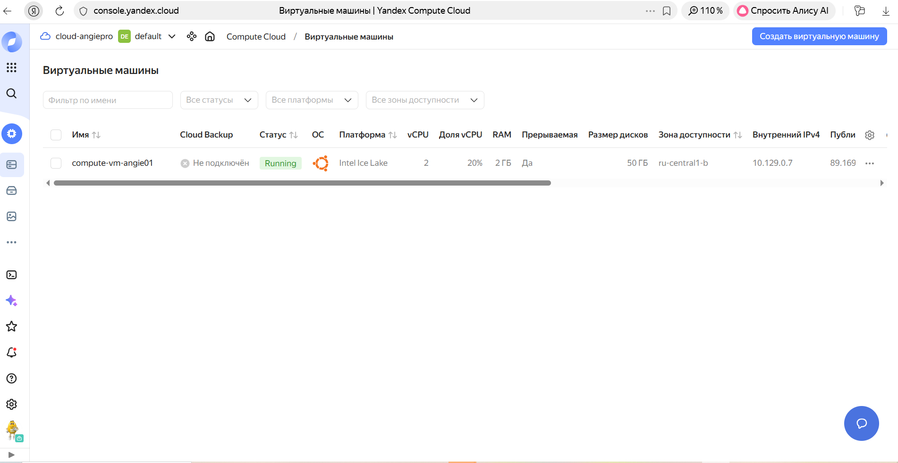

### Организация ВМ в YandexCloud, установка Angie и доп. модуля:

#### Шаг 1:
Создали ВМ в облаке:



#### Шаг 2: Подключились к консоли и выполнили все рекомендации по установке:

Debian, Ubuntu 
Установите вспомогательные пакеты для подключения репозитория Angie: 
```
sudo apt-get update
```

```
sudo apt-get install -y ca-certificates curl
```

Скачайте открытый ключ репозитория Angie для проверки подлинности пакетов: 
```
sudo curl -o /etc/apt/trusted.gpg.d/angie-signing.gpg \\ https://angie.software/keys/angie-signing.gpg
```

Подключите репозиторий Angie:
```
echo "deb https://download.angie.software/angie/$(. /etc/os-release && echo "$ID/$VERSION\_ID $VERSION\_CODENAME") main" \\ | sudo tee /etc/apt/sources.list.d/angie.list > /dev/null
```

Обновите индексы репозиториев: 
```
sudo apt-get update
```

Установите пакет Angie: 
```
sudo apt-get install -y angie
```

(Необязательно) Установите пакеты необходимых вам дополнений:
```
sudo apt-get install -y <ИМЯ ПАКЕТА>/br
```

### Результат

```
zubahin@compute-vm-angie01:~$ sudo apt-get install -y angie-module-image-filter\*\* Reading package lists... Done Building dependency tree... Done Reading state information... Done The following NEW packages will be installed: angie-module-image-filter 0 upgraded, 1 newly installed, 0 to remove and 13 not upgraded. Need to get 16.5 kB of archives. After this operation, 72.7 kB of additional disk space will be used. Get:1 https://download.angie.software/angie/ubuntu/24.04 noble/main amd64 angie-module-image-filter amd64 1.10.3-1~noble \[16.5 kB\] Fetched 16.5 kB in 0s (116 kB/s) Selecting previously unselected package angie-module-image-filter. (Reading database ... 106354 files and directories currently installed.) Preparing to unpack .../angie-module-image-filter\_1.10.3-1~noble\_amd64.deb ... Unpacking angie-module-image-filter (1.10.3-1~noble) ... Setting up angie-module-image-filter (1.10.3-1~noble) ... ---------------------------------------------------------------------- The image-filter dynamic module for Angie has been installed. To enable this module, add the following to /etc/angie/angie.conf and reload angie: load\_module modules/ngx\_http\_image\_filter\_module.so; Please refer to the modules documentation for further details: https://en.angie.software/angie/docs/configuration/modules/http/http\_image\_filter/ ---------------------------------------------------------------------- Scanning processes... Scanning linux images... Running kernel seems to be up-to-date. No services need to be restarted. No containers need to be restarted. No user sessions are running outdated binaries. No VM guests are running outdated hypervisor (qemu) binaries on this host. zubahin@compute-vm-angie01:~$ angie -V Angie version: Angie/1.10.3 nginx version: nginx/1.27.5 built on Thu, 13 Nov 2025 10:52:28 GMT built with OpenSSL 3.0.13 30 Jan 2024 TLS SNI support enabled configure arguments: --prefix=/etc/angie --conf-path=/etc/angie/angie.conf --error-log-path=/var/log/angie/error.log --http-log-path=/var/log/angie/access.log --lock-path=/run/angie.lock --modules-path=/usr/lib/angie/modules --pid-path=/run/angie.pid --sbin-path=/usr/sbin/angie --http-acme-client-path=/var/lib/angie/acme --http-client-body-temp-path=/var/cache/angie/client\_temp --http-fastcgi-temp-path=/var/cache/angie/fastcgi\_temp --http-proxy-temp-path=/var/cache/angie/proxy\_temp --http-scgi-temp-path=/var/cache/angie/scgi\_temp --http-uwsgi-temp-path=/var/cache/angie/uwsgi\_temp --user=angie --group=angie --with-file-aio --with-http\_acme\_module --with-http\_addition\_module --with-http\_auth\_request\_module --with-http\_dav\_module --with-http\_flv\_module --with-http\_gunzip\_module --with-http\_gzip\_static\_module --with-http\_mp4\_module --with-http\_random\_index\_module --with-http\_realip\_module --with-http\_secure\_link\_module --with-http\_slice\_module --with-http\_ssl\_module --with-http\_stub\_status\_module --with-http\_sub\_module --with-http\_v2\_module --with-http\_v3\_module --with-mail --with-mail\_ssl\_module --with-stream --with-stream\_acme\_module --with-stream\_mqtt\_preread\_module --with-stream\_rdp\_preread\_module --with-stream\_realip\_module --with-stream\_ssl\_module --with-stream\_ssl\_preread\_module --with-threads --feature-cache=../angie-feature-cache --with-ld-opt='-Wl,-Bsymbolic-functions -flto=auto -ffat-lto-objects -Wl,-z,relro -Wl,-z,now' zubahin@compute-vm-angie01:~$
```
