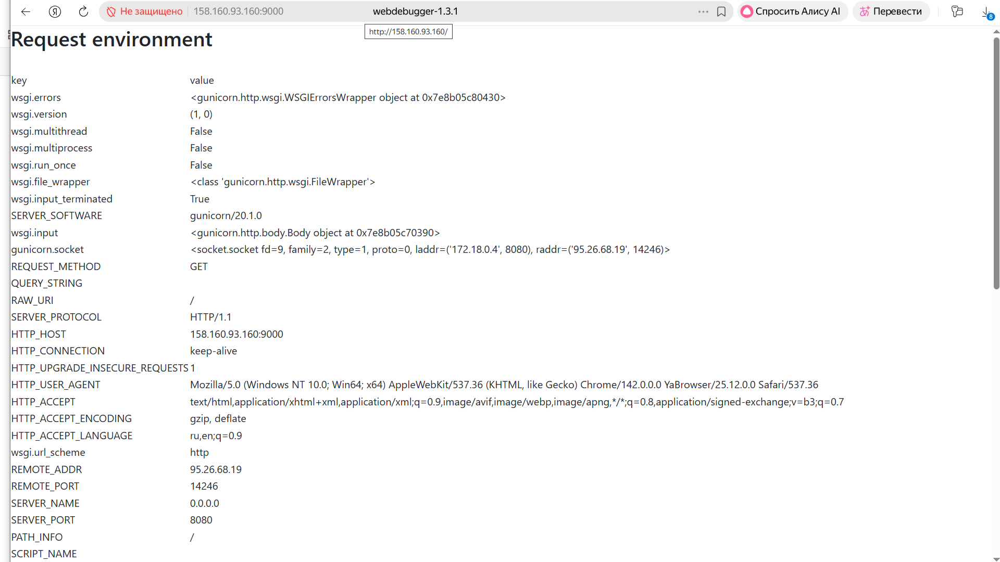
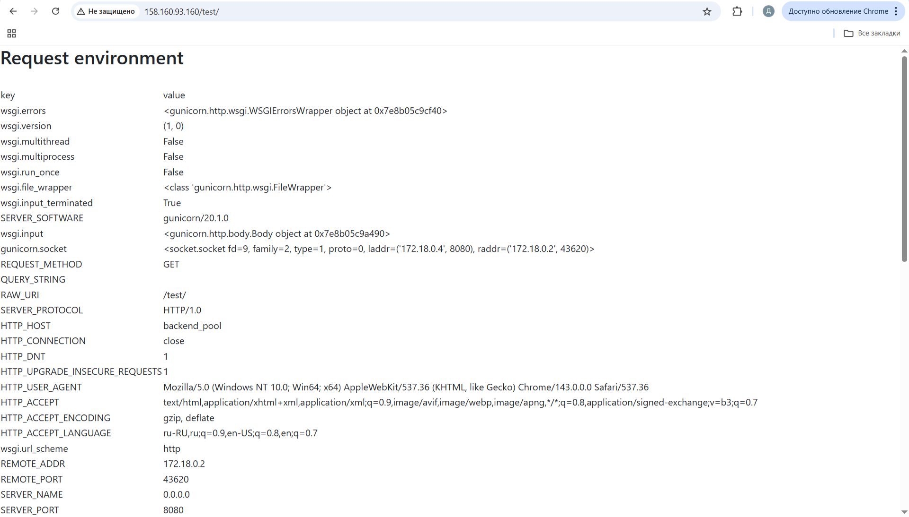
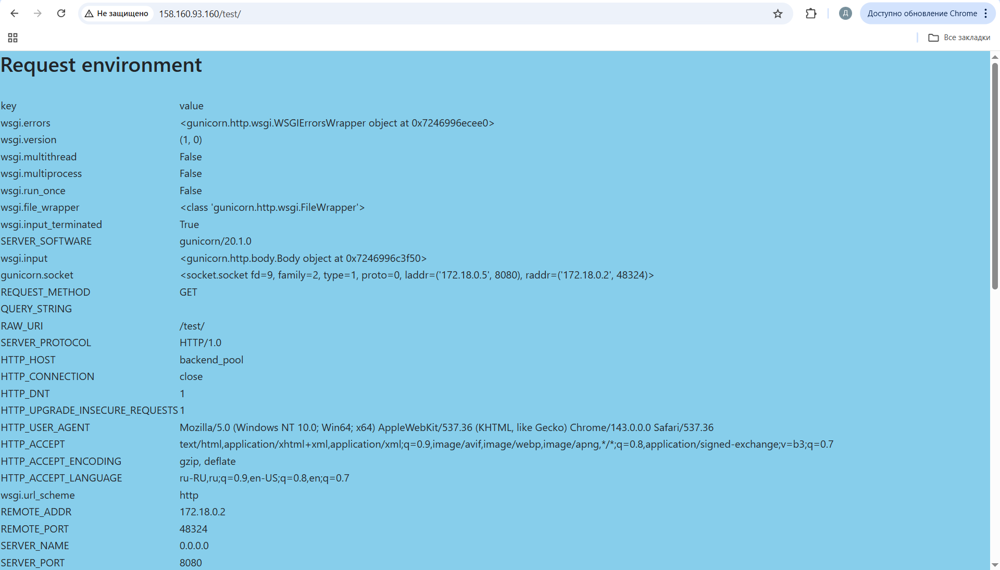
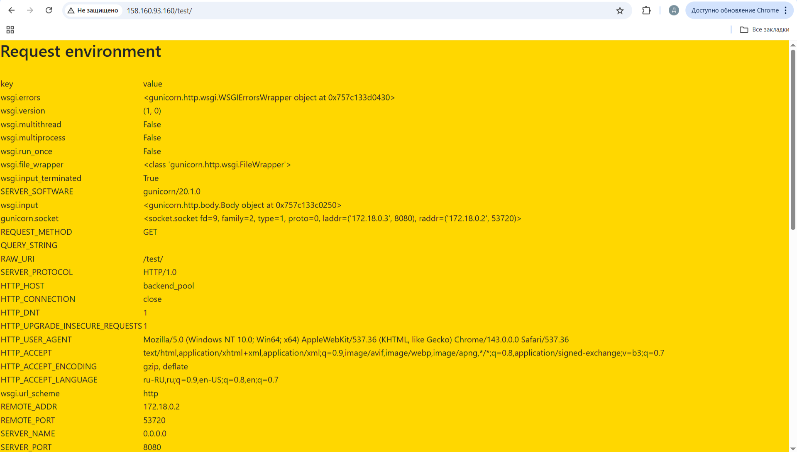
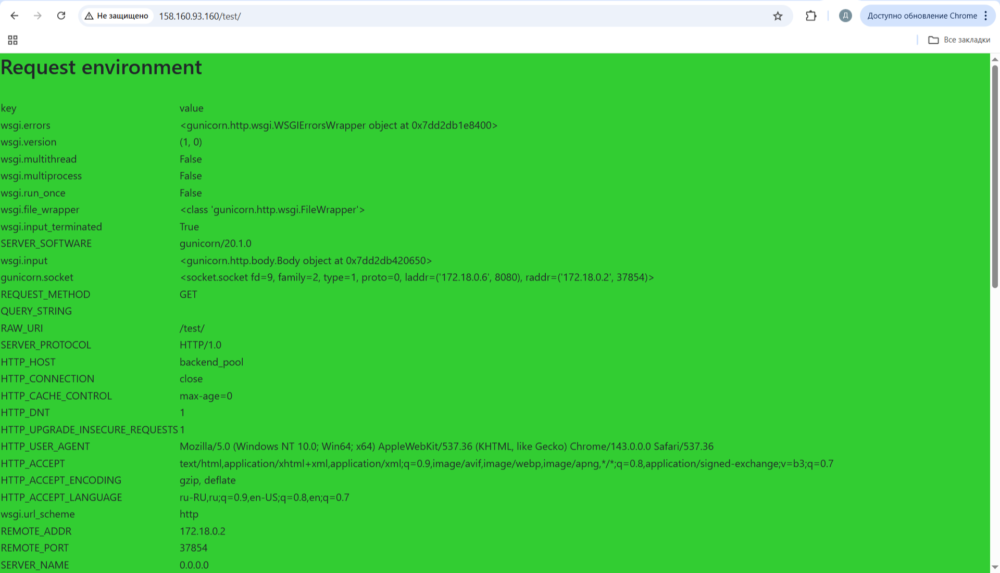
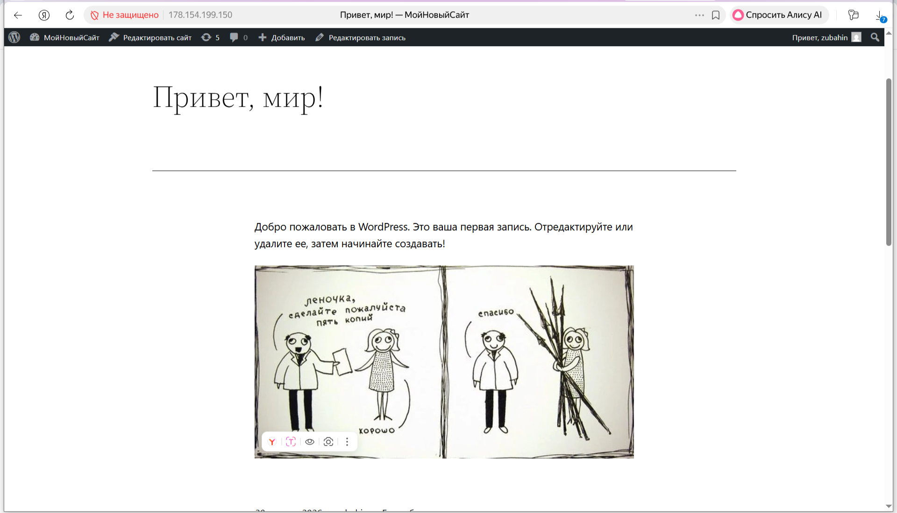

### Подготовительные шаги:

#### Шаг 1:
Создали ВМ в облаке.

#### Шаг 2: Устанавливаем docker,  docker-compose:

```
sudo apt-get update

sudo apt install docker.io
```
Добавим своего пользователя в группу docker чтобы можно было запускать команды без sudo:
```
sudo usermod -aG docker  zubahin
```

Для начала установим сам docker-compose
```
sudo apt install docker-compose
```

```
sudo apt update
```

#### Шаг 3: Копируем файлы из ДЗ по SFTP в домашнюю директорию (данные файлы потребуются для установки через docker-compose):

Создал папку project в домашней директории и скопировал туда файлы:
```
.dockerignore
.env
docker-compose.yml
```

#### Шаг 4: Правим YAML файл

###### Модифицированный YAML
<details>
    
```
version: '3'

services:
  debug-white:
    image: vscoder/webdebugger
    container_name: debug-white
    restart: unless-stopped
    environment:
      APP_DELAY: 0
      APP_PORT: 8080
      APP_BGCOLOR: white
    ports:
      - "9000:8080"
    networks:
      - app-network
  debug-blue:
    image: vscoder/webdebugger
    container_name: debug-blue
    restart: unless-stopped
    environment:
      APP_DELAY: 0
      APP_PORT: 8080
      APP_BGCOLOR: skyblue
    ports:
      - "9001:8080"
    networks:
      - app-network
  debug-green:
    image: vscoder/webdebugger
    container_name: debug-green
    restart: unless-stopped
    environment:
      APP_DELAY: 0
      APP_PORT: 8080
      APP_BGCOLOR: limegreen
    ports:
      - "9002:8080"     
    networks:
      - app-network      
  debug-gold:
    image: vscoder/webdebugger
    container_name: debug-gold
    restart: unless-stopped
    environment:
      APP_DELAY: 0
      APP_PORT: 8080
      APP_BGCOLOR: gold
    ports:
      - "9003:8080"
    networks:
      - app-network
  angie:
    image: docker.angie.software/angie:1.10.3-ubuntu
    container_name: angie
    restart: unless-stopped
    ports:
      - "80:80"
    networks:
      - app-network
networks:
  app-network:
    driver: bridge

```

</details>

Запускаем docker-compose
```
docker-compose up -d
```

копируем структуру каталогов на хостовую систему:

```
zubahin@compute-vm-lb:~$ sudo docker cp angie:/etc/angie/ ~/
Successfully copied 110kB to /home/zubahin/

zubahin@compute-vm-lb:~$ ls -la
total 48
drwxr-x--- 6 zubahin zubahin 4096 Feb  3 18:30 .
drwxr-xr-x 3 root    root    4096 Feb  3 09:50 ..
-rw------- 1 zubahin zubahin 4741 Feb  3 14:37 .bash_history
-rw-r--r-- 1 zubahin zubahin  220 Mar 31  2024 .bash_logout
-rw-r--r-- 1 zubahin zubahin 3771 Mar 31  2024 .bashrc
drwx------ 2 zubahin zubahin 4096 Feb  3 09:50 .cache
-rw-r--r-- 1 zubahin zubahin  807 Mar 31  2024 .profile
drwx------ 2 zubahin zubahin 4096 Feb  3 10:48 .ssh
-rw------- 1 zubahin zubahin 2815 Feb  3 18:19 .viminfo
drwxr-xr-x 5 root    root    4096 Nov 13 18:19 angie
drwxrwxr-x 2 zubahin zubahin 4096 Feb  3 18:18 projectmkdir angie

```
Выключаем docker-compose 

```
docker-compose down
```

Добавляем в YAML файл volumes:

<details>
    
```
version: '3'

services:
  debug-white:
    image: vscoder/webdebugger
    container_name: debug-white
    restart: unless-stopped
    environment:
      APP_DELAY: 0
      APP_PORT: 8080
      APP_BGCOLOR: white
    ports:
      - "9000:8080"
    networks:
      - app-network
  debug-blue:
    image: vscoder/webdebugger
    container_name: debug-blue
    restart: unless-stopped
    environment:
      APP_DELAY: 0
      APP_PORT: 8080
      APP_BGCOLOR: skyblue
    ports:
      - "9001:8080"
    networks:
      - app-network
  debug-green:
    image: vscoder/webdebugger
    container_name: debug-green
    restart: unless-stopped
    environment:
      APP_DELAY: 0
      APP_PORT: 8080
      APP_BGCOLOR: limegreen
    ports:
      - "9002:8080"     
    networks:
      - app-network      
  debug-gold:
    image: vscoder/webdebugger
    container_name: debug-gold
    restart: unless-stopped
    environment:
      APP_DELAY: 0
      APP_PORT: 8080
      APP_BGCOLOR: gold
    ports:
      - "9003:8080"
    networks:
      - app-network
  angie:
    image: docker.angie.software/angie:1.10.3-ubuntu
    container_name: angie
    restart: unless-stopped
    ports:
      - "80:80"
    volumes:
      - /home/zubahin/angie:/etc/angie:ro
    networks:
      - app-network

networks:
  app-network:
    driver: bridge

```

</details>

#### Шаг 5: Устанавливаем контейнеры в соответствии с YAML файлом:
```
docker-compose up -d
```

Как итог получаем:

```
zubahin@compute-vm-lb:~/project$ sudo docker ps -a
CONTAINER ID   IMAGE                                       COMMAND                  CREATED         STATUS         PORTS                                         NAMES
ef94b505722d   vscoder/webdebugger                         "gunicorn -w 1 --bin…"   3 minutes ago   Up 3 minutes   0.0.0.0:9002->8080/tcp, [::]:9002->8080/tcp   debug-green
46a88c9c5870   vscoder/webdebugger                         "gunicorn -w 1 --bin…"   3 minutes ago   Up 3 minutes   0.0.0.0:9003->8080/tcp, [::]:9003->8080/tcp   debug-gold
953ce9410f62   docker.angie.software/angie:1.10.3-ubuntu   "angie -g 'daemon of…"   3 minutes ago   Up 3 minutes   0.0.0.0:80->80/tcp, [::]:80->80/tcp           angie
bda983c19b42   vscoder/webdebugger                         "gunicorn -w 1 --bin…"   3 minutes ago   Up 3 minutes   0.0.0.0:9001->8080/tcp, [::]:9001->8080/tcp   debug-blue
27e44400620c   vscoder/webdebugger                         "gunicorn -w 1 --bin…"   3 minutes ago   Up 3 minutes   0.0.0.0:9000->8080/tcp, [::]:9000->8080/tcp   debug-white
```


#### Шаг 6: Настраиваем балансировщик:

Проверяем корректность каталогов на хостовой системе:

```
zubahin@compute-vm-lb:~/project$ cd ..
zubahin@compute-vm-lb:~$ cd angie/
zubahin@compute-vm-lb:~/angie$ ls -la
total 68
drwxr-xr-x 5 root    root     4096 Nov 13 18:19 .
drwxr-x--- 6 zubahin zubahin  4096 Feb  3 18:30 ..
-rw-r--r-- 1 root    root     5241 Aug 21 10:16 angie.conf
-rw-r--r-- 1 root    root     1077 Nov 12 21:04 fastcgi.conf
-rw-r--r-- 1 root    root     1007 Nov 12 21:04 fastcgi_params
drwxr-xr-x 2 root    root     4096 Nov 13 18:19 http.d
-rw-r--r-- 1 root    root     5354 Nov 12 21:04 mime.types
drwxr-xr-x 2 root    root     4096 Nov 13 18:19 modsecurity
lrwxrwxrwx 1 root    root       22 Nov 13 08:37 modules -> /usr/lib/angie/modules
-rw-r--r-- 1 root    root    15083 Nov 12 21:04 prometheus_all.conf
-rw-r--r-- 1 root    root      636 Nov 12 21:04 scgi_params
drwxr-xr-x 2 root    root     4096 Nov 13 18:19 stream.d
-rw-r--r-- 1 root    root      664 Nov 12 21:04 uwsgi_params

```

Вносим изменения в файл angie.conf
<details>
    
```
# package: angie-module-auth-jwt
#load_module modules/ngx_http_auth_jwt_module.so;

# package: angie-module-auth-ldap
#load_module modules/ngx_http_auth_ldap_module.so;

# package: angie-module-auth-pam
#load_module modules/ngx_http_auth_pam_module.so;

# package: angie-module-auth-spnego
#load_module modules/ngx_http_auth_spnego_module.so;

# package: angie-module-auth-totp
#load_module modules/ngx_http_auth_totp_module.so;

# package: angie-module-brotli
#load_module modules/ngx_http_brotli_filter_module.so;
#load_module modules/ngx_http_brotli_static_module.so;

# package: angie-module-cache-purge
#load_module modules/ngx_http_cache_purge_module.so;

# package: angie-module-cgi
#load_module modules/ngx_http_cgi_module.so;

# package: angie-module-combined-upstreams
#load_module modules/ngx_http_combined_upstreams_module.so;

# package: angie-module-dav-ext
#load_module modules/ngx_http_dav_ext_module.so;

# package: angie-module-dynamic-limit-req
#load_module modules/ngx_http_dynamic_limit_req_module.so;

# package: angie-module-echo
#load_module modules/ngx_http_echo_module.so;

# package: angie-module-enhanced-memcached
#load_module modules/ngx_http_enhanced_memcached_module.so;

# package: angie-module-eval
#load_module modules/ngx_http_eval_module.so;

# package: angie-module-geoip2
#load_module modules/ngx_http_geoip2_module.so;
#load_module modules/ngx_stream_geoip2_module.so;

# package: angie-module-headers-more
#load_module modules/ngx_http_headers_more_filter_module.so;

# package: angie-module-http-auth-radius
# uncommenting line below make sure you have configured 'radius_server'
#load_module modules/ngx_http_auth_radius_module.so;

# package: angie-module-image-filter
#load_module modules/ngx_http_image_filter_module.so;

# package: angie-module-keyval
#load_module modules/ngx_http_keyval_module.so;
#load_module modules/ngx_stream_keyval_module.so;

# package: angie-module-ndk
#load_module modules/ndk_http_module.so;

# package: angie-module-lua
#load_module modules/ngx_http_lua_module.so;
#load_module modules/ngx_stream_lua_module.so;

# package: angie-module-modsecurity
#load_module modules/ngx_http_modsecurity_module.so;

# package: angie-module-njs
#load_module modules/ngx_http_js_module.so;
#load_module modules/ngx_stream_js_module.so;

# package: angie-module-opentracing
#load_module modules/ngx_http_opentracing_module.so;

# package: angie-module-otel
#load_module modules/ngx_otel_module.so;

# package: angie-module-perl
#load_module modules/ngx_http_perl_module.so;

# package: angie-module-postgres
#load_module modules/ngx_postgres_module.so;

# package: angie-module-redis2
#load_module modules/ngx_http_redis2_module.so;

# package: angie-module-rtmp
#load_module modules/ngx_rtmp_module.so;

# package: angie-module-set-misc
#load_module modules/ngx_http_set_misc_module.so;

# package: angie-module-subs
#load_module modules/ngx_http_subs_filter_module.so;

# package: angie-module-testcookie
#load_module modules/ngx_http_testcookie_access_module.so;

# package: angie-module-unbrotli
# load_module modules/ngx_http_unbrotli_filter_module.so;

# package: angie-module-upload
#load_module modules/ngx_http_upload_module.so;

# package: angie-module-vod
#load_module modules/ngx_http_vod_module.so;

# package: angie-module-vts
#load_module modules/ngx_http_stream_server_traffic_status_module.so;
#load_module modules/ngx_http_vhost_traffic_status_module.so;
#load_module modules/ngx_stream_server_traffic_status_module.so

# package: angie-module-wasm
#load_module modules/ngx_wasm_module.so;
#load_module modules/ngx_wasm_core_module.so;
#load_module modules/ngx_http_wasm_host_module.so;
#load_module modules/ngx_wasmtime_module.so;

# package: angie-module-xslt
#load_module modules/ngx_http_xslt_filter_module.so;

# package: angie-module-zip
#load_module modules/ngx_http_zip_module.so;

# package: angie-module-zstd
#load_module modules/ngx_http_zstd_filter_module.so;
#load_module modules/ngx_http_zstd_static_module.so;

user  angie;
worker_processes  auto;
worker_rlimit_nofile 65536;

error_log  /var/log/angie/error.log notice;
pid        /run/angie/angie.pid;

events {
    worker_connections  65536;
}

http {
    include       /etc/angie/mime.types;
    default_type  application/octet-stream;

    log_format  main  '$remote_addr - $remote_user [$time_local] "$request" '
                      '$status $body_bytes_sent "$http_referer" '
                      '"$http_user_agent" "$http_x_forwarded_for"';

    log_format extended '$remote_addr - $remote_user [$time_local] "$request" '
                        '$status $body_bytes_sent "$http_referer" rt="$request_time" '
                        '"$http_user_agent" "$http_x_forwarded_for" '
                        'h="$host" sn="$server_name" ru="$request_uri" u="$uri" '
                        'ucs="$upstream_cache_status" ua="$upstream_addr" us="$upstream_status" '
                        'uct="$upstream_connect_time" urt="$upstream_response_time"';

    access_log  /var/log/angie/access.log  main;

    sendfile        on;
    #tcp_nopush     on;

    keepalive_timeout  65;

    #gzip  on;

    include /etc/angie/http.d/*.conf;
}

#stream {
#    include /etc/angie/stream.d/*.conf;
#}
```

</details>


Создаем доп. файл в http.d или правим существующий default.conf:
<details>
    
```

# Настройки балансировки
    upstream backend_pool {
        # Round-robin (по умолчанию)
        server 127.0.0.1:9000 sid=white;
        server 127.0.0.1:9001 sid=blue;
        server 127.0.0.1:9002 sid=green;
        server 127.0.0.1:9003 sid=gold;

server {
    listen       80;
    server_name  localhost 158.160.93.160;

    #access_log  /var/log/angie/host.access.log  main;

    location / {
        root   /usr/share/angie/html;
        index  index.html index.htm;
    }

    location /status/ {
        api     /status/;
        allow   127.0.0.1;
        deny    all;
    }
    location /test/ {
        # Проксирование на бекенд пул
        proxy_pass http://backend_pool;
    }

    #error_page  404              /404.html;

    # redirect server error pages to the static page /50x.html
    #
    error_page   500 502 503 504  /50x.html;
    location = /50x.html {
        root   /usr/share/angie/html;
    }

    # proxy the PHP scripts to Apache listening on 127.0.0.1:80
    #
    #location ~ \.php$ {
    #    proxy_pass   http://127.0.0.1;
    #}

    # pass the PHP scripts to FastCGI server listening on 127.0.0.1:9000
    #
    #location ~ \.php$ {
#    proxy_pass   http://127.0.0.1;
    #}

    # pass the PHP scripts to FastCGI server listening on 127.0.0.1:9000
    #
    #location ~ \.php$ {
    #    root           html;
    #    fastcgi_pass   127.0.0.1:9000;
    #    fastcgi_index  index.php;
    #    fastcgi_param  SCRIPT_FILENAME  /scripts$fastcgi_script_name;
    #    include        fastcgi_params;
    #}

    # deny access to .htaccess files, if Apache's document root
    # concurs with angie's one
    #
    #location ~ /\.ht {
    #    deny  all;
    #}
}
```

</details>

#### Шаг 7: Проверяем работу:

Сначала смотрим базовуб страничку:
http://158.160.93.160/ 


Идем по HTTP на внешний адрес http://158.160.93.160/ по портам 9000-9003:
http://158.160.93.160:9000 и так далее (проверяем что серверы доступны по прямым обращениям):




Далее пробуем обратится на location /test/:
http://158.160.93.160/test

##### И внезапно...  НИЧЕГО НЕ РАБОТАЕТ!
#####  Причина в том, что порт 9000 -выставлены на хостовой системе,а в докере (где Angie и находится в сети app_network) они слушают обращения на портах 8080.

#### Шаг 8: Меняем конфигурацию с учетом того, что Angie мы установили в Докере и снова проверяем работу:


правим существующий default.conf:
<details>
    
```

# Настройки балансировки
    upstream backend_pool {
    #Round-robin (по умолчанию)
    # Порт 8080 - внутренний порт контейнеров webdebugger так как они в одной сети с Angie, cнаружи они доступны по портам 9000-9003
    # 127.0.0.1 внутри контейнера Angie ≠ 127.0.0.1 на хосте!!!
    server debug-white:8080 sid=white;  # указываем прямо имена контейнеров (чтобы не привязываться к адресации в докере)
    server debug-blue:8080 sid=blue;    # указываем прямо имена контейнеров (чтобы не привязываться к адресации в докере)
    server debug-green:8080 sid=green;  # указываем прямо имена контейнеров (чтобы не привязываться к адресации в докере)
    server debug-gold:8080 sid=gold;    # указываем прямо имена контейнеров (чтобы не привязываться к адресации в докере)
}
server {
    listen       80;
    server_name  localhost 158.160.93.160;

    #access_log  /var/log/angie/host.access.log  main;

    location / {
        root   /usr/share/angie/html;
        index  index.html index.htm;
    }

    location /status/ {
        api     /status/;
        allow   127.0.0.1;
        deny    all;
    }
    location /test/ {
        # Проксирование на бекенд пул
        proxy_pass http://backend_pool;
    }

    #error_page  404              /404.html;

    # redirect server error pages to the static page /50x.html
    #
    error_page   500 502 503 504  /50x.html;
    location = /50x.html {
        root   /usr/share/angie/html;
    }

    # proxy the PHP scripts to Apache listening on 127.0.0.1:80
    #
    #location ~ \.php$ {
    #    proxy_pass   http://127.0.0.1;
    #}

    # pass the PHP scripts to FastCGI server listening on 127.0.0.1:9000
    #
    #location ~ \.php$ {
#    proxy_pass   http://127.0.0.1;
    #}

    # pass the PHP scripts to FastCGI server listening on 127.0.0.1:9000
    #
    #location ~ \.php$ {
    #    root           html;
    #    fastcgi_pass   127.0.0.1:9000;
    #    fastcgi_index  index.php;
    #    fastcgi_param  SCRIPT_FILENAME  /scripts$fastcgi_script_name;
    #    include        fastcgi_params;
    #}

    # deny access to .htaccess files, if Apache's document root
    # concurs with angie's one
    #
    #location ~ /\.ht {
    #    deny  all;
    #}
}
```

</details>

И теперь видим 










### Подготовительные шаги:

#### Шаг 1:
Используем Docker-compose и набор файлов (.env dockerignore docker-compose.yaml) в директорию project:


```
zubahin@compute-vm-angie01:~$ cd project
zubahin@compute-vm-angie01:~/project$ ls -la
total 24
drwxrwxr-x 2 zubahin zubahin 4096 Jan  5 11:18 .
drwxr-x--- 6 zubahin zubahin 4096 Jan  5 11:32 ..
-rw-rw-rw- 1 zubahin zubahin    5 Dec 26 07:38 .dockerignore
-rw-rw-rw- 1 zubahin zubahin   83 Dec 26 07:38 .env
-rw-rw-rw- 1 zubahin zubahin 1193 Dec 26 08:47 angie.conf
-rw-rw-rw- 1 zubahin zubahin 1106 Jan  5 11:18 docker-compose.yml
```

Файл приложены к материалам.
Ниже продублировано содержание docker-compose.yaml:

<details>
    
```
version: '3'

services:
  db:
    image: mysql:8.0
    container_name: db
    restart: unless-stopped
    env_file: .env
    environment:
      - MYSQL_DATABASE=wordpress
    volumes:
      - dbdata:/var/lib/mysql
    command: '--default-authentication-plugin=mysql_native_password'
    networks:
      - app-network

  wordpress:
    depends_on:
      - db
    image: wordpress:6.0.1-php8.0-fpm-alpine
    container_name: wordpress
    restart: unless-stopped
    env_file: .env
    environment:
      - WORDPRESS_DB_HOST=db:3306
      - WORDPRESS_DB_USER=$MYSQL_USER
      - WORDPRESS_DB_PASSWORD=$MYSQL_PASSWORD
      - WORDPRESS_DB_NAME=wordpress
    volumes:
      - wordpress:/var/www/html
    networks:
      - app-network

  angie:
   depends_on:
      - wordpress
    image: docker.angie.software/angie:1.10.3-ubuntu
    container_name: angie
    restart: unless-stopped
    ports:
      - "80:80"
    volumes:
      - wordpress:/var/www/html
      - /home/zubahin/angie:/etc/angie:ro
    networks:
      - app-network
volumes:
  wordpress:
  dbdata:

networks:
  app-network:
    driver: bridge


```

</details>

ключевыми настройками здесь является проброс портов 80:80  мапирование директории для конфигураций контейнера angie в файлах хостовой системы (home/zubahin/angie) и создание сети ( bridge) 
с названием app-network  чтобы контейнеры видели друг-друга:

```
    ports:
      - "80:80"
    volumes:
      - wordpress:/var/www/html
      - /home/zubahin/angie:/etc/angie:ro
    networks:
      - app-network
```

Запускаем docker-compose:

```
docker-compose up -d
```

Проверяем состояние контейнеров и сети:

```
zubahin@compute-vm-angie01:~/project$ docker ps -a
CONTAINER ID   IMAGE                                       COMMAND                  CREATED        STATUS         PORTS                                 NAMES
b8516624afcb   docker.angie.software/angie:1.10.3-ubuntu   "angie -g 'daemon of…"   30 hours ago   Up 9 minutes   0.0.0.0:80->80/tcp, [::]:80->80/tcp   angie
1037e688e707   wordpress:6.0.1-php8.0-fpm-alpine           "docker-entrypoint.s…"   30 hours ago   Up 9 minutes   9000/tcp                              wordpress
f524c6d07282   mysql:8.0                                   "docker-entrypoint.s…"   30 hours ago   Up 9 minutes   3306/tcp, 33060/tcp                   db

zubahin@compute-vm-angie01:~/project$ docker network ls
NETWORK ID     NAME                  DRIVER    SCOPE
6b3b65f6e386   bridge                bridge    local
bacb1e0938f0   host                  host      local
21964b12fec6   none                  null      local
e850726d3268   project_app-network   bridge    local

```


#### Шаг 2: Вносим изменения в конфигурационные файлы.

Ориентируемся на имена контейнеров:

#####  корневой файл angie.conf:
```
zubahin@compute-vm-angie01:~/angie$ vim angie.conf
```

<details>
    
```
# package: angie-module-auth-jwt
#load_module modules/ngx_http_auth_jwt_module.so;

# package: angie-module-auth-ldap
#load_module modules/ngx_http_auth_ldap_module.so;

# package: angie-module-auth-pam
#load_module modules/ngx_http_auth_pam_module.so;

# package: angie-module-auth-spnego
#load_module modules/ngx_http_auth_spnego_module.so;

# package: angie-module-auth-totp
#load_module modules/ngx_http_auth_totp_module.so;

# package: angie-module-brotli
#load_module modules/ngx_http_brotli_filter_module.so;
#load_module modules/ngx_http_brotli_static_module.so;

# package: angie-module-cache-purge
#load_module modules/ngx_http_cache_purge_module.so;

# package: angie-module-cgi
#load_module modules/ngx_http_cgi_module.so;

# package: angie-module-combined-upstreams
#load_module modules/ngx_http_combined_upstreams_module.so;

# package: angie-module-dav-ext
#load_module modules/ngx_http_dav_ext_module.so;

# package: angie-module-dynamic-limit-req
#load_module modules/ngx_http_dynamic_limit_req_module.so;

# package: angie-module-echo
#load_module modules/ngx_http_echo_module.so;

# package: angie-module-enhanced-memcached
#load_module modules/ngx_http_enhanced_memcached_module.so;

# package: angie-module-eval
#load_module modules/ngx_http_eval_module.so;

# package: angie-module-geoip2
#load_module modules/ngx_http_geoip2_module.so;
#load_module modules/ngx_stream_geoip2_module.so;

# package: angie-module-headers-more
#load_module modules/ngx_http_headers_more_filter_module.so;

# package: angie-module-http-auth-radius
# uncommenting line below make sure you have configured 'radius_server'
#load_module modules/ngx_http_auth_radius_module.so;

# package: angie-module-image-filter
#load_module modules/ngx_http_image_filter_module.so;

# package: angie-module-keyval
#load_module modules/ngx_http_keyval_module.so;
#load_module modules/ngx_stream_keyval_module.so;

# package: angie-module-ndk
#load_module modules/ndk_http_module.so;

# package: angie-module-lua
#load_module modules/ngx_http_lua_module.so;
#load_module modules/ngx_stream_lua_module.so;

#package: angie-module-modsecurity
#load_module modules/ngx_http_modsecurity_module.so;

# package: angie-module-njs
#load_module modules/ngx_http_js_module.so;
#load_module modules/ngx_stream_js_module.so;

# package: angie-module-opentracing
#load_module modules/ngx_http_opentracing_module.so;

# package: angie-module-otel
#load_module modules/ngx_otel_module.so;

# package: angie-module-perl
#load_module modules/ngx_http_perl_module.so;

# package: angie-module-postgres
#load_module modules/ngx_postgres_module.so;

# package: angie-module-redis2
#load_module modules/ngx_http_redis2_module.so;

# package: angie-module-rtmp
#load_module modules/ngx_rtmp_module.so;

# package: angie-module-set-misc
#load_module modules/ngx_http_set_misc_module.so;

# package: angie-module-subs
#load_module modules/ngx_http_subs_filter_module.so;

# package: angie-module-testcookie
#load_module modules/ngx_http_testcookie_access_module.so;

# package: angie-module-unbrotli
# load_module modules/ngx_http_unbrotli_filter_module.so;

# package: angie-module-upload
#load_module modules/ngx_http_upload_module.so;

# package: angie-module-vod
#load_module modules/ngx_http_vod_module.so;

# package: angie-module-vts
#load_module modules/ngx_http_stream_server_traffic_status_module.so;
#load_module modules/ngx_http_vhost_traffic_status_module.so;
#load_module modules/ngx_stream_server_traffic_status_module.so;

# package: angie-module-wasm
#load_module modules/ngx_wasm_module.so;
#load_module modules/ngx_wasm_core_module.so;
#load_module modules/ngx_http_wasm_host_module.so;
#load_module modules/ngx_wasmtime_module.so;

# package: angie-module-xslt
#load_module modules/ngx_http_xslt_filter_module.so;

# package: angie-module-zip
#load_module modules/ngx_http_zip_module.so;

# package: angie-module-zstd
load_module modules/ngx_http_zstd_filter_module.so;
load_module modules/ngx_http_zstd_static_module.so;

user  angie;
worker_processes  auto;
worker_rlimit_nofile 65536;

error_log  /var/log/angie/error.log notice;
pid        /run/angie/angie.pid;

events {
    worker_connections  65536;
}


http {
    include       /etc/angie/mime.types;
    default_type  application/octet-stream;

    log_format  main  '$remote_addr - $remote_user [$time_local] "$request" '
                      '$status $body_bytes_sent "$http_referer" '
                      '"$http_user_agent" "$http_x_forwarded_for"';

    log_format extended '$remote_addr - $remote_user [$time_local] "$request" '
                        '$status $body_bytes_sent "$http_referer" rt="$request_time" '
                        '"$http_user_agent" "$http_x_forwarded_for" '
                        'h="$host" sn="$server_name" ru="$request_uri" u="$uri" '
                        'ucs="$upstream_cache_status" ua="$upstream_addr" us="$upstream_status" '
                        'uct="$upstream_connect_time" urt="$upstream_response_time"';

    access_log  /var/log/angie/access.log  main;

    sendfile        on;
    tcp_nopush     on;

    keepalive_timeout  65;

    #gzip  on;

# Включаем zstd
    zstd on;
    zstd_min_length 256;
    zstd_comp_level 5;
    #zstd_static on;
    zstd_types text/plain text/css text/xml application/javascript
    application/json image/x-icon image/svg+xml;

    # Proxy cache
    proxy_cache_valid 1m;
    proxy_cache_key $scheme$host$request_uri;
    proxy_cache_path /cache levels=1:2 keys_zone=one:10m inactive=48h max_size=800m;


    include /etc/angie/http.d/*.conf;

# MAP для картинок

map $msie $cache_control {
 default "max-age=31536000, public, no-transform, immutable";
 "1" "max-age=31536000, private, no-transform, immutable";
 }
 map $msie $vary_header {
default "Accept";
"1" "";
 }
 map $http_accept $webp_suffix {
 "~*webp" ".webp";
 }
 map $http_accept $avif_suffix {
 "~*avif" ".avif";
 "~*webp" ".webp";
 }

}

#stream {
#    include /etc/angie/stream.d/*.conf;
#}


```

</details>


#####  файл с настройками модуля server в http.d:

Заходит в директорию хостовой системы куда были замаплены конфигурации контейнера Angie
```
zubahin@compute-vm-angie01:/$ cd /home/zubahin/angie/http.d
zubahin@compute-vm-angie01:~/angie/http.d$ 
zubahin@compute-vm-angie01:~/angie/http.d$ vim angie.conf
```

<details>
    
```
server {
        listen 80 default_server reuseport;
        reset_timedout_connection on;

       # Keepalive (для клиентов):
       keepalive_timeout 300;
       keepalive_requests 10000;
       #Таймауты:
       send_timeout 10;
       client_body_timeout 10;
       client_header_timeout 10;


       #Сокращение задержек (fail fast)
       proxy_connect_timeout 5;
       proxy_send_timeout 10;
       proxy_read_timeout 10;
       #Буфер для чтения ответа от бэкенда
       proxy_temp_file_write_size 64k;
       proxy_buffer_size 4k;
       proxy_buffers 64 4k;
       proxy_busy_buffers_size 32k;


        server_name MyServer.com www.MyServer.com;

        index index.php index.html index.htm;

        root /var/www/html;

        location ~ /.well-known/acme-challenge {
                allow all;
                root /var/www/html;
        }
       location / {
                try_files $uri $uri/ /index.php$is_args$args;

        # Серверное кеширование
        proxy_cache one;
        proxy_cache_valid 200 1h;
        proxy_cache_lock on;
        proxy_cache_min_uses 2;
        proxy_ignore_headers "Cache-Control" "Expires";
        proxy_cache_use_stale updating error timeout invalid_header http_500 http_502 http_504;
        proxy_cache_background_update on;

       }

        location ~ \.php$ {
                try_files $uri =404;
                fastcgi_split_path_info ^(.+\.php)(/.+)$;
                fastcgi_pass wordpress:9000;
                fastcgi_index index.php;
                include fastcgi_params;
                fastcgi_param SCRIPT_FILENAME $document_root$fastcgi_script_name;
                fastcgi_param PATH_INFO $fastcgi_path_info;
        }

        location ~ /\.ht {
                deny all;
        }

        location = /favicon.ico {
                log_not_found off; access_log off;
        }
        location = /robots.txt {
                log_not_found off; access_log off; allow all;
        }
        location ~* \.(css|gif|ico|jpeg|jpg|js|png)$ {
                expires max;
                log_not_found off;
        }

# оптимизация картинок
location /img {
    add_header Vary $vary_header;
    add_header Cache-Control $cache_control;
    try_files $uri$avif_suffix $uri$webp_suffix $uri =404;
    expires max;
    log_not_found off;
}

# Для других изображений:
location ~* \.(gif|ico|jpeg|jpg|png|svg|webp|avif)$ {
    expires max;
    log_not_found off;
    add_header Vary $vary_header;
    add_header Cache-Control $cache_control;
    try_files $uri$avif_suffix $uri$webp_suffix $uri =404;
}

# Для CSS/JS:
location ~* \.(css|js)$ {
    expires max;
    log_not_found off;
}

}
````
</details>

Проверяем работу:




###  ПОЯСНЕНИЕ ПРИМЕНЕННЫХ НАСТРОЕК:

#### Оптимизация сжатия: Zstd с разумными настройками
1. Что настроено:
```
nginx
zstd on;
zstd_min_length 256;
zstd_comp_level 5;
zstd_types text/plain text/css text/xml application/javascript 
application/json image/x-icon image/svg+xml;
```
Что это дает:  Экономия трафика и ускорение загрузки:
Zstd (Zstandard) на 20-30% эффективнее gzip при аналогичной скорости

2. Разумные ограничения:

```
zstd_min_length 256 - не сжимаем мелочь (<256 байт)
zstd_comp_level 5 - оптимальный баланс:
```
Уровень 1: быстро, но слабое сжатие
Уровень 19: максимальное сжатие, но медленно
Сжимаем только текстовые форматы (CSS, JS, JSON, XML)
Не сжимаем уже сжатые форматы (JPEG, PNG, MP4)

#### Кэширование статики (заголовки Cache-Control)

1. Что настроено:
```
nginx
expires max;
add_header Cache-Control $cache_control;
# где cache_control = "max-age=31536000, public, no-transform, immutable"
```

2. Что это дает:
Устранение лишних запросов к серверу (90% запросов от постоянных пользователей обслуживаются из кэша браузера):
max-age=31536000 = 1 год кэширования в браузере

Оптимизация работы браузера:
immutable - браузер не проверяет обновления файла
public - можно кэшировать в промежуточных прокси (CDN)
no-transform - запрет на изменение контента (например, сжатие мобильными операторами)

Повторные посещения ускоряются.

#### HTTP/2-ready: reuseport и tcp_nopush

1. Что настроено:
```
nginx
listen 80 default_server reuseport;
tcp_nopush on;
```

2. Что это дает:
reuseport - масштабирование соединений:

Без reuseport:
Один listen socket - конкуренция за принятие соединений

С reuseport:
Множество listen sockets - каждому воркеру свой socket (нет конкуренции )
Устраняет contention lock между worker процессами
Улучшает распределение нагрузки при высоком RPS.
Это важно при >10K одновременных соединений

tcp_nopush on + sendfile on - оптимизация отправки:

Без оптимизации:
[Пакет 1: Заголовки][Пакет 2: Данные][Пакет 3: Данные]...

С tcp_nopush:
[Пакет 1: Заголовки + Данные][Пакет 2: Данные]...
Объединение мелких TCP пакетов в более крупные (алгоритм Nagle)
Уменьшение overhead на заголовки TCP/IP
Особенно эффективно для мелких статических файлов
Результат: Увеличение пропускной способности и уменьшение загрузки CPU.

#### Keepalive и прокси-таймауты

1.Что настроено:
```
nginx
keepalive_timeout 300;
keepalive_requests 10000;
client_body_timeout 10;
client_header_timeout 10;
proxy_connect_timeout 5;
proxy_read_timeout 10;
```
Что это дает:
Keepalive соединения:

Без keepalive (HTTP/1.0 стиль):
Клиент: GET /page.html → Сервер: Ответ → Разрыв соединения

С keepalive:
Клиент: Соединение → GET /page.html → GET /style.css → GET /script.js
Сервер: Ответ → Ответ → Ответ → Таймаут 300с
1 соединение вместо 3+ для загрузки страницы
Устранение накладных расходов на установку TCP соединения
keepalive_requests 10000 - одно соединение может обслужить 10000 запросов

Fail-fast таймауты:

proxy_connect_timeout 5 - если бэкенд не отвечает 5 секунд, прерываем
client_body_timeout 10 - если клиент медленно отправляет тело запроса
Защита от "висящих" соединений, которые занимают ресурсы

Результат: Ускорение последовательных запросов , защита от DDoS медленными соединениями.

#### Адаптивные изображения: Поддержка AVIF/WebP через map

1.Что настроено:
```
map $http_accept $avif_suffix {
    "~*avif" ".avif";
    "~*webp" ".webp";
}
location /img {
    try_files $uri$avif_suffix $uri$webp_suffix $uri =404;
}
```
2. Что это дает:

Автоматическая доставка современных форматов:
- WebP: 80KB (47% экономия от JPEG)
- AVIF: 45KB (70% экономия от JPEG)
Умное определение возможностей клиента:
Браузер отправляет Accept: image/avif,image/webp,image/*
Angie проверяет наличие .jpg.avif или .jpg.webp
Отдает самый современный формат, который поддерживает клиент

Экономия трафика и ускорение загрузки:
Результат: Ускорение загрузки изображений без потери качества.

#### Прокси-кэш: Настроен базовый кэш для контента

1. Что настроено:
```
proxy_cache_path /cache levels=1:2 keys_zone=one:10m inactive=48h max_size=800m;
proxy_cache_valid 200 1h;
proxy_cache_min_uses 2;
```
2. Что это дает:
Кэширование динамического контента:
Оптимизация работы в памяти:

keys_zone=one:10m - 10MB памяти на хранение ключей кэша (1 ключ ~ 128 байт)
→ ~80,000 закэшированных URL в памяти
max_size=800m - ограничение на диске, предотвращает переполнение
inactive=48h - удаление неиспользуемых файлов через 2 дня

Интеллектуальная политика кэширования:
proxy_cache_min_uses 2 - кэшируем только то, что запрашивают минимум 2 раза
Защита от кэширования уникальных запросов (поисковые роботы, сканеры)

Результат: По оценке должно давать ускорение загрузки динамических страниц в 50-100 раз для повторных посетителей, 
снижение нагрузки на бэкенд на 80-95%.


### ТЕСТЫ (ДО и ПОСЛЕ оптимизации):

#### 1. Проверка сжатия
```
curl -H "Accept-Encoding: gzip, deflate, br, zstd" -I http://178.154.199.150/2026/01/30/привет-мир/
```

```
HTTP/1.1 200 OK
Server: Angie/1.10.3
Date: Fri, 30 Jan 2026 14:18:35 GMT
Content-Type: text/html; charset=UTF-8
Connection: keep-alive
X-Powered-By: PHP/8.0.22
X-Pingback: http://178.154.199.150/xmlrpc.php
Link: <http://178.154.199.150/wp-json/>; rel="https://api.w.org/"
Link: <http://178.154.199.150/wp-json/wp/v2/posts/1>; rel="alternate"; title="JSON"; type="application/json"
Link: <http://178.154.199.150/?p=1>; rel=shortlink
Content-Encoding: zstd
```
При необходимости можно включить gzip для старых клиентов:
<details>

```
# Включить gzip как fallback для старых клиентов
gzip on;
gzip_vary on;
gzip_proxied any;
gzip_comp_level 6;
gzip_min_length 256;
gzip_types
    application/atom+xml
    application/javascript
    application/json
    application/ld+json
    application/manifest+json
    application/rss+xml
    application/vnd.geo+json
    application/vnd.ms-fontobject
    application/x-font-ttf
    application/x-web-app-manifest+json
    application/xhtml+xml
    application/xml
    font/opentype
    image/bmp
    image/svg+xml
    image/x-icon
    text/cache-manifest
    text/css
    text/plain
    text/vcard
    text/vnd.rim.location.xloc
    text/vtt
    text/x-component
    text/x-cross-domain-policy;

# Оптимизация zstd
zstd_min_length 128; # Уменьшить минимальную длину
zstd_comp_level 3; # Оптимальное соотношение скорость/сжатие
zstd_types
    application/javascript
    application/json
    application/xml
    application/xhtml+xml
    image/svg+xml
    text/css
    text/plain
    text/xml;
```
</details>

##### 2. Проверка заголовков кэширования
```
curl -I http://178.154.199.150/2026/01/30/привет-мир/
```

```
HTTP/1.1 200 OK
Server: Angie/1.10.3
Date: Fri, 30 Jan 2026 14:21:13 GMT
Content-Type: text/html; charset=UTF-8
Connection: keep-alive
X-Powered-By: PHP/8.0.22
X-Pingback: http://178.154.199.150/xmlrpc.php
Link: <http://178.154.199.150/wp-json/>; rel="https://api.w.org/"
Link: <http://178.154.199.150/wp-json/wp/v2/posts/1>; rel="alternate"; title="JSON"; type="application/json"
Link: <http://178.154.199.150/?p=1>; rel=shortlink
```

#### 3. Проверка WebP/AVIF

```
curl -H "Accept: image/avif" -I http://178.154.199.150/image.jpg
curl -H "Accept: image/webp" -I http://178.154.199.150/image.jpg
```
для этого нужны файлы в соответствующем формате..

##### 4. Нагрузочное тестирование
```
sudo apt install apache2-utils
ab -n 1000 -c 50 http://178.154.199.150/2026/01/30/привет-мир/
```

До оптимизации (закомментируем улучшения в конфиге):

<details>

```

This is ApacheBench, Version 2.3 <$Revision: 1903618 $>
Copyright 1996 Adam Twiss, Zeus Technology Ltd, http://www.zeustech.net/
Licensed to The Apache Software Foundation, http://www.apache.org/

Benchmarking 178.154.199.150 (be patient)
Completed 100 requests
Completed 200 requests
Completed 300 requests
Completed 400 requests
Completed 500 requests
Completed 600 requests
Completed 700 requests
Completed 800 requests
Completed 900 requests
Completed 1000 requests
Finished 1000 requests


Server Software:        Angie/1.10.3
Server Hostname:        178.154.199.150
Server Port:            80

Document Path:          /2026/01/30/привет-мир/
Document Length:        76873 bytes

Concurrency Level:      50
Time taken for tests:   27.385 seconds
Complete requests:      1000
Failed requests:        0
Total transferred:      77312000 bytes
HTML transferred:       76873000 bytes
Requests per second:    36.52 [#/sec] (mean)
Time per request:       1369.226 [ms] (mean)
Time per request:       27.385 [ms] (mean, across all concurrent requests)
Transfer rate:          2757.03 [Kbytes/sec] received

Connection Times (ms)
              min  mean[+/-sd] median   max
Connect:        0    0   0.5      0       3
Processing:    53 1335 190.2   1365    1605
Waiting:       49 1329 189.6   1359    1599
Total:         53 1335 189.9   1365    1605

Percentage of the requests served within a certain time (ms)
  50%   1365
  66%   1401
  75%   1420
  80%   1433
  90%   1459
  95%   1496
  98%   1530
  99%   1552
 100%   1605 (longest request)
```

</details>

После оптимизации:

<details>

```
This is ApacheBench, Version 2.3 <$Revision: 1903618 $>
Copyright 1996 Adam Twiss, Zeus Technology Ltd, http://www.zeustech.net/
Licensed to The Apache Software Foundation, http://www.apache.org/

Benchmarking 178.154.199.150 (be patient)
Completed 100 requests
Completed 200 requests
Completed 300 requests
Completed 400 requests
Completed 500 requests
Completed 600 requests
Completed 700 requests
Completed 800 requests
Completed 900 requests
Completed 1000 requests
Finished 1000 requests


Server Software:        Angie/1.10.3
Server Hostname:        178.154.199.150
Server Port:            80

Document Path:          /2026/01/30/привет-мир/
Document Length:        76873 bytes

Concurrency Level:      50
Time taken for tests:   25.862 seconds
Complete requests:      1000
Failed requests:        0
Total transferred:      77312000 bytes
HTML transferred:       76873000 bytes
Requests per second:    38.67 [#/sec] (mean)
Time per request:       1293.100 [ms] (mean)
Time per request:       25.862 [ms] (mean, across all concurrent requests)
Transfer rate:          2919.34 [Kbytes/sec] received

Connection Times (ms)
              min  mean[+/-sd] median   max
Connect:        0    0   0.4      0       3
Processing:    52 1260 174.3   1287    1453
Waiting:       50 1255 173.7   1282    1442
Total:         54 1261 174.1   1287    1453

Percentage of the requests served within a certain time (ms)
  50%   1287
  66%   1311
  75%   1326
  80%   1337
  90%   1368
  95%   1390
  98%   1414
  99%   1426
 100%   1453 (longest request)

```
 
</details>

## То есть даже на примере простой странички можно увидеть что оптимизация работает (длительность запросов уменьшилась для клиента)


