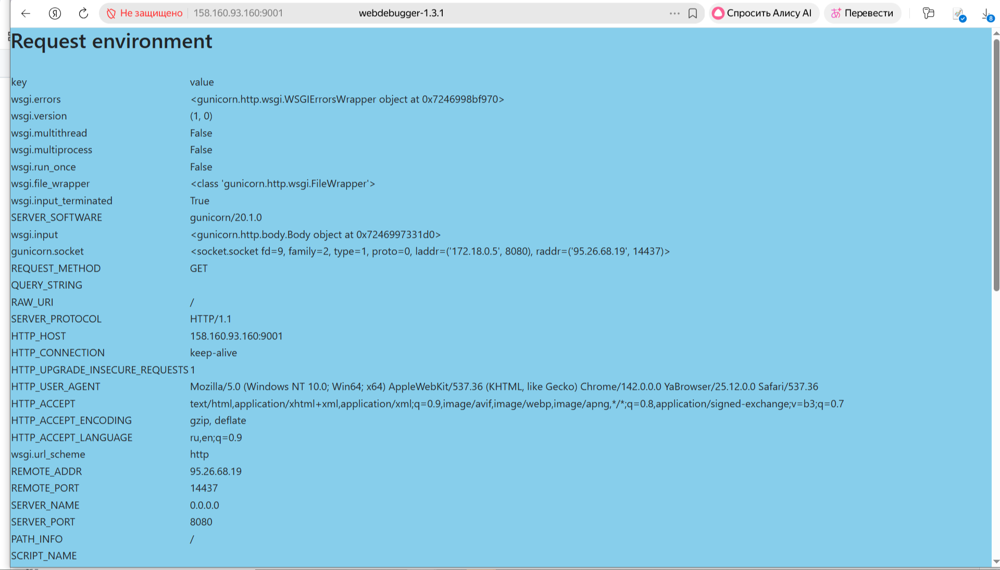
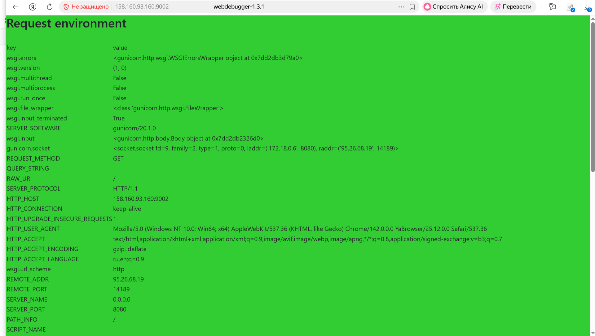
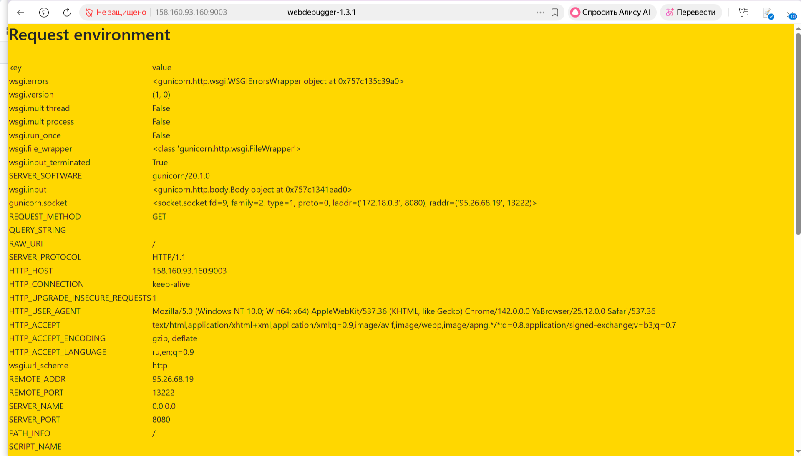

### Подготовительные шаги:

#### Шаг 1:
Создали ВМ в облаке.

#### Шаг 2: Устанавливаем docker,  docker-compose:

```
sudo apt-get update

sudo apt install docker.io
```
Добавим своего пользователя в группу docker чтобы можно было запускать команды без sudo:
```
sudo usermod -aG docker  zubahin
```

Для начала установим сам docker-compose
```
sudo apt install docker-compose
```

```
sudo apt update
```

#### Шаг 3: Копируем файлы из ДЗ по SFTP в домашнюю директорию (данные файлы потребуются для установки через docker-compose):

Создал папку project в домашней директории и скопировал туда файлы:
```
.dockerignore
.env
docker-compose.yml
```

#### Шаг 4: Правим YAML файл

###### Модифицированный YAML
<details>
    
```
version: '3'

services:
  debug-white:
    image: vscoder/webdebugger
    container_name: debug-white
    restart: unless-stopped
    environment:
      APP_DELAY: 0
      APP_PORT: 8080
      APP_BGCOLOR: white
    ports:
      - "9000:8080"
    networks:
      - app-network
  debug-blue:
    image: vscoder/webdebugger
    container_name: debug-blue
    restart: unless-stopped
    environment:
      APP_DELAY: 0
      APP_PORT: 8080
      APP_BGCOLOR: skyblue
    ports:
      - "9001:8080"
    networks:
      - app-network
  debug-green:
    image: vscoder/webdebugger
    container_name: debug-green
    restart: unless-stopped
    environment:
      APP_DELAY: 0
      APP_PORT: 8080
      APP_BGCOLOR: limegreen
    ports:
      - "9002:8080"     
    networks:
      - app-network      
  debug-gold:
    image: vscoder/webdebugger
    container_name: debug-gold
    restart: unless-stopped
    environment:
      APP_DELAY: 0
      APP_PORT: 8080
      APP_BGCOLOR: gold
    ports:
      - "9003:8080"
    networks:
      - app-network
  angie:
    image: docker.angie.software/angie:1.10.3-ubuntu
    container_name: angie
    restart: unless-stopped
    ports:
      - "80:80"
    networks:
      - app-network
networks:
  app-network:
    driver: bridge

```

</details>

Запускаем docker-compose
```
docker-compose up -d
```

копируем структуру каталогов на хостовую систему:

```
zubahin@compute-vm-lb:~$ sudo docker cp angie:/etc/angie/ ~/
Successfully copied 110kB to /home/zubahin/

zubahin@compute-vm-lb:~$ ls -la
total 48
drwxr-x--- 6 zubahin zubahin 4096 Feb  3 18:30 .
drwxr-xr-x 3 root    root    4096 Feb  3 09:50 ..
-rw------- 1 zubahin zubahin 4741 Feb  3 14:37 .bash_history
-rw-r--r-- 1 zubahin zubahin  220 Mar 31  2024 .bash_logout
-rw-r--r-- 1 zubahin zubahin 3771 Mar 31  2024 .bashrc
drwx------ 2 zubahin zubahin 4096 Feb  3 09:50 .cache
-rw-r--r-- 1 zubahin zubahin  807 Mar 31  2024 .profile
drwx------ 2 zubahin zubahin 4096 Feb  3 10:48 .ssh
-rw------- 1 zubahin zubahin 2815 Feb  3 18:19 .viminfo
drwxr-xr-x 5 root    root    4096 Nov 13 18:19 angie
drwxrwxr-x 2 zubahin zubahin 4096 Feb  3 18:18 projectmkdir angie

```
Выключаем docker-compose 

```
docker-compose down
```

Добавляем в YAML файл volumes:

<details>
    
```
version: '3'

services:
  debug-white:
    image: vscoder/webdebugger
    container_name: debug-white
    restart: unless-stopped
    environment:
      APP_DELAY: 0
      APP_PORT: 8080
      APP_BGCOLOR: white
    ports:
      - "9000:8080"
    networks:
      - app-network
  debug-blue:
    image: vscoder/webdebugger
    container_name: debug-blue
    restart: unless-stopped
    environment:
      APP_DELAY: 0
      APP_PORT: 8080
      APP_BGCOLOR: skyblue
    ports:
      - "9001:8080"
    networks:
      - app-network
  debug-green:
    image: vscoder/webdebugger
    container_name: debug-green
    restart: unless-stopped
    environment:
      APP_DELAY: 0
      APP_PORT: 8080
      APP_BGCOLOR: limegreen
    ports:
      - "9002:8080"     
    networks:
      - app-network      
  debug-gold:
    image: vscoder/webdebugger
    container_name: debug-gold
    restart: unless-stopped
    environment:
      APP_DELAY: 0
      APP_PORT: 8080
      APP_BGCOLOR: gold
    ports:
      - "9003:8080"
    networks:
      - app-network
  angie:
    image: docker.angie.software/angie:1.10.3-ubuntu
    container_name: angie
    restart: unless-stopped
    ports:
      - "80:80"
    volumes:
      - /home/zubahin/angie:/etc/angie:ro
    networks:
      - app-network

networks:
  app-network:
    driver: bridge

```

</details>

#### Шаг 5: Устанавливаем контейнеры в соответствии с YAML файлом:
```
docker-compose up -d
```

Как итог получаем:

```
zubahin@compute-vm-lb:~/project$ sudo docker ps -a
CONTAINER ID   IMAGE                                       COMMAND                  CREATED         STATUS         PORTS                                         NAMES
ef94b505722d   vscoder/webdebugger                         "gunicorn -w 1 --bin…"   3 minutes ago   Up 3 minutes   0.0.0.0:9002->8080/tcp, [::]:9002->8080/tcp   debug-green
46a88c9c5870   vscoder/webdebugger                         "gunicorn -w 1 --bin…"   3 minutes ago   Up 3 minutes   0.0.0.0:9003->8080/tcp, [::]:9003->8080/tcp   debug-gold
953ce9410f62   docker.angie.software/angie:1.10.3-ubuntu   "angie -g 'daemon of…"   3 minutes ago   Up 3 minutes   0.0.0.0:80->80/tcp, [::]:80->80/tcp           angie
bda983c19b42   vscoder/webdebugger                         "gunicorn -w 1 --bin…"   3 minutes ago   Up 3 minutes   0.0.0.0:9001->8080/tcp, [::]:9001->8080/tcp   debug-blue
27e44400620c   vscoder/webdebugger                         "gunicorn -w 1 --bin…"   3 minutes ago   Up 3 minutes   0.0.0.0:9000->8080/tcp, [::]:9000->8080/tcp   debug-white
```


#### Шаг 6: Настраиваем балансировщик:

Проверяем корректность каталогов на хостовой системе:

```
zubahin@compute-vm-lb:~/project$ cd ..
zubahin@compute-vm-lb:~$ cd angie/
zubahin@compute-vm-lb:~/angie$ ls -la
total 68
drwxr-xr-x 5 root    root     4096 Nov 13 18:19 .
drwxr-x--- 6 zubahin zubahin  4096 Feb  3 18:30 ..
-rw-r--r-- 1 root    root     5241 Aug 21 10:16 angie.conf
-rw-r--r-- 1 root    root     1077 Nov 12 21:04 fastcgi.conf
-rw-r--r-- 1 root    root     1007 Nov 12 21:04 fastcgi_params
drwxr-xr-x 2 root    root     4096 Nov 13 18:19 http.d
-rw-r--r-- 1 root    root     5354 Nov 12 21:04 mime.types
drwxr-xr-x 2 root    root     4096 Nov 13 18:19 modsecurity
lrwxrwxrwx 1 root    root       22 Nov 13 08:37 modules -> /usr/lib/angie/modules
-rw-r--r-- 1 root    root    15083 Nov 12 21:04 prometheus_all.conf
-rw-r--r-- 1 root    root      636 Nov 12 21:04 scgi_params
drwxr-xr-x 2 root    root     4096 Nov 13 18:19 stream.d
-rw-r--r-- 1 root    root      664 Nov 12 21:04 uwsgi_params

```

Вносить изменения в файл angie.conf не будем:
<details>
    
```
# package: angie-module-auth-jwt
#load_module modules/ngx_http_auth_jwt_module.so;

# package: angie-module-auth-ldap
#load_module modules/ngx_http_auth_ldap_module.so;

# package: angie-module-auth-pam
#load_module modules/ngx_http_auth_pam_module.so;

# package: angie-module-auth-spnego
#load_module modules/ngx_http_auth_spnego_module.so;

# package: angie-module-auth-totp
#load_module modules/ngx_http_auth_totp_module.so;

# package: angie-module-brotli
#load_module modules/ngx_http_brotli_filter_module.so;
#load_module modules/ngx_http_brotli_static_module.so;

# package: angie-module-cache-purge
#load_module modules/ngx_http_cache_purge_module.so;

# package: angie-module-cgi
#load_module modules/ngx_http_cgi_module.so;

# package: angie-module-combined-upstreams
#load_module modules/ngx_http_combined_upstreams_module.so;

# package: angie-module-dav-ext
#load_module modules/ngx_http_dav_ext_module.so;

# package: angie-module-dynamic-limit-req
#load_module modules/ngx_http_dynamic_limit_req_module.so;

# package: angie-module-echo
#load_module modules/ngx_http_echo_module.so;

# package: angie-module-enhanced-memcached
#load_module modules/ngx_http_enhanced_memcached_module.so;

# package: angie-module-eval
#load_module modules/ngx_http_eval_module.so;

# package: angie-module-geoip2
#load_module modules/ngx_http_geoip2_module.so;
#load_module modules/ngx_stream_geoip2_module.so;

# package: angie-module-headers-more
#load_module modules/ngx_http_headers_more_filter_module.so;

# package: angie-module-http-auth-radius
# uncommenting line below make sure you have configured 'radius_server'
#load_module modules/ngx_http_auth_radius_module.so;

# package: angie-module-image-filter
#load_module modules/ngx_http_image_filter_module.so;

# package: angie-module-keyval
#load_module modules/ngx_http_keyval_module.so;
#load_module modules/ngx_stream_keyval_module.so;

# package: angie-module-ndk
#load_module modules/ndk_http_module.so;

# package: angie-module-lua
#load_module modules/ngx_http_lua_module.so;
#load_module modules/ngx_stream_lua_module.so;

# package: angie-module-modsecurity
#load_module modules/ngx_http_modsecurity_module.so;

# package: angie-module-njs
#load_module modules/ngx_http_js_module.so;
#load_module modules/ngx_stream_js_module.so;

# package: angie-module-opentracing
#load_module modules/ngx_http_opentracing_module.so;

# package: angie-module-otel
#load_module modules/ngx_otel_module.so;

# package: angie-module-perl
#load_module modules/ngx_http_perl_module.so;

# package: angie-module-postgres
#load_module modules/ngx_postgres_module.so;

# package: angie-module-redis2
#load_module modules/ngx_http_redis2_module.so;

# package: angie-module-rtmp
#load_module modules/ngx_rtmp_module.so;

# package: angie-module-set-misc
#load_module modules/ngx_http_set_misc_module.so;

# package: angie-module-subs
#load_module modules/ngx_http_subs_filter_module.so;

# package: angie-module-testcookie
#load_module modules/ngx_http_testcookie_access_module.so;

# package: angie-module-unbrotli
# load_module modules/ngx_http_unbrotli_filter_module.so;

# package: angie-module-upload
#load_module modules/ngx_http_upload_module.so;

# package: angie-module-vod
#load_module modules/ngx_http_vod_module.so;

# package: angie-module-vts
#load_module modules/ngx_http_stream_server_traffic_status_module.so;
#load_module modules/ngx_http_vhost_traffic_status_module.so;
#load_module modules/ngx_stream_server_traffic_status_module.so

# package: angie-module-wasm
#load_module modules/ngx_wasm_module.so;
#load_module modules/ngx_wasm_core_module.so;
#load_module modules/ngx_http_wasm_host_module.so;
#load_module modules/ngx_wasmtime_module.so;

# package: angie-module-xslt
#load_module modules/ngx_http_xslt_filter_module.so;

# package: angie-module-zip
#load_module modules/ngx_http_zip_module.so;

# package: angie-module-zstd
#load_module modules/ngx_http_zstd_filter_module.so;
#load_module modules/ngx_http_zstd_static_module.so;

user  angie;
worker_processes  auto;
worker_rlimit_nofile 65536;

error_log  /var/log/angie/error.log notice;
pid        /run/angie/angie.pid;

events {
    worker_connections  65536;
}

http {
    include       /etc/angie/mime.types;
    default_type  application/octet-stream;

    log_format  main  '$remote_addr - $remote_user [$time_local] "$request" '
                      '$status $body_bytes_sent "$http_referer" '
                      '"$http_user_agent" "$http_x_forwarded_for"';

    log_format extended '$remote_addr - $remote_user [$time_local] "$request" '
                        '$status $body_bytes_sent "$http_referer" rt="$request_time" '
                        '"$http_user_agent" "$http_x_forwarded_for" '
                        'h="$host" sn="$server_name" ru="$request_uri" u="$uri" '
                        'ucs="$upstream_cache_status" ua="$upstream_addr" us="$upstream_status" '
                        'uct="$upstream_connect_time" urt="$upstream_response_time"';

    access_log  /var/log/angie/access.log  main;

    sendfile        on;
    #tcp_nopush     on;

    keepalive_timeout  65;

    #gzip  on;

    include /etc/angie/http.d/*.conf;
}

#stream {
#    include /etc/angie/stream.d/*.conf;
#}
```

</details>


Создаем доп. файл в http.d или правим существующий default.conf:
<details>
    
```

# Настройки балансировки
    upstream backend_pool {
        # Round-robin (по умолчанию)
        server 127.0.0.1:9000 sid=white;
        server 127.0.0.1:9001 sid=blue;
        server 127.0.0.1:9002 sid=green;
        server 127.0.0.1:9003 sid=gold;

server {
    listen       80;
    server_name  localhost 158.160.93.160;

    #access_log  /var/log/angie/host.access.log  main;

    location / {
        root   /usr/share/angie/html;
        index  index.html index.htm;
    }

    location /status/ {
        api     /status/;
        allow   127.0.0.1;
        deny    all;
    }
    location /test/ {
        # Проксирование на бекенд пул
        proxy_pass http://backend_pool;
    }

    #error_page  404              /404.html;

    # redirect server error pages to the static page /50x.html
    #
    error_page   500 502 503 504  /50x.html;
    location = /50x.html {
        root   /usr/share/angie/html;
    }

    # proxy the PHP scripts to Apache listening on 127.0.0.1:80
    #
    #location ~ \.php$ {
    #    proxy_pass   http://127.0.0.1;
    #}

    # pass the PHP scripts to FastCGI server listening on 127.0.0.1:9000
    #
    #location ~ \.php$ {
#    proxy_pass   http://127.0.0.1;
    #}

    # pass the PHP scripts to FastCGI server listening on 127.0.0.1:9000
    #
    #location ~ \.php$ {
    #    root           html;
    #    fastcgi_pass   127.0.0.1:9000;
    #    fastcgi_index  index.php;
    #    fastcgi_param  SCRIPT_FILENAME  /scripts$fastcgi_script_name;
    #    include        fastcgi_params;
    #}

    # deny access to .htaccess files, if Apache's document root
    # concurs with angie's one
    #
    #location ~ /\.ht {
    #    deny  all;
    #}
}
```

</details>

#### Шаг 7: Проверяем работу:

Сначала смотрим базовуб страничку:
http://158.160.93.160/ 


Идем по HTTP на внешний адрес http://158.160.93.160/ по портам 9000-9003:
http://158.160.93.160:9000 и так далее (проверяем что серверы доступны по прямым обращениям):









Далее пробуем обратится на location /test/:
http://158.160.93.160/test

##### И внезапно...  НИЧЕГО НЕ РАБОТАЕТ!
#####  Причина в том, что порт 9000 -выставлены на хостовой системе,а в докере (где Angie и находится в сети app_network) они слушают обращения на портах 8080.

#### Шаг 8: Меняем конфигурацию с учетом того, что Angie мы установили в Докере и снова проверяем работу:


правим существующий default.conf:
<details>
    
```

# Настройки балансировки
    upstream backend_pool {
    #Round-robin (по умолчанию)
    # Порт 8080 - внутренний порт контейнеров webdebugger так как они в одной сети с Angie, cнаружи они доступны по портам 9000-9003
    # 127.0.0.1 внутри контейнера Angie ≠ 127.0.0.1 на хосте!!!
    server debug-white:8080 sid=white;  # указываем прямо имена контейнеров (чтобы не привязываться к адресации в докере)
    server debug-blue:8080 sid=blue;    # указываем прямо имена контейнеров (чтобы не привязываться к адресации в докере)
    server debug-green:8080 sid=green;  # указываем прямо имена контейнеров (чтобы не привязываться к адресации в докере)
    server debug-gold:8080 sid=gold;    # указываем прямо имена контейнеров (чтобы не привязываться к адресации в докере)
}
server {
    listen       80;
    server_name  localhost 158.160.93.160;

    #access_log  /var/log/angie/host.access.log  main;

    location / {
        root   /usr/share/angie/html;
        index  index.html index.htm;
    }

    location /status/ {
        api     /status/;
        allow   127.0.0.1;
        deny    all;
    }
    location /test/ {
        # Проксирование на бекенд пул
        proxy_pass http://backend_pool;
    }

    #error_page  404              /404.html;

    # redirect server error pages to the static page /50x.html
    #
    error_page   500 502 503 504  /50x.html;
    location = /50x.html {
        root   /usr/share/angie/html;
    }

    # proxy the PHP scripts to Apache listening on 127.0.0.1:80
    #
    #location ~ \.php$ {
    #    proxy_pass   http://127.0.0.1;
    #}

    # pass the PHP scripts to FastCGI server listening on 127.0.0.1:9000
    #
    #location ~ \.php$ {
#    proxy_pass   http://127.0.0.1;
    #}

    # pass the PHP scripts to FastCGI server listening on 127.0.0.1:9000
    #
    #location ~ \.php$ {
    #    root           html;
    #    fastcgi_pass   127.0.0.1:9000;
    #    fastcgi_index  index.php;
    #    fastcgi_param  SCRIPT_FILENAME  /scripts$fastcgi_script_name;
    #    include        fastcgi_params;
    #}

    # deny access to .htaccess files, if Apache's document root
    # concurs with angie's one
    #
    #location ~ /\.ht {
    #    deny  all;
    #}
}
```

</details>

И теперь видим 


#### Шаг 9: Меняем конфигурацию добавляя проверки, slow start, переводим один из серверов в состояние down и создаем backup сервер:


правим существующий default.conf:
<details>
    
```

# Настройки балансировки
    upstream backend_pool {
    # Активные серверы
    server debug-white:8080 sid=white max_fails=3 fail_timeout=30s slow_start=60s;
    server debug-blue:8080 sid=blue max_fails=3 fail_timeout=30s slow_start=60s;

    # Отключенный сервер (временно выведен из ротации)
    server debug-green:8080 sid=green max_fails=3 fail_timeout=30s slow_start=60s down;

    # Резервный сервер
    server debug-gold:8080 sid=gold backup;
}
server {
    listen       80;
    server_name  localhost 158.160.93.160;

    #access_log  /var/log/angie/host.access.log  main;

    location / {
        root   /usr/share/angie/html;
        index  index.html index.htm;
    }

    location /status/ {
        api     /status/;
        allow   127.0.0.1;
        deny    all;
    }
    location /test/ {
        # Проксирование на бекенд пул
        proxy_pass http://backend_pool;
    }

    #error_page  404              /404.html;

    # redirect server error pages to the static page /50x.html
    #
    error_page   500 502 503 504  /50x.html;
    location = /50x.html {
        root   /usr/share/angie/html;
    }

    # proxy the PHP scripts to Apache listening on 127.0.0.1:80
    #
    #location ~ \.php$ {
    #    proxy_pass   http://127.0.0.1;
    #}

    # pass the PHP scripts to FastCGI server listening on 127.0.0.1:9000
    #
    #location ~ \.php$ {
#    proxy_pass   http://127.0.0.1;
    #}

    # pass the PHP scripts to FastCGI server listening on 127.0.0.1:9000
    #
    #location ~ \.php$ {
    #    root           html;
    #    fastcgi_pass   127.0.0.1:9000;
    #    fastcgi_index  index.php;
    #    fastcgi_param  SCRIPT_FILENAME  /scripts$fastcgi_script_name;
    #    include        fastcgi_params;
    #}

    # deny access to .htaccess files, if Apache's document root
    # concurs with angie's one
    #
    #location ~ /\.ht {
    #    deny  all;
    #}
}
```

</details>


### Поведение системы меняется! Тепер отображаются только страницы "белого" и "голубого" бэкендов пока они доступны.  если отключить их командой down или отключить контейнеры с ними, то срабатывает бэкап сервер и демонстрируется "золотой" сервер.  Причем открывается с задержкой (после неудачных попыток обращения к серверам как раньше):


#### Шаг 10: Hash балансировка по IP-адресу клиента (статичная балансировка по пользователям):

правим существующий default.conf:
<details>
    
```

# Настройки балансировки
    upstream backend_pool {
    hash $remote_addr consistent;  # Параметр consistent в hash-балансировке минимизирует перераспределение при изменении количества бэкендов
    # Активные серверы (убираем slow start)
    server debug-white:8080 sid=white max_fails=3 fail_timeout=30s;
    server debug-blue:8080 sid=blue max_fails=3 fail_timeout=30s;
    server debug-green:8080 sid=green max_fails=3 fail_timeout=30s;
    server debug-gold:8080 sid=gold max_fails=3 fail_timeout=30s;
}
server {
    listen       80;
    server_name  localhost 158.160.93.160;

    #access_log  /var/log/angie/host.access.log  main;

    location / {
        root   /usr/share/angie/html;
        index  index.html index.htm;
    }

    location /status/ {
        api     /status/;
        allow   127.0.0.1;
        deny    all;
    }
    location /test/ {
        # Проксирование на бекенд пул
        proxy_pass http://backend_pool;
    }

    #error_page  404              /404.html;

    # redirect server error pages to the static page /50x.html
    #
    error_page   500 502 503 504  /50x.html;
    location = /50x.html {
        root   /usr/share/angie/html;
    }

    # proxy the PHP scripts to Apache listening on 127.0.0.1:80
    #
    #location ~ \.php$ {
    #    proxy_pass   http://127.0.0.1;
    #}

    # pass the PHP scripts to FastCGI server listening on 127.0.0.1:9000
    #
    #location ~ \.php$ {
#    proxy_pass   http://127.0.0.1;
    #}

    # pass the PHP scripts to FastCGI server listening on 127.0.0.1:9000
    #
    #location ~ \.php$ {
    #    root           html;
    #    fastcgi_pass   127.0.0.1:9000;
    #    fastcgi_index  index.php;
    #    fastcgi_param  SCRIPT_FILENAME  /scripts$fastcgi_script_name;
    #    include        fastcgi_params;
    #}

    # deny access to .htaccess files, if Apache's document root
    # concurs with angie's one
    #
    #location ~ /\.ht {
    #    deny  all;
    #}
}
```

</details>

Теперь по IP адресу все время выдается один и тот же сервер (в моем случае "gold").

#### Шаг 11: Hash балансировка по cookie сессии (для sticky sessions):

правим существующий default.conf:
<details>
    
```

# Настройки балансировки
    upstream backend_pool {
    hash $cookie_jsessionid consistent; # Параметр consistent в hash-балансировке минимизирует перераспределение при изменении количества бэкендов
    # Активные серверы
    server debug-white:8080 sid=white max_fails=3 fail_timeout=30s;
    server debug-blue:8080 sid=blue max_fails=3 fail_timeout=30s;
    server debug-green:8080 sid=green max_fails=3 fail_timeout=30s;
    server debug-gold:8080 sid=gold max_fails=3 fail_timeout=30s;
}
server {
    listen       80;
    server_name  localhost 158.160.93.160;

    #access_log  /var/log/angie/host.access.log  main;

    location / {
        root   /usr/share/angie/html;
        index  index.html index.htm;
    }

    location /status/ {
        api     /status/;
        allow   127.0.0.1;
        deny    all;
    }
    location /test/ {
        # Проксирование на бекенд пул
        proxy_pass http://backend_pool;
    }

    #error_page  404              /404.html;

    # redirect server error pages to the static page /50x.html
    #
    error_page   500 502 503 504  /50x.html;
    location = /50x.html {
        root   /usr/share/angie/html;
    }

    # proxy the PHP scripts to Apache listening on 127.0.0.1:80
    #
    #location ~ \.php$ {
    #    proxy_pass   http://127.0.0.1;
    #}

    # pass the PHP scripts to FastCGI server listening on 127.0.0.1:9000
    #
    #location ~ \.php$ {
#    proxy_pass   http://127.0.0.1;
    #}

    # pass the PHP scripts to FastCGI server listening on 127.0.0.1:9000
    #
    #location ~ \.php$ {
    #    root           html;
    #    fastcgi_pass   127.0.0.1:9000;
    #    fastcgi_index  index.php;
    #    fastcgi_param  SCRIPT_FILENAME  /scripts$fastcgi_script_name;
    #    include        fastcgi_params;
    #}

    # deny access to .htaccess files, if Apache's document root
    # concurs with angie's one
    #
    #location ~ /\.ht {
    #    deny  all;
    #}
}
```

</details>

#### Шаг 11: Hash балансировка по User-Agent + IP (для балансировки по типам устройств)

правим существующий default.conf:
<details>
    
```

# Настройки балансировки
    upstream backend_pool {
    hash $http_user_agent$remote_addr; # 
    # Активные серверы
    server debug-white:8080 sid=white max_fails=3 fail_timeout=30s;
    server debug-blue:8080 sid=blue max_fails=3 fail_timeout=30s;
    server debug-green:8080 sid=green max_fails=3 fail_timeout=30s;
    server debug-gold:8080 sid=gold max_fails=3 fail_timeout=30s;
}
server {
    listen       80;
    server_name  localhost 158.160.93.160;

    #access_log  /var/log/angie/host.access.log  main;

    location / {
        root   /usr/share/angie/html;
        index  index.html index.htm;
    }

    location /status/ {
        api     /status/;
        allow   127.0.0.1;
        deny    all;
    }
    location /test/ {
        # Проксирование на бекенд пул
        proxy_pass http://backend_pool;
    }

    #error_page  404              /404.html;

    # redirect server error pages to the static page /50x.html
    #
    error_page   500 502 503 504  /50x.html;
    location = /50x.html {
        root   /usr/share/angie/html;
    }

    # proxy the PHP scripts to Apache listening on 127.0.0.1:80
    #
    #location ~ \.php$ {
    #    proxy_pass   http://127.0.0.1;
    #}

    # pass the PHP scripts to FastCGI server listening on 127.0.0.1:9000
    #
    #location ~ \.php$ {
#    proxy_pass   http://127.0.0.1;
    #}

    # pass the PHP scripts to FastCGI server listening on 127.0.0.1:9000
    #
    #location ~ \.php$ {
    #    root           html;
    #    fastcgi_pass   127.0.0.1:9000;
    #    fastcgi_index  index.php;
    #    fastcgi_param  SCRIPT_FILENAME  /scripts$fastcgi_script_name;
    #    include        fastcgi_params;
    #}

    # deny access to .htaccess files, if Apache's document root
    # concurs with angie's one
    #
    #location ~ /\.ht {
    #    deny  all;
    #}
}
```

</details>

ИТОГ:  с мобильного телефона открывается страничка "blue" c ПК "gold" хотя оба работают через один WiFi роутер (единый внешний IP)

#### Шаг 12: Random-балансировка 

правим существующий default.conf:
<details>
    
```

# Настройки балансировки
    upstream backend_pool {
    random; #  Random-балансировка
    # Активные серверы
    server debug-white:8080 sid=white max_fails=3 fail_timeout=30s;
    server debug-blue:8080 sid=blue max_fails=3 fail_timeout=30s;
    server debug-green:8080 sid=green max_fails=3 fail_timeout=30s;
    server debug-gold:8080 sid=gold max_fails=3 fail_timeout=30s;
}
server {
    listen       80;
    server_name  localhost 158.160.93.160;

    #access_log  /var/log/angie/host.access.log  main;

    location / {
        root   /usr/share/angie/html;
        index  index.html index.htm;
    }

    location /status/ {
        api     /status/;
        allow   127.0.0.1;
        deny    all;
    }
    location /test/ {
        # Проксирование на бекенд пул
        proxy_pass http://backend_pool;
    }

    #error_page  404              /404.html;

    # redirect server error pages to the static page /50x.html
    #
    error_page   500 502 503 504  /50x.html;
    location = /50x.html {
        root   /usr/share/angie/html;
    }

    # proxy the PHP scripts to Apache listening on 127.0.0.1:80
    #
    #location ~ \.php$ {
    #    proxy_pass   http://127.0.0.1;
    #}

    # pass the PHP scripts to FastCGI server listening on 127.0.0.1:9000
    #
    #location ~ \.php$ {
#    proxy_pass   http://127.0.0.1;
    #}

    # pass the PHP scripts to FastCGI server listening on 127.0.0.1:9000
    #
    #location ~ \.php$ {
    #    root           html;
    #    fastcgi_pass   127.0.0.1:9000;
    #    fastcgi_index  index.php;
    #    fastcgi_param  SCRIPT_FILENAME  /scripts$fastcgi_script_name;
    #    include        fastcgi_params;
    #}

    # deny access to .htaccess files, if Apache's document root
    # concurs with angie's one
    #
    #location ~ /\.ht {
    #    deny  all;
    #}
}
```

</details>

После применения конфигурации серверы сменяются "не по кругу" а в произвольном порядке. Проверено.
