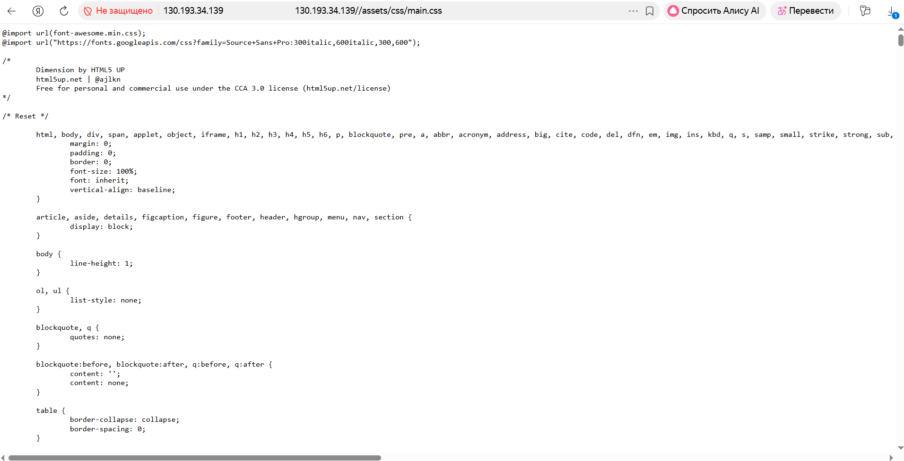
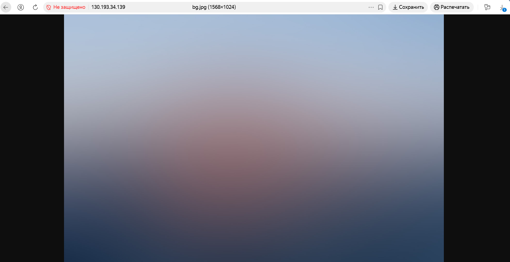

### Подготовительные шаги:

#### Шаг 1:
Устанавливаем пакет Angie на машину с Ubuntu:

```
zubahin@compute-vm-2-tls:~$ angie -v
Angie version: Angie/1.11.2
zubahin@compute-vm-2-tls:~$ sudo angie -t
angie: the configuration file /etc/angie/angie.conf syntax is ok
angie: configuration file /etc/angie/angie.conf test is successful
zubahin@compute-vm-2-tls:~$ 
```

#### Шаг 2: Настройка структуры каталогов

```
sudo mkdir -p /var/www/ip-ssl/html
sudo mkdir -p /etc/angie/sites-available
sudo mkdir -p /etc/angie/sites-enabled
sudo mkdir -p /etc/angie/ssl
```

#### Шаг 3: Создание тестовой страницы

```
sudo tee /var/www/ip-ssl/html/index.html <<EOF
<!DOCTYPE html>
<html>
<head>
    <title>IP SSL Test - $(hostname -I | awk '{print $1}')</title>
</head>
<body>
    <h1>SSL для IP-адреса работает!</h1>
    <p>IP: $(hostname -I | awk '{print $1}')</p>
    <p>Сервер: Angie</p>
    <p>Сертификат: Let's Encrypt (6 дней)</p>
</body>
</html>
EOF
```

##### Настройка прав для владельца www-data и группы www-datа
```
sudo chown -R www-data:www-data /var/www/ip-ssl
sudo chmod -R 755 /var/www/ip-ssl
```
 
#### Шаг 3 Вносим изменения в конфигурацию Angie

Резервное копирование конфигурации по умолчанию:
```
sudo mv /etc/angie/angie.conf /etc/angie/angie.conf.backup
```

Создание основной конфигурации

```
sudo tee /etc/angie/angie.conf <<EOF
user www-data;
worker_processes auto;
pid /var/run/angie.pid;

events {
    worker_connections 1024;
    multi_accept on;
    use epoll;
}

http {
    # Основные настройки
    sendfile on;
    tcp_nopush on;
    tcp_nodelay on;
    keepalive_timeout 65;
    types_hash_max_size 2048;
    server_tokens off;
    
    # MIME types
    include /etc/angie/mime.types;
    default_type application/octet-stream;
    
    # Логирование
    access_log /var/log/angie/access.log;
    error_log /var/log/angie/error.log;
    
    # Gzip сжатие
    gzip on;
    gzip_vary on;
    gzip_proxied any;
    gzip_comp_level 6;
    gzip_types text/plain text/css text/xml text/javascript 
               application/json application/javascript application/xml+rss 
               application/atom+xml image/svg+xml;
    
    # Включение сайтов
    include /etc/angie/sites-enabled/*;
}
EOF
```


/usr/share/angie/html/site/static_site/
##### Задание: Запустите приложенный из дополнительных материалов к занятию на сервере.
##### Для каждой директории создайте location со своими настройками. Отдельно создайте location c регулярным выражением для отдачи картинок jpg, jpeg, png, gif.

#### Шаг 3: Правим конфигурацию:

Вносим изменения в конфигурацию http.d\default.conf: 
```
server {
    listen       80;
    server_name  localhost;

    #access_log  /var/log/angie/host.access.log  main;

    location / {
        root   /usr/share/angie/html;
        index  index.html index.htm;
    }

    location /status/ {
        api     /status/;
        allow   127.0.0.1;
        deny    all;
    }

         location /site/ {
        alias /usr/share/angie/html/site/static_site/;
        index  index.html index.htm;
   }
     location /error/ {
        alias /usr/share/angie/html/site/static_site/error;
        index  index.html index.htm;
   }
     location /images/ {
        alias /usr/share/angie/html/site/static_site/images;
   }
     location /assets/css {
        alias /usr/share/angie/html/site/static_site/assets/css;
   }
     location /assets/fonts {
        alias /usr/share/angie/html/site/static_site/assets/fonts;
   }
     location /assets/js {
        alias /usr/share/angie/html/site/static_site/assets/js;
   }
location /assets/sass {
        alias /usr/share/angie/html/site/static_site/assets/sass;
   }
     location ~*\.(gif|jpg|jpeg|jiff)$ {
    root /usr/share/angie/html/site/static_site/images/;
    }
#error_page  404              /404.html;

    # redirect server error pages to the static page /50x.html
    #
    error_page   500 502 503 504  /50x.html;
    location = /50x.html {
        root   /usr/share/angie/html;
    }

    # proxy the PHP scripts to Apache listening on 127.0.0.1:80
    #
    #location ~ \.php$ {
    #    proxy_pass   http://127.0.0.1;
    #}

    # pass the PHP scripts to FastCGI server listening on 127.0.0.1:9000
    #
    #location ~ \.php$ {
    #    root           html;
    #    fastcgi_pass   127.0.0.1:9000;
    #    fastcgi_index  index.php;
    #    fastcgi_param  SCRIPT_FILENAME  /scripts$fastcgi_script_name;
    #    include        fastcgi_params;
    #}
# deny access to .htaccess files, if Apache's document root
    # concurs with angie's one
    #
    #location ~ /\.ht {
    #    deny  all;
    #}
}
```
### Проверяем, что получилось:

1) Обращение к сайту:
zubahin@compute-vm-angie01:~$ sudo curl http://127.0.0.1/site

<details>
```
zubahin@compute-vm-angie01:~$ sudo curl http://127.0.0.1/site
<html>
<head><title>301 Moved Permanently</title></head>
<body>
<center><h1>301 Moved Permanently</h1></center>
<hr><center>Angie/1.10.3</center>
</body>
</html>
zubahin@compute-vm-angie01:~$ sudo curl http://127.0.0.1/site/
<!DOCTYPE HTML>
<!--
        Dimension by HTML5 UP
        html5up.net | @ajlkn
        Free for personal and commercial use under the CCA 3.0 license (html5up.net/license)
-->
<html>
        <head>
                <title>Welcome</title>
                <meta charset="utf-8" />
                <meta name="viewport" content="width=device-width, initial-scale=1, user-scalable=no" />
                <link rel="stylesheet" href="/assets/css/main.css" />
                <!--[if lte IE 9]><link rel="stylesheet" href="/assets/css/ie9.css" /><![endif]-->
                <noscript><link rel="stylesheet" href="/assets/css/noscript.css" /></noscript>
        </head>
        <body>

                <!-- Wrapper -->
                        <div id="wrapper">

                                <!-- Header -->
                                        <header id="header">
                                                <div class="logo">
                                                        <span class="icon fa-diamond"></span>
                                                </div>
                                                <div class="content">
                                                        <div class="inner">
                                                                <h1>Dimension</h1>
                                                                <p><!--[-->A fully responsive site template designed by <a href="https://html5up.net">HTML5 UP</a> and released<!--]--><br />
                                                                <!--[-->for free under the <a href="https://html5up.net/license">Creative Commons</a> license.<!--]--></p>
                                                        </div>
                                                </div>
                                                <nav>
                                                        <ul>
                                                                <li><a href="#intro">Intro</a></li>
                                                                <li><a href="#work">Work</a></li>
                                                                <li><a href="#about">About</a></li>
                                                                <li><a href="#contact">Contact</a></li>
                                                                <!--<li><a href="#elements">Elements</a></li>-->
                                                        </ul>
                                                </nav>
                                        </header>

                                <!-- Main -->
                                        <div id="main">

                                                <!-- Intro -->
                                                        <article id="intro">
                                                                <h2 class="major">Intro</h2>
                                                                <span class="image main"></span>
                                                                <p>Aenean ornare velit lacus, ac varius enim ullamcorper eu. Proin aliquam facilisis ante interdum congue. Integer mollis, nisl amet convallis, porttitor magna ullamcorper, amet egestas mauris. Ut magna finibus nisi nec lacinia. Nam maximus erat id euismod egestas. By the way, check out my <a href="#work">awesome work</a>.</p>
                                                                <p>Lorem ipsum dolor sit amet, consectetur adipiscing elit. Duis dapibus rutrum facilisis. Class aptent taciti sociosqu ad litora torquent per conubia nostra, per inceptos himenaeos. Etiam tristique libero eu nibh porttitor fermentum. Nullam venenatis erat id vehicula viverra. Nunc ultrices eros ut ultricies condimentum. Mauris risus lacus, blandit sit amet venenatis non, bibendum vitae dolor. Nunc lorem mauris, fringilla in aliquam at, euismod in lectus. Pellentesque habitant morbi tristique senectus et netus et malesuada fames ac turpis egestas. In non lorem sit amet elit placerat maximus. Pellentesque aliquam maximus risus, vel sed vehicula.</p>
                                                        </article>

                                                <!-- Work -->
                                                        <article id="work">
                                                                <h2 class="major">Work</h2>
                                                                <span class="image main"></span>
                                                                <p>Adipiscing magna sed dolor elit. Praesent eleifend dignissim arcu, at eleifend sapien imperdiet ac. Aliquam erat volutpat. Praesent urna nisi, fringila lorem et vehicula lacinia quam. Integer sollicitudin mauris nec lorem luctus ultrices.</p>
                                                                <p>Nullam et orci eu lorem consequat tincidunt vivamus et sagittis libero. Mauris aliquet magna magna sed nunc rhoncus pharetra. Pellentesque condimentum sem. In efficitur ligula tate urna. Maecenas laoreet massa vel lacinia pellentesque lorem ipsum dolor. Nullam et orci eu lorem consequat tincidunt. Vivamus et sagittis libero. Mauris aliquet magna magna sed nunc rhoncus amet feugiat tempus.</p>
                                                        </article>

                                                <!-- About -->
                                                        <article id="about">
                                                                <h2 class="major">About</h2>
                                                                <span class="image main"></span>
                                                                <p>Lorem ipsum dolor sit amet, consectetur et adipiscing elit. Praesent eleifend dignissim arcu, at eleifend sapien imperdiet ac. Aliquam erat volutpat. Praesent urna nisi, fringila lorem et vehicula lacinia quam. Integer sollicitudin mauris nec lorem luctus ultrices. Aliquam libero et malesuada fames ac ante ipsum primis in faucibus. Cras viverra ligula sit amet ex mollis mattis lorem ipsum dolor sit amet.</p>
                                                        </article>

                                                <!-- Contact -->
                                                        <article id="contact">
                                                                <h2 class="major">Contact</h2>
                                                                <form method="post" action="#">
                                                                        <div class="field half first">
                                                                                <label for="name">Name</label>
                                                                                <input type="text" name="name" id="name" />
                                                                        </div>
                                                                        <div class="field half">
                                                                                <label for="email">Email</label>
                                                                                <input type="text" name="email" id="email" />
                                                                        </div>
                                                                        <div class="field">
                                                                                <label for="message">Message</label>
                                                                                <textarea name="message" id="message" rows="4"></textarea>
                                                                        </div>
                                                                        <ul class="actions">
                                                                                <li><input type="submit" value="Send Message" class="special" /></li>
                                                                                <li><input type="reset" value="Reset" /></li>
                                                                        </ul>
                                                                </form>
                                                                <ul class="icons">
                                                                        <li><a href="#" class="icon fa-twitter"><span class="label">Twitter</span></a></li>
                                                                        <li><a href="#" class="icon fa-facebook"><span class="label">Facebook</span></a></li>
                                                                        <li><a href="#" class="icon fa-instagram"><span class="label">Instagram</span></a></li>
                                                                        <li><a href="#" class="icon fa-github"><span class="label">GitHub</span></a></li>
                                                                </ul>
                                                        </article>

                                                <!-- Elements -->
                                                        <article id="elements">
                                                                <h2 class="major">Elements</h2>

                                                                <section>
                                                                        <h3 class="major">Text</h3>
                                                                        <p>This is <b>bold</b> and this is <strong>strong</strong>. This is <i>italic</i> and this is <em>emphasized</em>.
                                                                        This is <sup>superscript</sup> text and this is <sub>subscript</sub> text.
                                                                        This is <u>underlined</u> and this is code: <code>for (;;) { ... }</code>. Finally, <a href="#">this is a link</a>.</p>
                                                                        <hr />
                                                                        <h2>Heading Level 2</h2>
                                                                        <h3>Heading Level 3</h3>
                                                                        <h4>Heading Level 4</h4>
                                                                        <h5>Heading Level 5</h5>
                                                                        <h6>Heading Level 6</h6>
                                                                        <hr />
                                                                        <h4>Blockquote</h4>
                                                                        <blockquote>Fringilla nisl. Donec accumsan interdum nisi, quis tincidunt felis sagittis eget tempus euismod. Vestibulum ante ipsum primis in faucibus vestibulum. Blandit adipiscing eu felis iaculis volutpat ac adipiscing accumsan faucibus. Vestibulum ante ipsum primis in faucibus lorem ipsum dolor sit amet nullam adipiscing eu felis.</blockquote>
                                                                        <h4>Preformatted</h4>
                                                                        <pre><code>i = 0;

while (!deck.isInOrder()) {
    print 'Iteration ' + i;
    deck.shuffle();
    i++;
}

print 'It took ' + i + ' iterations to sort the deck.';</code></pre>
                                                                </section>

                                                                <section>
                                                                        <h3 class="major">Lists</h3>

                                                                        <h4>Unordered</h4>
                                                                        <ul>
                                                                                <li>Dolor pulvinar etiam.</li>
                                                                                <li>Sagittis adipiscing.</li>
                                                                                <li>Felis enim feugiat.</li>
                                                                        </ul>

                                                                        <h4>Alternate</h4>
                                                                        <ul class="alt">
                                                                                <li>Dolor pulvinar etiam.</li>
                                                                                <li>Sagittis adipiscing.</li>
                                                                                <li>Felis enim feugiat.</li>
                                                                        </ul>

                                                                        <h4>Ordered</h4>
                                                                        <ol>
                                                                                <li>Dolor pulvinar etiam.</li>
                                                                                <li>Etiam vel felis viverra.</li>
                                                                                <li>Felis enim feugiat.</li>
                                                                                <li>Dolor pulvinar etiam.</li>
                                                                                <li>Etiam vel felis lorem.</li>
                                                                                <li>Felis enim et feugiat.</li>
                                                                        </ol>
                                                                        <h4>Icons</h4>
                                                                        <ul class="icons">
                                                                                <li><a href="#" class="icon fa-twitter"><span class="label">Twitter</span></a></li>
                                                                                <li><a href="#" class="icon fa-facebook"><span class="label">Facebook</span></a></li>
                                                                                <li><a href="#" class="icon fa-instagram"><span class="label">Instagram</span></a></li>
                                                                                <li><a href="#" class="icon fa-github"><span class="label">Github</span></a></li>
                                                                        </ul>

                                                                        <h4>Actions</h4>
                                                                        <ul class="actions">
                                                                                <li><a href="#" class="button special">Default</a></li>
                                                                                <li><a href="#" class="button">Default</a></li>
                                                                        </ul>
                                                                        <ul class="actions vertical">
                                                                                <li><a href="#" class="button special">Default</a></li>
                                                                                <li><a href="#" class="button">Default</a></li>
                                                                        </ul>
                                                                </section>

                                                                <section>
                                                                        <h3 class="major">Table</h3>
                                                                        <h4>Default</h4>
                                                                        <div class="table-wrapper">
                                                                                <table>
                                                                                        <thead>
                                                                                                <tr>
                                                                                                        <th>Name</th>
                                                                                                        <th>Description</th>
                                                                                                        <th>Price</th>
                                                                                                </tr>
                                                                                        </thead>
                                                                                        <tbody>
                                                                                                <tr>
                                                                                                        <td>Item One</td>
                                                                                                        <td>Ante turpis integer aliquet porttitor.</td>
                                                                                                        <td>29.99</td>
                                                                                                </tr>
                                                                                                <tr>
                                                                                                        <td>Item Two</td>
                                                                                                        <td>Vis ac commodo adipiscing arcu aliquet.</td>
                                                                                                        <td>19.99</td>
                                                                                                </tr>
                                                                                                <tr>
                                                                                                        <td>Item Three</td>
                                                                                                        <td> Morbi faucibus arcu accumsan lorem.</td>
                                                                                                        <td>29.99</td>
                                                                                                </tr>
                                                                                                <tr>
                                                                                                        <td>Item Four</td>
                                                                                                        <td>Vitae integer tempus condimentum.</td>
                                                                                                        <td>19.99</td>
                                                                                                </tr>
                                                                                                <tr>
                                                                                                        <td>Item Five</td>
                                                                                                        <td>Ante turpis integer aliquet porttitor.</td>
                                                                                                        <td>29.99</td>
                                                                                                </tr>
                                                                                        </tbody>
                                                                                        <tfoot>
                                                                                                <tr>
                                                                                                        <td colspan="2"></td>
                                                                                                        <td>100.00</td>
                                                                                                </tr>
                                                                                        </tfoot>
                                                                                </table>
                                                                        </div>

                                                                        <h4>Alternate</h4>
                                                                        <div class="table-wrapper">
                                                                                <table class="alt">
                                                                                        <thead>
                                                                                                <tr>
                                                                                                        <th>Name</th>
                                                                                                        <th>Description</th>
                                                                                                        <th>Price</th>
                                                                                                </tr>
                                                                                        </thead>
                                                                                        <tbody>
                                                                                                <tr>
                                                                                                        <td>Item One</td>
                                                                                                        <td>Ante turpis integer aliquet porttitor.</td>
                                                                                                        <td>29.99</td>
                                                                                                </tr>
                                                                                                <tr>
                                                                                                        <td>Item Two</td>
                                                                                                        <td>Vis ac commodo adipiscing arcu aliquet.</td>
                                                                                                        <td>19.99</td>
                                                                                                </tr>
                                                                                                <tr>
                                                                                                        <td>Item Three</td>
                                                                                                        <td> Morbi faucibus arcu accumsan lorem.</td>
                                                                                                        <td>29.99</td>
                                                                                                </tr>
                                                                                                <tr>
                                                                                                        <td>Item Four</td>
                                                                                                        <td>Vitae integer tempus condimentum.</td>
                                                                                                        <td>19.99</td>
                                                                                                </tr>
                                                                                                <tr>
                                                                                                        <td>Item Five</td>
                                                                                                        <td>Ante turpis integer aliquet porttitor.</td>
                                                                                                        <td>29.99</td>
                                                                                                </tr>
                                                                                        </tbody>
                                                                                        <tfoot>
                                                                                                <tr>
                                                                                                        <td colspan="2"></td>
                                                                                                        <td>100.00</td>
                                                                                                </tr>
                                                                                        </tfoot>
                                                                                </table>
                                                                        </div>
                                                                </section>

                                                                <section>
                                                                        <h3 class="major">Buttons</h3>
                                                                        <ul class="actions">
                                                                                <li><a href="#" class="button special">Special</a></li>
                                                                                <li><a href="#" class="button">Default</a></li>
                                                                        </ul>
                                                                        <ul class="actions">
                                                                                <li><a href="#" class="button">Default</a></li>
                                                                                <li><a href="#" class="button small">Small</a></li>
                                                                        </ul>
                                                                        <ul class="actions">
                                                                                <li><a href="#" class="button special icon fa-download">Icon</a></li>
                                                                                <li><a href="#" class="button icon fa-download">Icon</a></li>
                                                                        </ul>
                                                                        <ul class="actions">
                                                                                <li><span class="button special disabled">Disabled</span></li>
                                                                                <li><span class="button disabled">Disabled</span></li>
                                                                        </ul>
                                                                </section>

                                                                <section>
                                                                        <h3 class="major">Form</h3>
                                                                        <form method="post" action="#">
                                                                                <div class="field half first">
                                                                                        <label for="demo-name">Name</label>
                                                                                        <input type="text" name="demo-name" id="demo-name" value="" placeholder="Jane Doe" />
                                                                                </div>
                                                                                <div class="field half">
                                                                                        <label for="demo-email">Email</label>
                                                                                        <input type="email" name="demo-email" id="demo-email" value="" placeholder="jane@untitled.tld" />
                                                                                </div>
                                                                                <div class="field">
                                                                                        <label for="demo-category">Category</label>
                                                                                        <div class="select-wrapper">
                                                                                                <select name="demo-category" id="demo-category">
                                                                                                        <option value="">-</option>
                                                                                                        <option value="1">Manufacturing</option>
                                                                                                        <option value="1">Shipping</option>
                                                                                                        <option value="1">Administration</option>
                                                                                                        <option value="1">Human Resources</option>
                                                                                                </select>
                                                                                        </div>
                                                                                </div>
                                                                                <div class="field half first">
                                                                                        <input type="radio" id="demo-priority-low" name="demo-priority" checked>
                                                                                        <label for="demo-priority-low">Low</label>
                                                                                </div>
                                                                                <div class="field half">
                                                                                        <input type="radio" id="demo-priority-high" name="demo-priority">
                                                                                        <label for="demo-priority-high">High</label>
                                                                                </div>
                                                                                <div class="field half first">
                                                                                        <input type="checkbox" id="demo-copy" name="demo-copy">
                                                                                        <label for="demo-copy">Email me a copy</label>
                                                                                </div>
                                                                                <div class="field half">
                                                                                        <input type="checkbox" id="demo-human" name="demo-human" checked>
                                                                                        <label for="demo-human">Not a robot</label>
                                                                                </div>
                                                                                <div class="field">
                                                                                        <label for="demo-message">Message</label>
                                                                                        <textarea name="demo-message" id="demo-message" placeholder="Enter your message" rows="6"></textarea>
                                                                                </div>
                                                                                <ul class="actions">
                                                                                        <li><input type="submit" value="Send Message" class="special" /></li>
                                                                                        <li><input type="reset" value="Reset" /></li>
                                                                                </ul>
                                                                        </form>
                                                                </section>

                                                        </article>

                                        </div>

                                <!-- Footer -->
                                        <footer id="footer">
                                                <p class="copyright">&copy; Untitled. Design: <a href="https://html5up.net">HTML5 UP</a>.</p>
                                        </footer>

                        </div>

                <!-- BG -->
                        <div id="bg"></div>

                <!-- Scripts -->
                        <script src="/assets/js/jquery.min.js"></script>
                        <script src="/assets/js/skel.min.js"></script>
                        <script src="/assets/js/util.js"></script>
                        <script src="/assets/js/main.js"></script>

        </body>
</html>
```
</details>

2) Попробуем сходить в какую-нибудь папку:


3) А теперь обращения к картинкам:


   


### Задание: Задействуйте переменные, определённые с map для работы с location.
### Настройте два вида перенаправлений (301/302 и внутренние).

#### Шаг 4.  Для начала внесем изменения в файл hosts на локальном сервере:
Добавим записи для example.com, www.test.com. mysite  и test.com

```
# Your system has configured 'manage_etc_hosts' as True.
# As a result, if you wish for changes to this file to persist
# then you will need to either
# a.) make changes to the master file in /etc/cloud/templates/hosts.debian.tmpl
# b.) change or remove the value of 'manage_etc_hosts' in
#     /etc/cloud/cloud.cfg or cloud-config from user-data
#
127.0.1.1 compute-vm-angie01.ru-central1.internal compute-vm-angie01
127.0.0.1 localhost
127.0.0.1 example.com
127.0.0.1 test.com
127.0.0.1 www.test.com
127.0.0.1 mysite.com
# The following lines are desirable for IPv6 capable hosts
::1 localhost ip6-localhost ip6-loopback
ff02::1 ip6-allnodes
ff02::2 ip6-allrouters
```

#### Шаг 5.  Добавляем настройки в angie.conf:

<details>
    
```
user  angie;
worker_processes  auto;
worker_rlimit_nofile 65536;

error_log  /var/log/angie/error.log notice;
pid        /run/angie.pid;

events {
    worker_connections  65536;
}


http {
    include       /etc/angie/mime.types;
    default_type  application/octet-stream;

    log_format  main  '$remote_addr - $remote_user [$time_local] "$request" '
                      '$status $body_bytes_sent "$http_referer" '
                      '"$http_user_agent" "$http_x_forwarded_for"';

    log_format extended '$remote_addr - $remote_user [$time_local] "$request" '
                        '$status $body_bytes_sent "$http_referer" rt="$request_time" '
                        '"$http_user_agent" "$http_x_forwarded_for" '
                        'h="$host" sn="$server_name" ru="$request_uri" u="$uri" '
                        'ucs="$upstream_cache_status" ua="$upstream_addr" us="$upstream_status" '
                        'uct="$upstream_connect_time" urt="$upstream_response_time"';

    access_log  /var/log/angie/access.log  main;

    sendfile        on;
    #tcp_nopush     on;
        keepalive_timeout  65;

    #gzip  on;

    include /etc/angie/http.d/*.conf;

map $remote_addr $user_agent_header {
    default "No user agent info - Untrusted IP";
    127.0.0.1 "User-agent is from a trusted IP-Thats I am";
}
server {
    listen 80;
    server_name example.com;
    add_header X-Custom-Header $user_agent_header always;

    location / {
        return 200 "Custom header added\n";
  }
}

server {
    listen 80;
    server_name test.com;
    return 301 $scheme://localhost$request_uri;
location /site {
        alias /usr/share/angie/html/site/static_site/;
        index  index.html index.htm;
    }
     }
server {
    listen 80;
    server_name www.test.com;
    return 400 "Bad Request";
  }
}
#stream {
#    include /etc/angie/stream.d/*.conf;
#} 

```
</details>

#### Шаг 6.  Смотрим, что получилось:

zubahin@compute-vm-angie01:~$ sudo curl -i http://test.com/site

```
zubahin@compute-vm-angie01:~$ sudo curl -i http://test.com/site
HTTP/1.1 301 Moved Permanently
Server: Angie/1.10.3
Date: Tue, 02 Dec 2025 09:29:27 GMT
Content-Type: text/html
Content-Length: 169
Connection: keep-alive
Location: http://localhost/site

<html>
<head><title>301 Moved Permanently</title></head>
<body>
<center><h1>301 Moved Permanently</h1></center>
<hr><center>Angie/1.10.3</center>
</body>
</html>
```

zubahin@compute-vm-angie01:~$ sudo curl -L http://test.com/site

<details>
    
```
zubahin@compute-vm-angie01:~$ sudo curl -L http://test.com/site
<!DOCTYPE HTML>
<!--
        Dimension by HTML5 UP
        html5up.net | @ajlkn
        Free for personal and commercial use under the CCA 3.0 license (html5up.net/license)
-->
<html>
        <head>
                <title>Welcome</title>
                <meta charset="utf-8" />
                <meta name="viewport" content="width=device-width, initial-scale=1, user-scalable=no" />
                <link rel="stylesheet" href="/assets/css/main.css" />
                <!--[if lte IE 9]><link rel="stylesheet" href="/assets/css/ie9.css" /><![endif]-->
                <noscript><link rel="stylesheet" href="/assets/css/noscript.css" /></noscript>
        </head>
        <body>

                <!-- Wrapper -->
                        <div id="wrapper">

                                <!-- Header -->
                                        <header id="header">
                                                <div class="logo">
                                                        <span class="icon fa-diamond"></span>
                                                </div>
                                                <div class="content">
                                                        <div class="inner">
                                                                <h1>Dimension</h1>
                                                                <p><!--[-->A fully responsive site template designed by <a href="https://html5up.net">HTML5 UP</a> and released<!--]--><br />
                                                                <!--[-->for free under the <a href="https://html5up.net/license">Creative Commons</a> license.<!--]--></p>
                                                        </div>
                                                </div>
                                                <nav>
                                                        <ul>
                                                                <li><a href="#intro">Intro</a></li>
                                                                <li><a href="#work">Work</a></li>
                                                                <li><a href="#about">About</a></li>
                                                                <li><a href="#contact">Contact</a></li>
                                                                <!--<li><a href="#elements">Elements</a></li>-->
                                                        </ul>
                                                </nav>
                                        </header>

                                <!-- Main -->
                                        <div id="main">

                                                <!-- Intro -->
                                                        <article id="intro">
                                                                <h2 class="major">Intro</h2>
                                                                <span class="image main"></span>
                                                                <p>Aenean ornare velit lacus, ac varius enim ullamcorper eu. Proin aliquam facilisis ante interdum congue. Integer mollis, nisl amet convallis, porttitor magna ullamcorper, amet egestas mauris. Ut magna finibus nisi nec lacinia. Nam maximus erat id euismod egestas. By the way, check out my <a href="#work">awesome work</a>.</p>
                                                                <p>Lorem ipsum dolor sit amet, consectetur adipiscing elit. Duis dapibus rutrum facilisis. Class aptent taciti sociosqu ad litora torquent per conubia nostra, per inceptos himenaeos. Etiam tristique libero eu nibh porttitor fermentum. Nullam venenatis erat id vehicula viverra. Nunc ultrices eros ut ultricies condimentum. Mauris risus lacus, blandit sit amet venenatis non, bibendum vitae dolor. Nunc lorem mauris, fringilla in aliquam at, euismod in lectus. Pellentesque habitant morbi tristique senectus et netus et malesuada fames ac turpis egestas. In non lorem sit amet elit placerat maximus. Pellentesque aliquam maximus risus, vel sed vehicula.</p>
                                                        </article>

                                                <!-- Work -->
                                                        <article id="work">
                                                                <h2 class="major">Work</h2>
                                                                <span class="image main"></span>
                                                                <p>Adipiscing magna sed dolor elit. Praesent eleifend dignissim arcu, at eleifend sapien imperdiet ac. Aliquam erat volutpat. Praesent urna nisi, fringila lorem et vehicula lacinia quam. Integer sollicitudin mauris nec lorem luctus ultrices.</p>
                                                                <p>Nullam et orci eu lorem consequat tincidunt vivamus et sagittis libero. Mauris aliquet magna magna sed nunc rhoncus pharetra. Pellentesque condimentum sem. In efficitur ligula tate urna. Maecenas laoreet massa vel lacinia pellentesque lorem ipsum dolor. Nullam et orci eu lorem consequat tincidunt. Vivamus et sagittis libero. Mauris aliquet magna magna sed nunc rhoncus amet feugiat tempus.</p>
                                                        </article>

                                                <!-- About -->
                                                        <article id="about">
                                                                <h2 class="major">About</h2>
                                                                <span class="image main"></span>
                                                                <p>Lorem ipsum dolor sit amet, consectetur et adipiscing elit. Praesent eleifend dignissim arcu, at eleifend sapien imperdiet ac. Aliquam erat volutpat. Praesent urna nisi, fringila lorem et vehicula lacinia quam. Integer sollicitudin mauris nec lorem luctus ultrices. Aliquam libero et malesuada fames ac ante ipsum primis in faucibus. Cras viverra ligula sit amet ex mollis mattis lorem ipsum dolor sit amet.</p>
                                                        </article>

                                                <!-- Contact -->
                                                        <article id="contact">
                                                                <h2 class="major">Contact</h2>
                                                                <form method="post" action="#">
                                                                        <div class="field half first">
                                                                                <label for="name">Name</label>
                                                                                <input type="text" name="name" id="name" />
                                                                        </div>
                                                                        <div class="field half">
                                                                                <label for="email">Email</label>
                                                                                <input type="text" name="email" id="email" />
                                                                        </div>
                                                                        <div class="field">
                                                                                <label for="message">Message</label>
                                                                                <textarea name="message" id="message" rows="4"></textarea>
                                                                        </div>
                                                                        <ul class="actions">
                                                                                <li><input type="submit" value="Send Message" class="special" /></li>
                                                                                <li><input type="reset" value="Reset" /></li>
                                                                        </ul>
                                                                </form>
                                                                <ul class="icons">
                                                                        <li><a href="#" class="icon fa-twitter"><span class="label">Twitter</span></a></li>
                                                                        <li><a href="#" class="icon fa-facebook"><span class="label">Facebook</span></a></li>
                                                                        <li><a href="#" class="icon fa-instagram"><span class="label">Instagram</span></a></li>
                                                                        <li><a href="#" class="icon fa-github"><span class="label">GitHub</span></a></li>
                                                                </ul>
                                                        </article>

                                                <!-- Elements -->
                                                        <article id="elements">
                                                                <h2 class="major">Elements</h2>

                                                                <section>
                                                                        <h3 class="major">Text</h3>
                                                                        <p>This is <b>bold</b> and this is <strong>strong</strong>. This is <i>italic</i> and this is <em>emphasized</em>.
                                                                        This is <sup>superscript</sup> text and this is <sub>subscript</sub> text.
                                                                        This is <u>underlined</u> and this is code: <code>for (;;) { ... }</code>. Finally, <a href="#">this is a link</a>.</p>
                                                                        <hr />
                                                                        <h2>Heading Level 2</h2>
                                                                        <h3>Heading Level 3</h3>
                                                                        <h4>Heading Level 4</h4>
                                                                        <h5>Heading Level 5</h5>
                                                                        <h6>Heading Level 6</h6>
                                                                        <hr />
                                                                        <h4>Blockquote</h4>
                                                                        <blockquote>Fringilla nisl. Donec accumsan interdum nisi, quis tincidunt felis sagittis eget tempus euismod. Vestibulum ante ipsum primis in faucibus vestibulum. Blandit adipiscing eu felis iaculis volutpat ac adipiscing accumsan faucibus. Vestibulum ante ipsum primis in faucibus lorem ipsum dolor sit amet nullam adipiscing eu felis.</blockquote>
                                                                        <h4>Preformatted</h4>
                                                                        <pre><code>i = 0;

while (!deck.isInOrder()) {
    print 'Iteration ' + i;
    deck.shuffle();
    i++;
}

print 'It took ' + i + ' iterations to sort the deck.';</code></pre>
                                                                </section>

                                                                <section>
                                                                        <h3 class="major">Lists</h3>

                                                                        <h4>Unordered</h4>
                                                                        <ul>
                                                                                <li>Dolor pulvinar etiam.</li>
                                                                                <li>Sagittis adipiscing.</li>
                                                                                <li>Felis enim feugiat.</li>
                                                                        </ul>

                                                                        <h4>Alternate</h4>
                                                                        <ul class="alt">
                                                                                <li>Dolor pulvinar etiam.</li>
                                                                                <li>Sagittis adipiscing.</li>
                                                                                <li>Felis enim feugiat.</li>
                                                                        </ul>

                                                                        <h4>Ordered</h4>
                                                                        <ol>
                                                                                <li>Dolor pulvinar etiam.</li>
                                                                                <li>Etiam vel felis viverra.</li>
                                                                                <li>Felis enim feugiat.</li>
                                                                                <li>Dolor pulvinar etiam.</li>
                                                                                <li>Etiam vel felis lorem.</li>
                                                                                <li>Felis enim et feugiat.</li>
                                                                        </ol>
                                                                        <h4>Icons</h4>
                                                                        <ul class="icons">
                                                                                <li><a href="#" class="icon fa-twitter"><span class="label">Twitter</span></a></li>
                                                                                <li><a href="#" class="icon fa-facebook"><span class="label">Facebook</span></a></li>
                                                                                <li><a href="#" class="icon fa-instagram"><span class="label">Instagram</span></a></li>
                                                                                <li><a href="#" class="icon fa-github"><span class="label">Github</span></a></li>
                                                                        </ul>

                                                                        <h4>Actions</h4>
                                                                        <ul class="actions">
                                                                                <li><a href="#" class="button special">Default</a></li>
                                                                                <li><a href="#" class="button">Default</a></li>
                                                                        </ul>
                                                                        <ul class="actions vertical">
                                                                                <li><a href="#" class="button special">Default</a></li>
                                                                                <li><a href="#" class="button">Default</a></li>
                                                                        </ul>
                                                                </section>

                                                                <section>
                                                                        <h3 class="major">Table</h3>
                                                                        <h4>Default</h4>
                                                                        <div class="table-wrapper">
                                                                                <table>
                                                                                        <thead>
                                                                                                <tr>
                                                                                                        <th>Name</th>
                                                                                                        <th>Description</th>
                                                                                                        <th>Price</th>
                                                                                                </tr>
                                                                                        </thead>
                                                                                        <tbody>
                                                                                                <tr>
                                                                                                        <td>Item One</td>
                                                                                                        <td>Ante turpis integer aliquet porttitor.</td>
                                                                                                        <td>29.99</td>
                                                                                                </tr>
                                                                                                <tr>
                                                                                                        <td>Item Two</td>
                                                                                                        <td>Vis ac commodo adipiscing arcu aliquet.</td>
                                                                                                        <td>19.99</td>
                                                                                                </tr>
                                                                                                <tr>
                                                                                                        <td>Item Three</td>
                                                                                                        <td> Morbi faucibus arcu accumsan lorem.</td>
                                                                                                        <td>29.99</td>
                                                                                                </tr>
                                                                                                <tr>
                                                                                                        <td>Item Four</td>
                                                                                                        <td>Vitae integer tempus condimentum.</td>
                                                                                                        <td>19.99</td>
                                                                                                </tr>
                                                                                                <tr>
                                                                                                        <td>Item Five</td>
                                                                                                        <td>Ante turpis integer aliquet porttitor.</td>
                                                                                                        <td>29.99</td>
                                                                                                </tr>
                                                                                        </tbody>
                                                                                        <tfoot>
                                                                                                <tr>
                                                                                                        <td colspan="2"></td>
                                                                                                        <td>100.00</td>
                                                                                                </tr>
                                                                                        </tfoot>
                                                                                </table>
                                                                        </div>

                                                                        <h4>Alternate</h4>
                                                                        <div class="table-wrapper">
                                                                                <table class="alt">
                                                                                        <thead>
                                                                                                <tr>
                                                                                                        <th>Name</th>
                                                                                                        <th>Description</th>
                                                                                                        <th>Price</th>
                                                                                                </tr>
                                                                                        </thead>
                                                                                        <tbody>
                                                                                                <tr>
                                                                                                        <td>Item One</td>
                                                                                                        <td>Ante turpis integer aliquet porttitor.</td>
                                                                                                        <td>29.99</td>
                                                                                                </tr>
                                                                                                <tr>
                                                                                                        <td>Item Two</td>
                                                                                                        <td>Vis ac commodo adipiscing arcu aliquet.</td>
                                                                                                        <td>19.99</td>
                                                                                                </tr>
                                                                                                <tr>
                                                                                                        <td>Item Three</td>
                                                                                                        <td> Morbi faucibus arcu accumsan lorem.</td>
                                                                                                        <td>29.99</td>
                                                                                                </tr>
                                                                                                <tr>
                                                                                                        <td>Item Four</td>
                                                                                                        <td>Vitae integer tempus condimentum.</td>
                                                                                                        <td>19.99</td>
                                                                                                </tr>
                                                                                                <tr>
                                                                                                        <td>Item Five</td>
                                                                                                        <td>Ante turpis integer aliquet porttitor.</td>
                                                                                                        <td>29.99</td>
                                                                                                </tr>
                                                                                        </tbody>
                                                                                        <tfoot>
                                                                                                <tr>
                                                                                                        <td colspan="2"></td>
                                                                                                        <td>100.00</td>
                                                                                                </tr>
                                                                                        </tfoot>
                                                                                </table>
                                                                        </div>
                                                                </section>

                                                                <section>
                                                                        <h3 class="major">Buttons</h3>
                                                                        <ul class="actions">
                                                                                <li><a href="#" class="button special">Special</a></li>
                                                                                <li><a href="#" class="button">Default</a></li>
                                                                        </ul>
                                                                        <ul class="actions">
                                                                                <li><a href="#" class="button">Default</a></li>
                                                                                <li><a href="#" class="button small">Small</a></li>
                                                                        </ul>
                                                                        <ul class="actions">
                                                                                <li><a href="#" class="button special icon fa-download">Icon</a></li>
                                                                                <li><a href="#" class="button icon fa-download">Icon</a></li>
                                                                        </ul>
                                                                        <ul class="actions">
                                                                                <li><span class="button special disabled">Disabled</span></li>
                                                                                <li><span class="button disabled">Disabled</span></li>
                                                                        </ul>
                                                                </section>

                                                                <section>
                                                                        <h3 class="major">Form</h3>
                                                                        <form method="post" action="#">
                                                                                <div class="field half first">
                                                                                        <label for="demo-name">Name</label>
                                                                                        <input type="text" name="demo-name" id="demo-name" value="" placeholder="Jane Doe" />
                                                                                </div>
                                                                                <div class="field half">
                                                                                        <label for="demo-email">Email</label>
                                                                                        <input type="email" name="demo-email" id="demo-email" value="" placeholder="jane@untitled.tld" />
                                                                                </div>
                                                                                <div class="field">
                                                                                        <label for="demo-category">Category</label>
                                                                                        <div class="select-wrapper">
                                                                                                <select name="demo-category" id="demo-category">
                                                                                                        <option value="">-</option>
                                                                                                        <option value="1">Manufacturing</option>
                                                                                                        <option value="1">Shipping</option>
                                                                                                        <option value="1">Administration</option>
                                                                                                        <option value="1">Human Resources</option>
                                                                                                </select>
                                                                                        </div>
                                                                                </div>
                                                                                <div class="field half first">
                                                                                        <input type="radio" id="demo-priority-low" name="demo-priority" checked>
                                                                                        <label for="demo-priority-low">Low</label>
                                                                                </div>
                                                                                <div class="field half">
                                                                                        <input type="radio" id="demo-priority-high" name="demo-priority">
                                                                                        <label for="demo-priority-high">High</label>
                                                                                </div>
                                                                                <div class="field half first">
                                                                                        <input type="checkbox" id="demo-copy" name="demo-copy">
                                                                                        <label for="demo-copy">Email me a copy</label>
                                                                                </div>
                                                                                <div class="field half">
                                                                                        <input type="checkbox" id="demo-human" name="demo-human" checked>
                                                                                        <label for="demo-human">Not a robot</label>
                                                                                </div>
                                                                                <div class="field">
                                                                                        <label for="demo-message">Message</label>
                                                                                        <textarea name="demo-message" id="demo-message" placeholder="Enter your message" rows="6"></textarea>
                                                                                </div>
                                                                                <ul class="actions">
                                                                                        <li><input type="submit" value="Send Message" class="special" /></li>
                                                                                        <li><input type="reset" value="Reset" /></li>
                                                                                </ul>
                                                                        </form>
                                                                </section>

                                                        </article>

                                        </div>

                                <!-- Footer -->
                                        <footer id="footer">
                                                <p class="copyright">&copy; Untitled. Design: <a href="https://html5up.net">HTML5 UP</a>.</p>
                                        </footer>

                        </div>

                <!-- BG -->
                        <div id="bg"></div>

                <!-- Scripts -->
                        <script src="/assets/js/jquery.min.js"></script>
                        <script src="/assets/js/skel.min.js"></script>
                        <script src="/assets/js/util.js"></script>
                        <script src="/assets/js/main.js"></script>

        </body>
</html>

```
</details>

Обратимся к example.com
zubahin@compute-vm-angie01:~$ sudo curl -i http://example.com

```
zubahin@compute-vm-angie01:~$ sudo curl -i http://example.com
HTTP/1.1 200 OK
Server: Angie/1.10.3
Date: Tue, 02 Dec 2025 09:33:40 GMT
Content-Type: application/octet-stream
Content-Length: 20
Connection: keep-alive
X-Custom-Header: User-agent is from a trusted IP-Thats I am

Custom header added
```

Обратимся к www.test.com
```
zubahin@compute-vm-angie01:~$ sudo curl -i http://www.test.com
HTTP/1.1 400 Bad Request
Server: Angie/1.10.3
Date: Tue, 02 Dec 2025 09:34:35 GMT
Content-Type: application/octet-stream
Content-Length: 11
Connection: keep-alive

Bad Requestzubahin@compute-vm-angie01:~$
```
