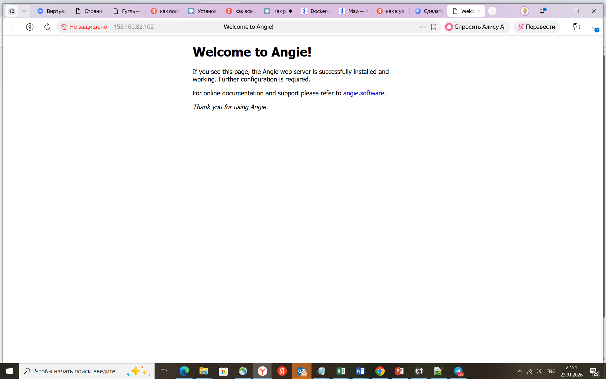
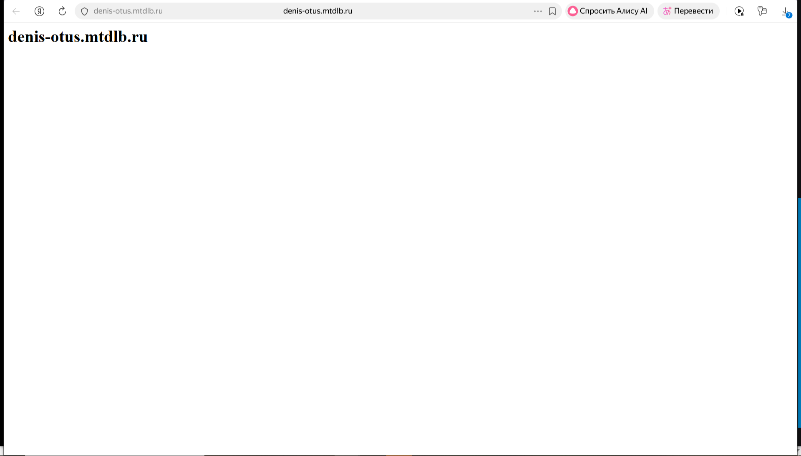

### Подготовительные шаги:

#### Шаг 1:
Устанавливаем пакет Angie на машину с Ubuntu:

```
sudo apt-get update
sudo apt-get install -y ca-certificates curl
```

Скачайте открытый ключ репозитория Angie для проверки подлинности пакетов:
```
sudo curl -o /etc/apt/trusted.gpg.d/angie-signing.gpg \
            https://angie.software/keys/angie-signing.gpg
```
Подключите репозиторий Angie:
```
echo "deb https://download.angie.software/angie/$(. /etc/os-release && echo "$ID/$VERSION\_ID $VERSION\_CODENAME") main" \\ | sudo tee /etc/apt/sources.list.d/angie.list > /dev/null
```
Обновите индексы репозиториев:
```
sudo apt-get update
```
Установите пакет Angie:
```
sudo apt-get install -y angie
```
Проверяем установку:
```
zubahin@compute-vm-2-tls:~$ angie -v
Angie version: Angie/1.11.2
zubahin@compute-vm-2-tls:~$ sudo angie -t
angie: the configuration file /etc/angie/angie.conf syntax is ok
angie: configuration file /etc/angie/angie.conf test is successful
zubahin@compute-vm-2-tls:~$ 
```

#### Шаг 2: Установка certbot через snap (рекомендуется Let's Encrypt)

Сначала ставим Snap и из него certbot, делаем ссылку в /usr/bin
```
sudo apt install snap
sudo apt install snapd

sudo snap install core
sudo snap refresh core

sudo snap install --classic certbot

sudo ln -s /snap/bin/certbot /usr/bin/certbot
```
Проверяем версию certbot:

```
zubahin@compute-vm-3:~$ certbot --version
certbot 5.2.2
```

#### Шаг 3: Настройка сайта в Angie (тестовая страница) для HTTP-валидации

Создаем директорию для сайта и для ACME
```
sudo mkdir -p /var/www/denis-otus.mtdlb.ru/html
sudo mkdir -p /usr/share/angie/html/.well-known/acme-challenge
sudo chown -R $USER:$USER /var/www/denis-otus.mtdlb.ru
sudo chmod -R 755 /var/www/denis-otus.mtdlb.ru
```
Создаем тестовую страницу
```
echo "<h1>denis-otus.mtdlb.ru</h1>" | sudo tee /var/www/denis-otus.mtdlb.ru/html/index.html
```
Создаем конфигурационный файл сайта
```
sudo vim /etc/angie/http.d/denis-otus.mtdlb.ru
```
В конфигурационном файле создаем конфигурацию сервера:
```
server {
    listen 80;
    listen [::]:80;
    
    server_name denis-otus.mtdlb.ru www.denis-otus.mtdlb.ru;
    root /var/www/denis-otus.mtdlb.ru/html;
    
    index index.html index.htm;
    
    # Критически важно для HTTP-01 challenge!
    location /.well-known/acme-challenge/ {
        allow all;
        root /var/www/denis-otus.mtdlb.ru/html;
        try_files $uri =404;
    }
    
    location / {
        try_files $uri $uri/ =404;
    }
}
```

Активируем сайт
```
sudo mkdir /etc/angie/http.d/sites-enabled/
sudo ln -s /etc/angie/http.d/denis-otus.mtdlb.ru /etc/angie/http.d/sites-enabled/
```
Проверяем синтаксис конфигурации
```
sudo angie -t
```
Запускаем и включаем автозагрузку Angie
```
sudo systemctl start angie
sudo systemctl enable angie
```
Перезапускаем для применения изменений
```
sudo systemctl reload angie
```


##### Шаг 4 Настройка фаервола 
```
# Открываем HTTP порт (обязательно!)
sudo ufw allow 80/tcp
sudo ufw allow 'Angie HTTP'
sudo ufw reload

# Проверяем статус фаервола
sudo ufw status
```
 
#### Шаг 5 Вносим изменения в DNS (запросил А-запись   denis-otus.mtdlb.ru  158.160.82.102 ) и проверяем доступность сайта по HTTP:



#### Шаг 6: Получение сертификата через HTTP-01 Challenge

Конфигурация для валидации Let's Encrypt через HTTP-01 Challenge
Получаем сертификат (веб-сервер будет временно остановлен)
```
sudo certbot certonly --webroot \
    --webroot-path /var/www/denis-otus.mtdlb.ru/html \
    -d denis-otus.mtdlb.ru\
    --agree-tos \
    --no-eff-email \
    --non-interactive
```
Запускаем команду и смотрим:

```
zubahin@compute-vm-3:~$ sudo certbot certonly --webroot \
    --webroot-path /var/www/denis-otus.mtdlb.ru/html \
    -d denis-otus.mtdlb.ru\
    --agree-tos \
    --no-eff-email \
    --non-interactive
Saving debug log to /var/log/letsencrypt/letsencrypt.log
Requesting a certificate for denis-otus.mtdlb.ru

Successfully received certificate.
Certificate is saved at: /etc/letsencrypt/live/denis-otus.mtdlb.ru/fullchain.pem
Key is saved at:         /etc/letsencrypt/live/denis-otus.mtdlb.ru/privkey.pem
This certificate expires on 2026-04-28.
These files will be updated when the certificate renews.
Certbot has set up a scheduled task to automatically renew this certificate in the background.

- - - - - - - - - - - - - - - - - - - - - - - - - - - - - - - - - - - - - - - -
If you like Certbot, please consider supporting our work by:
 * Donating to ISRG / Let's Encrypt:   https://letsencrypt.org/donate
 * Donating to EFF:                    https://eff.org/donate-le
- - - - - - - - - - - - - - - - - - - - - - - - - - - - - - - - - - - - - - - -
zubahin@compute-vm-3:~$ 
```


### Шаг 5 Ручная настройка SSL (если не использовался --angie плагин)

Создаем SSL конфигурацию
```
sudo vim /etc/angie/http.d/denis-otus.mtdlb.ru-ssl
```

И вносим конфигурационный файл:

<details>
          
```

server {
    listen 80;
    listen [::]:80;
    server_name denis-otus.mtdlb.ru www.denis-otus.mtdlb.ru;
    
    # Редирект на HTTPS
    return 301 https://$server_name$request_uri;
    
    # Сохраняем доступ к ACME challenge для обновления
    location /.well-known/acme-challenge/ {
        allow all;
        root /var/www/denis-otus.mtdlb.ru/html;
    }
}

server {
    listen 443 ssl http2;
    listen [::]:443 ssl http2;
    
    server_name denis-otus.mtdlb.ru.com www.denis-otus.mtdlb.ru;
    root /var/www/denis-otus.mtdlb.ru/html;
    
    # Пути к сертификатам Let's Encrypt
    ssl_certificate /etc/letsencrypt/live/denis-otus.mtdlb.ru/fullchain.pem;
    ssl_certificate_key /etc/letsencrypt/live/denis-otus.mtdlb.ru/privkey.pem;
    
    # Настройки SSL (рекомендованные Let's Encrypt)
    ssl_session_cache shared:le_nginx_SSL:10m;
    ssl_session_timeout 1440m;
    ssl_session_tickets off;
    
    ssl_protocols TLSv1.2 TLSv1.3;
    ssl_prefer_server_ciphers off;
    
    ssl_ciphers "ECDHE-ECDSA-AES128-GCM-SHA256:ECDHE-RSA-AES128-GCM-SHA256:ECDHE-ECDSA-AES256-GCM-SHA384:ECDHE-RSA-AES256-GCM-SHA384:ECDHE-ECDSA-CHACHA20-POLY1305:ECDHE-RSA-CHACHA20-POLY1305:DHE-RSA-AES128-GCM-SHA256:DHE-RSA-AES256-GCM-SHA384";
    
    # DH параметры (генерируем если нужно)
    # sudo openssl dhparam -out /etc/ssl/certs/dhparam.pem 2048
    # ssl_dhparam /etc/ssl/certs/dhparam.pem;
    
    # HSTS (осторожно - нельзя отключить в течение 6 месяцев)
    # add_header Strict-Transport-Security "max-age=63072000" always;
    
    index index.html index.htm;
    
    location / {
        try_files $uri $uri/ =404;
    }
    
    # Разрешаем доступ к файлам Let's Encrypt для обновления
    location ^~ /.well-known/acme-challenge/ {
        allow all;
        root /var/www/denis-otus.mtdlb.ru/html;
    }
}

```
</details>


Активируем SSL конфигурацию
```
zubahin@compute-vm-3:~$ sudo cp /etc/angie/http.d/arc/denis-otus.mtdlb.ru-ssl.conf /etc/angie/http.d/denis-otus.mtdlb.ru-ssl.conf
zubahin@compute-vm-3:~$ sudo cp /etc/angie/http.d/denis-otus.mtdlb.ru.conf /etc/angie/http.d/arc/denis-otus.mtdlb.ru-ssl.conf
zubahin@compute-vm-3:~$ sudo rm /etc/angie/http.d/denis-otus.mtdlb.ru.conf
```

Открываем HTTPS порт в фаерволе
```
sudo ufw allow 443/tcp
sudo ufw reload
sudo ufw enable
```

Проверяем синтаксис
```
sudo angie -t
```

Перезапускаем Angie
```
sudo systemctl reload angie
```

### Шаг 6 Проверяем перенаправление HTTP на HTTPS и работу сайта:




Установка Certbot 
```
sudo apt install snap
sudo apt install snapd
sudo snap install certbot --classic
sudo ln -s /snap/bin/certbot /usr/bin/certbot
```
Обязательно обновитьcя:
Для Ubuntu/Debian
```
sudo apt update
sudo apt install --only-upgrade certbot python3-certbot
```
Проверяем версию (должна быть не ниже 2.9.0)
```
certbot --version
```
Получение сертификата через HTTP-валидацию

```
#создаем файл html:
sudo mkdir /var/www/ip-validation/html

sudo certbot certonly --webroot \
      -w /var/www/ip-validation/html \
      -d $YOUR_IP \
      --staging \  # <-- КЛЮЧЕВОЙ ПАРАМЕТР!
      --profile shortlived \  # <-- КЛЮЧЕВОЙ ПАРАМЕТР!
      --agree-tos \
      --register-unsafely-without-email \
      --no-eff-email \
      --preferred-challenges http

```


Альтернативно, через standalone (требуется остановка Angie)
```
sudo systemctl stop angie
sudo certbot certonly --standalone \
  -d $YOUR_IP \
  --agree-tos \
  --register-unsafely-without-email
sudo systemctl start angie
```


1) Обращение к сайту:
zubahin@compute-vm-angie01:~$ sudo curl http://127.0.0.1/site

<details>
```
zubahin@compute-vm-angie01:~$ sudo curl http://127.0.0.1/site
<html>
<head><title>301 Moved Permanently</title></head>
<body>
<center><h1>301 Moved Permanently</h1></center>
<hr><center>Angie/1.10.3</center>
</body>
</html>
zubahin@compute-vm-angie01:~$ sudo curl http://127.0.0.1/site/
<!DOCTYPE HTML>
<!--
        Dimension by HTML5 UP
        html5up.net | @ajlkn
        Free for personal and commercial use under the CCA 3.0 license (html5up.net/license)
-->
<html>
        <head>
                <title>Welcome</title>
                <meta charset="utf-8" />
                <meta name="viewport" content="width=device-width, initial-scale=1, user-scalable=no" />
                <link rel="stylesheet" href="/assets/css/main.css" />
                <!--[if lte IE 9]><link rel="stylesheet" href="/assets/css/ie9.css" /><![endif]-->
                <noscript><link rel="stylesheet" href="/assets/css/noscript.css" /></noscript>
        </head>
        <body>

                <!-- Wrapper -->
                        <div id="wrapper">

                                <!-- Header -->
                                        <header id="header">
                                                <div class="logo">
                                                        <span class="icon fa-diamond"></span>
                                                </div>
                                                <div class="content">
                                                        <div class="inner">
                                                                <h1>Dimension</h1>
                                                                <p><!--[-->A fully responsive site template designed by <a href="https://html5up.net">HTML5 UP</a> and released<!--]--><br />
                                                                <!--[-->for free under the <a href="https://html5up.net/license">Creative Commons</a> license.<!--]--></p>
                                                        </div>
                                                </div>
                                                <nav>
                                                        <ul>
                                                                <li><a href="#intro">Intro</a></li>
                                                                <li><a href="#work">Work</a></li>
                                                                <li><a href="#about">About</a></li>
                                                                <li><a href="#contact">Contact</a></li>
                                                                <!--<li><a href="#elements">Elements</a></li>-->
                                                        </ul>
                                                </nav>
                                        </header>

                                <!-- Main -->
                                        <div id="main">

                                                <!-- Intro -->
                                                        <article id="intro">
                                                                <h2 class="major">Intro</h2>
                                                                <span class="image main"></span>
                                                                <p>Aenean ornare velit lacus, ac varius enim ullamcorper eu. Proin aliquam facilisis ante interdum congue. Integer mollis, nisl amet convallis, porttitor magna ullamcorper, amet egestas mauris. Ut magna finibus nisi nec lacinia. Nam maximus erat id euismod egestas. By the way, check out my <a href="#work">awesome work</a>.</p>
                                                                <p>Lorem ipsum dolor sit amet, consectetur adipiscing elit. Duis dapibus rutrum facilisis. Class aptent taciti sociosqu ad litora torquent per conubia nostra, per inceptos himenaeos. Etiam tristique libero eu nibh porttitor fermentum. Nullam venenatis erat id vehicula viverra. Nunc ultrices eros ut ultricies condimentum. Mauris risus lacus, blandit sit amet venenatis non, bibendum vitae dolor. Nunc lorem mauris, fringilla in aliquam at, euismod in lectus. Pellentesque habitant morbi tristique senectus et netus et malesuada fames ac turpis egestas. In non lorem sit amet elit placerat maximus. Pellentesque aliquam maximus risus, vel sed vehicula.</p>
                                                        </article>

                                                <!-- Work -->
                                                        <article id="work">
                                                                <h2 class="major">Work</h2>
                                                                <span class="image main"></span>
                                                                <p>Adipiscing magna sed dolor elit. Praesent eleifend dignissim arcu, at eleifend sapien imperdiet ac. Aliquam erat volutpat. Praesent urna nisi, fringila lorem et vehicula lacinia quam. Integer sollicitudin mauris nec lorem luctus ultrices.</p>
                                                                <p>Nullam et orci eu lorem consequat tincidunt vivamus et sagittis libero. Mauris aliquet magna magna sed nunc rhoncus pharetra. Pellentesque condimentum sem. In efficitur ligula tate urna. Maecenas laoreet massa vel lacinia pellentesque lorem ipsum dolor. Nullam et orci eu lorem consequat tincidunt. Vivamus et sagittis libero. Mauris aliquet magna magna sed nunc rhoncus amet feugiat tempus.</p>
                                                        </article>

                                                <!-- About -->
                                                        <article id="about">
                                                                <h2 class="major">About</h2>
                                                                <span class="image main"></span>
                                                                <p>Lorem ipsum dolor sit amet, consectetur et adipiscing elit. Praesent eleifend dignissim arcu, at eleifend sapien imperdiet ac. Aliquam erat volutpat. Praesent urna nisi, fringila lorem et vehicula lacinia quam. Integer sollicitudin mauris nec lorem luctus ultrices. Aliquam libero et malesuada fames ac ante ipsum primis in faucibus. Cras viverra ligula sit amet ex mollis mattis lorem ipsum dolor sit amet.</p>
                                                        </article>

                                                <!-- Contact -->
                                                        <article id="contact">
                                                                <h2 class="major">Contact</h2>
                                                                <form method="post" action="#">
                                                                        <div class="field half first">
                                                                                <label for="name">Name</label>
                                                                                <input type="text" name="name" id="name" />
                                                                        </div>
                                                                        <div class="field half">
                                                                                <label for="email">Email</label>
                                                                                <input type="text" name="email" id="email" />
                                                                        </div>
                                                                        <div class="field">
                                                                                <label for="message">Message</label>
                                                                                <textarea name="message" id="message" rows="4"></textarea>
                                                                        </div>
                                                                        <ul class="actions">
                                                                                <li><input type="submit" value="Send Message" class="special" /></li>
                                                                                <li><input type="reset" value="Reset" /></li>
                                                                        </ul>
                                                                </form>
                                                                <ul class="icons">
                                                                        <li><a href="#" class="icon fa-twitter"><span class="label">Twitter</span></a></li>
                                                                        <li><a href="#" class="icon fa-facebook"><span class="label">Facebook</span></a></li>
                                                                        <li><a href="#" class="icon fa-instagram"><span class="label">Instagram</span></a></li>
                                                                        <li><a href="#" class="icon fa-github"><span class="label">GitHub</span></a></li>
                                                                </ul>
                                                        </article>

                                                <!-- Elements -->
                                                        <article id="elements">
                                                                <h2 class="major">Elements</h2>

                                                                <section>
                                                                        <h3 class="major">Text</h3>
                                                                        <p>This is <b>bold</b> and this is <strong>strong</strong>. This is <i>italic</i> and this is <em>emphasized</em>.
                                                                        This is <sup>superscript</sup> text and this is <sub>subscript</sub> text.
                                                                        This is <u>underlined</u> and this is code: <code>for (;;) { ... }</code>. Finally, <a href="#">this is a link</a>.</p>
                                                                        <hr />
                                                                        <h2>Heading Level 2</h2>
                                                                        <h3>Heading Level 3</h3>
                                                                        <h4>Heading Level 4</h4>
                                                                        <h5>Heading Level 5</h5>
                                                                        <h6>Heading Level 6</h6>
                                                                        <hr />
                                                                        <h4>Blockquote</h4>
                                                                        <blockquote>Fringilla nisl. Donec accumsan interdum nisi, quis tincidunt felis sagittis eget tempus euismod. Vestibulum ante ipsum primis in faucibus vestibulum. Blandit adipiscing eu felis iaculis volutpat ac adipiscing accumsan faucibus. Vestibulum ante ipsum primis in faucibus lorem ipsum dolor sit amet nullam adipiscing eu felis.</blockquote>
                                                                        <h4>Preformatted</h4>
                                                                        <pre><code>i = 0;

while (!deck.isInOrder()) {
    print 'Iteration ' + i;
    deck.shuffle();
    i++;
}

print 'It took ' + i + ' iterations to sort the deck.';</code></pre>
                                                                </section>

                                                                <section>
                                                                        <h3 class="major">Lists</h3>

                                                                        <h4>Unordered</h4>
                                                                        <ul>
                                                                                <li>Dolor pulvinar etiam.</li>
                                                                                <li>Sagittis adipiscing.</li>
                                                                                <li>Felis enim feugiat.</li>
                                                                        </ul>

                                                                        <h4>Alternate</h4>
                                                                        <ul class="alt">
                                                                                <li>Dolor pulvinar etiam.</li>
                                                                                <li>Sagittis adipiscing.</li>
                                                                                <li>Felis enim feugiat.</li>
                                                                        </ul>

                                                                        <h4>Ordered</h4>
                                                                        <ol>
                                                                                <li>Dolor pulvinar etiam.</li>
                                                                                <li>Etiam vel felis viverra.</li>
                                                                                <li>Felis enim feugiat.</li>
                                                                                <li>Dolor pulvinar etiam.</li>
                                                                                <li>Etiam vel felis lorem.</li>
                                                                                <li>Felis enim et feugiat.</li>
                                                                        </ol>
                                                                        <h4>Icons</h4>
                                                                        <ul class="icons">
                                                                                <li><a href="#" class="icon fa-twitter"><span class="label">Twitter</span></a></li>
                                                                                <li><a href="#" class="icon fa-facebook"><span class="label">Facebook</span></a></li>
                                                                                <li><a href="#" class="icon fa-instagram"><span class="label">Instagram</span></a></li>
                                                                                <li><a href="#" class="icon fa-github"><span class="label">Github</span></a></li>
                                                                        </ul>

                                                                        <h4>Actions</h4>
                                                                        <ul class="actions">
                                                                                <li><a href="#" class="button special">Default</a></li>
                                                                                <li><a href="#" class="button">Default</a></li>
                                                                        </ul>
                                                                        <ul class="actions vertical">
                                                                                <li><a href="#" class="button special">Default</a></li>
                                                                                <li><a href="#" class="button">Default</a></li>
                                                                        </ul>
                                                                </section>

                                                                <section>
                                                                        <h3 class="major">Table</h3>
                                                                        <h4>Default</h4>
                                                                        <div class="table-wrapper">
                                                                                <table>
                                                                                        <thead>
                                                                                                <tr>
                                                                                                        <th>Name</th>
                                                                                                        <th>Description</th>
                                                                                                        <th>Price</th>
                                                                                                </tr>
                                                                                        </thead>
                                                                                        <tbody>
                                                                                                <tr>
                                                                                                        <td>Item One</td>
                                                                                                        <td>Ante turpis integer aliquet porttitor.</td>
                                                                                                        <td>29.99</td>
                                                                                                </tr>
                                                                                                <tr>
                                                                                                        <td>Item Two</td>
                                                                                                        <td>Vis ac commodo adipiscing arcu aliquet.</td>
                                                                                                        <td>19.99</td>
                                                                                                </tr>
                                                                                                <tr>
                                                                                                        <td>Item Three</td>
                                                                                                        <td> Morbi faucibus arcu accumsan lorem.</td>
                                                                                                        <td>29.99</td>
                                                                                                </tr>
                                                                                                <tr>
                                                                                                        <td>Item Four</td>
                                                                                                        <td>Vitae integer tempus condimentum.</td>
                                                                                                        <td>19.99</td>
                                                                                                </tr>
                                                                                                <tr>
                                                                                                        <td>Item Five</td>
                                                                                                        <td>Ante turpis integer aliquet porttitor.</td>
                                                                                                        <td>29.99</td>
                                                                                                </tr>
                                                                                        </tbody>
                                                                                        <tfoot>
                                                                                                <tr>
                                                                                                        <td colspan="2"></td>
                                                                                                        <td>100.00</td>
                                                                                                </tr>
                                                                                        </tfoot>
                                                                                </table>
                                                                        </div>

                                                                        <h4>Alternate</h4>
                                                                        <div class="table-wrapper">
                                                                                <table class="alt">
                                                                                        <thead>
                                                                                                <tr>
                                                                                                        <th>Name</th>
                                                                                                        <th>Description</th>
                                                                                                        <th>Price</th>
                                                                                                </tr>
                                                                                        </thead>
                                                                                        <tbody>
                                                                                                <tr>
                                                                                                        <td>Item One</td>
                                                                                                        <td>Ante turpis integer aliquet porttitor.</td>
                                                                                                        <td>29.99</td>
                                                                                                </tr>
                                                                                                <tr>
                                                                                                        <td>Item Two</td>
                                                                                                        <td>Vis ac commodo adipiscing arcu aliquet.</td>
                                                                                                        <td>19.99</td>
                                                                                                </tr>
                                                                                                <tr>
                                                                                                        <td>Item Three</td>
                                                                                                        <td> Morbi faucibus arcu accumsan lorem.</td>
                                                                                                        <td>29.99</td>
                                                                                                </tr>
                                                                                                <tr>
                                                                                                        <td>Item Four</td>
                                                                                                        <td>Vitae integer tempus condimentum.</td>
                                                                                                        <td>19.99</td>
                                                                                                </tr>
                                                                                                <tr>
                                                                                                        <td>Item Five</td>
                                                                                                        <td>Ante turpis integer aliquet porttitor.</td>
                                                                                                        <td>29.99</td>
                                                                                                </tr>
                                                                                        </tbody>
                                                                                        <tfoot>
                                                                                                <tr>
                                                                                                        <td colspan="2"></td>
                                                                                                        <td>100.00</td>
                                                                                                </tr>
                                                                                        </tfoot>
                                                                                </table>
                                                                        </div>
                                                                </section>

                                                                <section>
                                                                        <h3 class="major">Buttons</h3>
                                                                        <ul class="actions">
                                                                                <li><a href="#" class="button special">Special</a></li>
                                                                                <li><a href="#" class="button">Default</a></li>
                                                                        </ul>
                                                                        <ul class="actions">
                                                                                <li><a href="#" class="button">Default</a></li>
                                                                                <li><a href="#" class="button small">Small</a></li>
                                                                        </ul>
                                                                        <ul class="actions">
                                                                                <li><a href="#" class="button special icon fa-download">Icon</a></li>
                                                                                <li><a href="#" class="button icon fa-download">Icon</a></li>
                                                                        </ul>
                                                                        <ul class="actions">
                                                                                <li><span class="button special disabled">Disabled</span></li>
                                                                                <li><span class="button disabled">Disabled</span></li>
                                                                        </ul>
                                                                </section>

                                                                <section>
                                                                        <h3 class="major">Form</h3>
                                                                        <form method="post" action="#">
                                                                                <div class="field half first">
                                                                                        <label for="demo-name">Name</label>
                                                                                        <input type="text" name="demo-name" id="demo-name" value="" placeholder="Jane Doe" />
                                                                                </div>
                                                                                <div class="field half">
                                                                                        <label for="demo-email">Email</label>
                                                                                        <input type="email" name="demo-email" id="demo-email" value="" placeholder="jane@untitled.tld" />
                                                                                </div>
                                                                                <div class="field">
                                                                                        <label for="demo-category">Category</label>
                                                                                        <div class="select-wrapper">
                                                                                                <select name="demo-category" id="demo-category">
                                                                                                        <option value="">-</option>
                                                                                                        <option value="1">Manufacturing</option>
                                                                                                        <option value="1">Shipping</option>
                                                                                                        <option value="1">Administration</option>
                                                                                                        <option value="1">Human Resources</option>
                                                                                                </select>
                                                                                        </div>
                                                                                </div>
                                                                                <div class="field half first">
                                                                                        <input type="radio" id="demo-priority-low" name="demo-priority" checked>
                                                                                        <label for="demo-priority-low">Low</label>
                                                                                </div>
                                                                                <div class="field half">
                                                                                        <input type="radio" id="demo-priority-high" name="demo-priority">
                                                                                        <label for="demo-priority-high">High</label>
                                                                                </div>
                                                                                <div class="field half first">
                                                                                        <input type="checkbox" id="demo-copy" name="demo-copy">
                                                                                        <label for="demo-copy">Email me a copy</label>
                                                                                </div>
                                                                                <div class="field half">
                                                                                        <input type="checkbox" id="demo-human" name="demo-human" checked>
                                                                                        <label for="demo-human">Not a robot</label>
                                                                                </div>
                                                                                <div class="field">
                                                                                        <label for="demo-message">Message</label>
                                                                                        <textarea name="demo-message" id="demo-message" placeholder="Enter your message" rows="6"></textarea>
                                                                                </div>
                                                                                <ul class="actions">
                                                                                        <li><input type="submit" value="Send Message" class="special" /></li>
                                                                                        <li><input type="reset" value="Reset" /></li>
                                                                                </ul>
                                                                        </form>
                                                                </section>

                                                        </article>

                                        </div>

                                <!-- Footer -->
                                        <footer id="footer">
                                                <p class="copyright">&copy; Untitled. Design: <a href="https://html5up.net">HTML5 UP</a>.</p>
                                        </footer>

                        </div>

                <!-- BG -->
                        <div id="bg"></div>

                <!-- Scripts -->
                        <script src="/assets/js/jquery.min.js"></script>
                        <script src="/assets/js/skel.min.js"></script>
                        <script src="/assets/js/util.js"></script>
                        <script src="/assets/js/main.js"></script>

        </body>
</html>
```
</details>

2) Попробуем сходить в какую-нибудь папку:


3) А теперь обращения к картинкам:


   


### Задание: Задействуйте переменные, определённые с map для работы с location.
### Настройте два вида перенаправлений (301/302 и внутренние).

#### Шаг 4.  Для начала внесем изменения в файл hosts на локальном сервере:
Добавим записи для example.com, www.test.com. mysite  и test.com

```
# Your system has configured 'manage_etc_hosts' as True.
# As a result, if you wish for changes to this file to persist
# then you will need to either
# a.) make changes to the master file in /etc/cloud/templates/hosts.debian.tmpl
# b.) change or remove the value of 'manage_etc_hosts' in
#     /etc/cloud/cloud.cfg or cloud-config from user-data
#
127.0.1.1 compute-vm-angie01.ru-central1.internal compute-vm-angie01
127.0.0.1 localhost
127.0.0.1 example.com
127.0.0.1 test.com
127.0.0.1 www.test.com
127.0.0.1 mysite.com
# The following lines are desirable for IPv6 capable hosts
::1 localhost ip6-localhost ip6-loopback
ff02::1 ip6-allnodes
ff02::2 ip6-allrouters
```

#### Шаг 5.  Добавляем настройки в angie.conf:

<details>
    
```
user  angie;
worker_processes  auto;
worker_rlimit_nofile 65536;

error_log  /var/log/angie/error.log notice;
pid        /run/angie.pid;

events {
    worker_connections  65536;
}


http {
    include       /etc/angie/mime.types;
    default_type  application/octet-stream;

    log_format  main  '$remote_addr - $remote_user [$time_local] "$request" '
                      '$status $body_bytes_sent "$http_referer" '
                      '"$http_user_agent" "$http_x_forwarded_for"';

    log_format extended '$remote_addr - $remote_user [$time_local] "$request" '
                        '$status $body_bytes_sent "$http_referer" rt="$request_time" '
                        '"$http_user_agent" "$http_x_forwarded_for" '
                        'h="$host" sn="$server_name" ru="$request_uri" u="$uri" '
                        'ucs="$upstream_cache_status" ua="$upstream_addr" us="$upstream_status" '
                        'uct="$upstream_connect_time" urt="$upstream_response_time"';

    access_log  /var/log/angie/access.log  main;

    sendfile        on;
    #tcp_nopush     on;
        keepalive_timeout  65;

    #gzip  on;

    include /etc/angie/http.d/*.conf;

map $remote_addr $user_agent_header {
    default "No user agent info - Untrusted IP";
    127.0.0.1 "User-agent is from a trusted IP-Thats I am";
}
server {
    listen 80;
    server_name example.com;
    add_header X-Custom-Header $user_agent_header always;

    location / {
        return 200 "Custom header added\n";
  }
}

server {
    listen 80;
    server_name test.com;
    return 301 $scheme://localhost$request_uri;
location /site {
        alias /usr/share/angie/html/site/static_site/;
        index  index.html index.htm;
    }
     }
server {
    listen 80;
    server_name www.test.com;
    return 400 "Bad Request";
  }
}
#stream {
#    include /etc/angie/stream.d/*.conf;
#} 

```
</details>

#### Шаг 6.  Смотрим, что получилось:

zubahin@compute-vm-angie01:~$ sudo curl -i http://test.com/site

```
zubahin@compute-vm-angie01:~$ sudo curl -i http://test.com/site
HTTP/1.1 301 Moved Permanently
Server: Angie/1.10.3
Date: Tue, 02 Dec 2025 09:29:27 GMT
Content-Type: text/html
Content-Length: 169
Connection: keep-alive
Location: http://localhost/site

<html>
<head><title>301 Moved Permanently</title></head>
<body>
<center><h1>301 Moved Permanently</h1></center>
<hr><center>Angie/1.10.3</center>
</body>
</html>
```

zubahin@compute-vm-angie01:~$ sudo curl -L http://test.com/site

<details>
    
```
zubahin@compute-vm-angie01:~$ sudo curl -L http://test.com/site
<!DOCTYPE HTML>
<!--
        Dimension by HTML5 UP
        html5up.net | @ajlkn
        Free for personal and commercial use under the CCA 3.0 license (html5up.net/license)
-->
<html>
        <head>
                <title>Welcome</title>
                <meta charset="utf-8" />
                <meta name="viewport" content="width=device-width, initial-scale=1, user-scalable=no" />
                <link rel="stylesheet" href="/assets/css/main.css" />
                <!--[if lte IE 9]><link rel="stylesheet" href="/assets/css/ie9.css" /><![endif]-->
                <noscript><link rel="stylesheet" href="/assets/css/noscript.css" /></noscript>
        </head>
        <body>

                <!-- Wrapper -->
                        <div id="wrapper">

                                <!-- Header -->
                                        <header id="header">
                                                <div class="logo">
                                                        <span class="icon fa-diamond"></span>
                                                </div>
                                                <div class="content">
                                                        <div class="inner">
                                                                <h1>Dimension</h1>
                                                                <p><!--[-->A fully responsive site template designed by <a href="https://html5up.net">HTML5 UP</a> and released<!--]--><br />
                                                                <!--[-->for free under the <a href="https://html5up.net/license">Creative Commons</a> license.<!--]--></p>
                                                        </div>
                                                </div>
                                                <nav>
                                                        <ul>
                                                                <li><a href="#intro">Intro</a></li>
                                                                <li><a href="#work">Work</a></li>
                                                                <li><a href="#about">About</a></li>
                                                                <li><a href="#contact">Contact</a></li>
                                                                <!--<li><a href="#elements">Elements</a></li>-->
                                                        </ul>
                                                </nav>
                                        </header>

                                <!-- Main -->
                                        <div id="main">

                                                <!-- Intro -->
                                                        <article id="intro">
                                                                <h2 class="major">Intro</h2>
                                                                <span class="image main"></span>
                                                                <p>Aenean ornare velit lacus, ac varius enim ullamcorper eu. Proin aliquam facilisis ante interdum congue. Integer mollis, nisl amet convallis, porttitor magna ullamcorper, amet egestas mauris. Ut magna finibus nisi nec lacinia. Nam maximus erat id euismod egestas. By the way, check out my <a href="#work">awesome work</a>.</p>
                                                                <p>Lorem ipsum dolor sit amet, consectetur adipiscing elit. Duis dapibus rutrum facilisis. Class aptent taciti sociosqu ad litora torquent per conubia nostra, per inceptos himenaeos. Etiam tristique libero eu nibh porttitor fermentum. Nullam venenatis erat id vehicula viverra. Nunc ultrices eros ut ultricies condimentum. Mauris risus lacus, blandit sit amet venenatis non, bibendum vitae dolor. Nunc lorem mauris, fringilla in aliquam at, euismod in lectus. Pellentesque habitant morbi tristique senectus et netus et malesuada fames ac turpis egestas. In non lorem sit amet elit placerat maximus. Pellentesque aliquam maximus risus, vel sed vehicula.</p>
                                                        </article>

                                                <!-- Work -->
                                                        <article id="work">
                                                                <h2 class="major">Work</h2>
                                                                <span class="image main"></span>
                                                                <p>Adipiscing magna sed dolor elit. Praesent eleifend dignissim arcu, at eleifend sapien imperdiet ac. Aliquam erat volutpat. Praesent urna nisi, fringila lorem et vehicula lacinia quam. Integer sollicitudin mauris nec lorem luctus ultrices.</p>
                                                                <p>Nullam et orci eu lorem consequat tincidunt vivamus et sagittis libero. Mauris aliquet magna magna sed nunc rhoncus pharetra. Pellentesque condimentum sem. In efficitur ligula tate urna. Maecenas laoreet massa vel lacinia pellentesque lorem ipsum dolor. Nullam et orci eu lorem consequat tincidunt. Vivamus et sagittis libero. Mauris aliquet magna magna sed nunc rhoncus amet feugiat tempus.</p>
                                                        </article>

                                                <!-- About -->
                                                        <article id="about">
                                                                <h2 class="major">About</h2>
                                                                <span class="image main"></span>
                                                                <p>Lorem ipsum dolor sit amet, consectetur et adipiscing elit. Praesent eleifend dignissim arcu, at eleifend sapien imperdiet ac. Aliquam erat volutpat. Praesent urna nisi, fringila lorem et vehicula lacinia quam. Integer sollicitudin mauris nec lorem luctus ultrices. Aliquam libero et malesuada fames ac ante ipsum primis in faucibus. Cras viverra ligula sit amet ex mollis mattis lorem ipsum dolor sit amet.</p>
                                                        </article>

                                                <!-- Contact -->
                                                        <article id="contact">
                                                                <h2 class="major">Contact</h2>
                                                                <form method="post" action="#">
                                                                        <div class="field half first">
                                                                                <label for="name">Name</label>
                                                                                <input type="text" name="name" id="name" />
                                                                        </div>
                                                                        <div class="field half">
                                                                                <label for="email">Email</label>
                                                                                <input type="text" name="email" id="email" />
                                                                        </div>
                                                                        <div class="field">
                                                                                <label for="message">Message</label>
                                                                                <textarea name="message" id="message" rows="4"></textarea>
                                                                        </div>
                                                                        <ul class="actions">
                                                                                <li><input type="submit" value="Send Message" class="special" /></li>
                                                                                <li><input type="reset" value="Reset" /></li>
                                                                        </ul>
                                                                </form>
                                                                <ul class="icons">
                                                                        <li><a href="#" class="icon fa-twitter"><span class="label">Twitter</span></a></li>
                                                                        <li><a href="#" class="icon fa-facebook"><span class="label">Facebook</span></a></li>
                                                                        <li><a href="#" class="icon fa-instagram"><span class="label">Instagram</span></a></li>
                                                                        <li><a href="#" class="icon fa-github"><span class="label">GitHub</span></a></li>
                                                                </ul>
                                                        </article>

                                                <!-- Elements -->
                                                        <article id="elements">
                                                                <h2 class="major">Elements</h2>

                                                                <section>
                                                                        <h3 class="major">Text</h3>
                                                                        <p>This is <b>bold</b> and this is <strong>strong</strong>. This is <i>italic</i> and this is <em>emphasized</em>.
                                                                        This is <sup>superscript</sup> text and this is <sub>subscript</sub> text.
                                                                        This is <u>underlined</u> and this is code: <code>for (;;) { ... }</code>. Finally, <a href="#">this is a link</a>.</p>
                                                                        <hr />
                                                                        <h2>Heading Level 2</h2>
                                                                        <h3>Heading Level 3</h3>
                                                                        <h4>Heading Level 4</h4>
                                                                        <h5>Heading Level 5</h5>
                                                                        <h6>Heading Level 6</h6>
                                                                        <hr />
                                                                        <h4>Blockquote</h4>
                                                                        <blockquote>Fringilla nisl. Donec accumsan interdum nisi, quis tincidunt felis sagittis eget tempus euismod. Vestibulum ante ipsum primis in faucibus vestibulum. Blandit adipiscing eu felis iaculis volutpat ac adipiscing accumsan faucibus. Vestibulum ante ipsum primis in faucibus lorem ipsum dolor sit amet nullam adipiscing eu felis.</blockquote>
                                                                        <h4>Preformatted</h4>
                                                                        <pre><code>i = 0;

while (!deck.isInOrder()) {
    print 'Iteration ' + i;
    deck.shuffle();
    i++;
}

print 'It took ' + i + ' iterations to sort the deck.';</code></pre>
                                                                </section>

                                                                <section>
                                                                        <h3 class="major">Lists</h3>

                                                                        <h4>Unordered</h4>
                                                                        <ul>
                                                                                <li>Dolor pulvinar etiam.</li>
                                                                                <li>Sagittis adipiscing.</li>
                                                                                <li>Felis enim feugiat.</li>
                                                                        </ul>

                                                                        <h4>Alternate</h4>
                                                                        <ul class="alt">
                                                                                <li>Dolor pulvinar etiam.</li>
                                                                                <li>Sagittis adipiscing.</li>
                                                                                <li>Felis enim feugiat.</li>
                                                                        </ul>

                                                                        <h4>Ordered</h4>
                                                                        <ol>
                                                                                <li>Dolor pulvinar etiam.</li>
                                                                                <li>Etiam vel felis viverra.</li>
                                                                                <li>Felis enim feugiat.</li>
                                                                                <li>Dolor pulvinar etiam.</li>
                                                                                <li>Etiam vel felis lorem.</li>
                                                                                <li>Felis enim et feugiat.</li>
                                                                        </ol>
                                                                        <h4>Icons</h4>
                                                                        <ul class="icons">
                                                                                <li><a href="#" class="icon fa-twitter"><span class="label">Twitter</span></a></li>
                                                                                <li><a href="#" class="icon fa-facebook"><span class="label">Facebook</span></a></li>
                                                                                <li><a href="#" class="icon fa-instagram"><span class="label">Instagram</span></a></li>
                                                                                <li><a href="#" class="icon fa-github"><span class="label">Github</span></a></li>
                                                                        </ul>

                                                                        <h4>Actions</h4>
                                                                        <ul class="actions">
                                                                                <li><a href="#" class="button special">Default</a></li>
                                                                                <li><a href="#" class="button">Default</a></li>
                                                                        </ul>
                                                                        <ul class="actions vertical">
                                                                                <li><a href="#" class="button special">Default</a></li>
                                                                                <li><a href="#" class="button">Default</a></li>
                                                                        </ul>
                                                                </section>

                                                                <section>
                                                                        <h3 class="major">Table</h3>
                                                                        <h4>Default</h4>
                                                                        <div class="table-wrapper">
                                                                                <table>
                                                                                        <thead>
                                                                                                <tr>
                                                                                                        <th>Name</th>
                                                                                                        <th>Description</th>
                                                                                                        <th>Price</th>
                                                                                                </tr>
                                                                                        </thead>
                                                                                        <tbody>
                                                                                                <tr>
                                                                                                        <td>Item One</td>
                                                                                                        <td>Ante turpis integer aliquet porttitor.</td>
                                                                                                        <td>29.99</td>
                                                                                                </tr>
                                                                                                <tr>
                                                                                                        <td>Item Two</td>
                                                                                                        <td>Vis ac commodo adipiscing arcu aliquet.</td>
                                                                                                        <td>19.99</td>
                                                                                                </tr>
                                                                                                <tr>
                                                                                                        <td>Item Three</td>
                                                                                                        <td> Morbi faucibus arcu accumsan lorem.</td>
                                                                                                        <td>29.99</td>
                                                                                                </tr>
                                                                                                <tr>
                                                                                                        <td>Item Four</td>
                                                                                                        <td>Vitae integer tempus condimentum.</td>
                                                                                                        <td>19.99</td>
                                                                                                </tr>
                                                                                                <tr>
                                                                                                        <td>Item Five</td>
                                                                                                        <td>Ante turpis integer aliquet porttitor.</td>
                                                                                                        <td>29.99</td>
                                                                                                </tr>
                                                                                        </tbody>
                                                                                        <tfoot>
                                                                                                <tr>
                                                                                                        <td colspan="2"></td>
                                                                                                        <td>100.00</td>
                                                                                                </tr>
                                                                                        </tfoot>
                                                                                </table>
                                                                        </div>

                                                                        <h4>Alternate</h4>
                                                                        <div class="table-wrapper">
                                                                                <table class="alt">
                                                                                        <thead>
                                                                                                <tr>
                                                                                                        <th>Name</th>
                                                                                                        <th>Description</th>
                                                                                                        <th>Price</th>
                                                                                                </tr>
                                                                                        </thead>
                                                                                        <tbody>
                                                                                                <tr>
                                                                                                        <td>Item One</td>
                                                                                                        <td>Ante turpis integer aliquet porttitor.</td>
                                                                                                        <td>29.99</td>
                                                                                                </tr>
                                                                                                <tr>
                                                                                                        <td>Item Two</td>
                                                                                                        <td>Vis ac commodo adipiscing arcu aliquet.</td>
                                                                                                        <td>19.99</td>
                                                                                                </tr>
                                                                                                <tr>
                                                                                                        <td>Item Three</td>
                                                                                                        <td> Morbi faucibus arcu accumsan lorem.</td>
                                                                                                        <td>29.99</td>
                                                                                                </tr>
                                                                                                <tr>
                                                                                                        <td>Item Four</td>
                                                                                                        <td>Vitae integer tempus condimentum.</td>
                                                                                                        <td>19.99</td>
                                                                                                </tr>
                                                                                                <tr>
                                                                                                        <td>Item Five</td>
                                                                                                        <td>Ante turpis integer aliquet porttitor.</td>
                                                                                                        <td>29.99</td>
                                                                                                </tr>
                                                                                        </tbody>
                                                                                        <tfoot>
                                                                                                <tr>
                                                                                                        <td colspan="2"></td>
                                                                                                        <td>100.00</td>
                                                                                                </tr>
                                                                                        </tfoot>
                                                                                </table>
                                                                        </div>
                                                                </section>

                                                                <section>
                                                                        <h3 class="major">Buttons</h3>
                                                                        <ul class="actions">
                                                                                <li><a href="#" class="button special">Special</a></li>
                                                                                <li><a href="#" class="button">Default</a></li>
                                                                        </ul>
                                                                        <ul class="actions">
                                                                                <li><a href="#" class="button">Default</a></li>
                                                                                <li><a href="#" class="button small">Small</a></li>
                                                                        </ul>
                                                                        <ul class="actions">
                                                                                <li><a href="#" class="button special icon fa-download">Icon</a></li>
                                                                                <li><a href="#" class="button icon fa-download">Icon</a></li>
                                                                        </ul>
                                                                        <ul class="actions">
                                                                                <li><span class="button special disabled">Disabled</span></li>
                                                                                <li><span class="button disabled">Disabled</span></li>
                                                                        </ul>
                                                                </section>

                                                                <section>
                                                                        <h3 class="major">Form</h3>
                                                                        <form method="post" action="#">
                                                                                <div class="field half first">
                                                                                        <label for="demo-name">Name</label>
                                                                                        <input type="text" name="demo-name" id="demo-name" value="" placeholder="Jane Doe" />
                                                                                </div>
                                                                                <div class="field half">
                                                                                        <label for="demo-email">Email</label>
                                                                                        <input type="email" name="demo-email" id="demo-email" value="" placeholder="jane@untitled.tld" />
                                                                                </div>
                                                                                <div class="field">
                                                                                        <label for="demo-category">Category</label>
                                                                                        <div class="select-wrapper">
                                                                                                <select name="demo-category" id="demo-category">
                                                                                                        <option value="">-</option>
                                                                                                        <option value="1">Manufacturing</option>
                                                                                                        <option value="1">Shipping</option>
                                                                                                        <option value="1">Administration</option>
                                                                                                        <option value="1">Human Resources</option>
                                                                                                </select>
                                                                                        </div>
                                                                                </div>
                                                                                <div class="field half first">
                                                                                        <input type="radio" id="demo-priority-low" name="demo-priority" checked>
                                                                                        <label for="demo-priority-low">Low</label>
                                                                                </div>
                                                                                <div class="field half">
                                                                                        <input type="radio" id="demo-priority-high" name="demo-priority">
                                                                                        <label for="demo-priority-high">High</label>
                                                                                </div>
                                                                                <div class="field half first">
                                                                                        <input type="checkbox" id="demo-copy" name="demo-copy">
                                                                                        <label for="demo-copy">Email me a copy</label>
                                                                                </div>
                                                                                <div class="field half">
                                                                                        <input type="checkbox" id="demo-human" name="demo-human" checked>
                                                                                        <label for="demo-human">Not a robot</label>
                                                                                </div>
                                                                                <div class="field">
                                                                                        <label for="demo-message">Message</label>
                                                                                        <textarea name="demo-message" id="demo-message" placeholder="Enter your message" rows="6"></textarea>
                                                                                </div>
                                                                                <ul class="actions">
                                                                                        <li><input type="submit" value="Send Message" class="special" /></li>
                                                                                        <li><input type="reset" value="Reset" /></li>
                                                                                </ul>
                                                                        </form>
                                                                </section>

                                                        </article>

                                        </div>

                                <!-- Footer -->
                                        <footer id="footer">
                                                <p class="copyright">&copy; Untitled. Design: <a href="https://html5up.net">HTML5 UP</a>.</p>
                                        </footer>

                        </div>

                <!-- BG -->
                        <div id="bg"></div>

                <!-- Scripts -->
                        <script src="/assets/js/jquery.min.js"></script>
                        <script src="/assets/js/skel.min.js"></script>
                        <script src="/assets/js/util.js"></script>
                        <script src="/assets/js/main.js"></script>

        </body>
</html>

```
</details>

Обратимся к example.com
zubahin@compute-vm-angie01:~$ sudo curl -i http://example.com

```
zubahin@compute-vm-angie01:~$ sudo curl -i http://example.com
HTTP/1.1 200 OK
Server: Angie/1.10.3
Date: Tue, 02 Dec 2025 09:33:40 GMT
Content-Type: application/octet-stream
Content-Length: 20
Connection: keep-alive
X-Custom-Header: User-agent is from a trusted IP-Thats I am

Custom header added
```

Обратимся к www.test.com
```
zubahin@compute-vm-angie01:~$ sudo curl -i http://www.test.com
HTTP/1.1 400 Bad Request
Server: Angie/1.10.3
Date: Tue, 02 Dec 2025 09:34:35 GMT
Content-Type: application/octet-stream
Content-Length: 11
Connection: keep-alive

Bad Requestzubahin@compute-vm-angie01:~$
```
