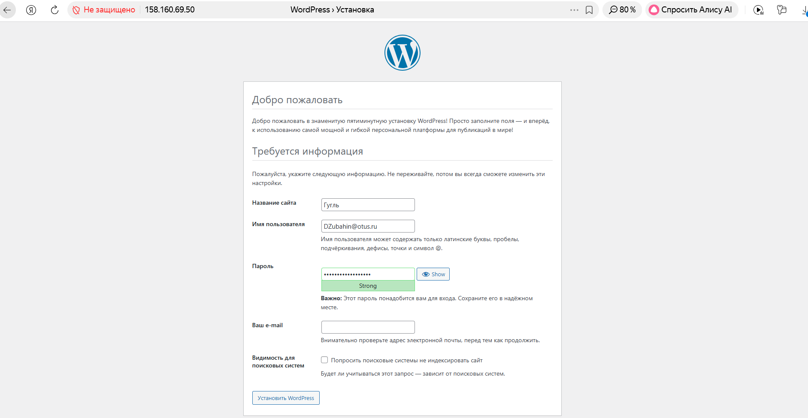
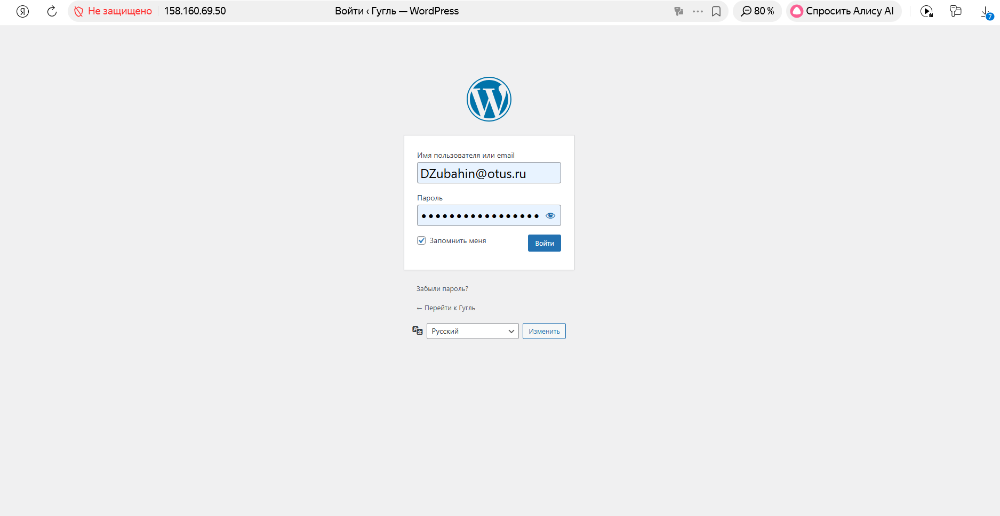
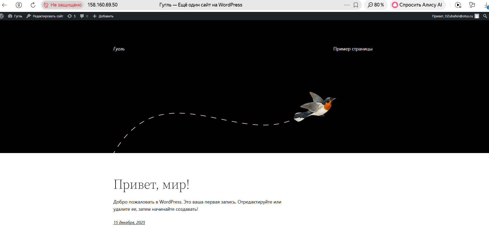
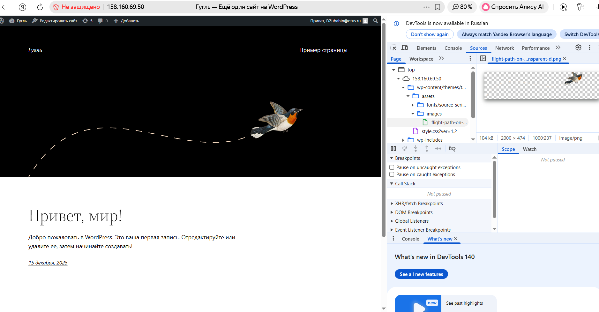
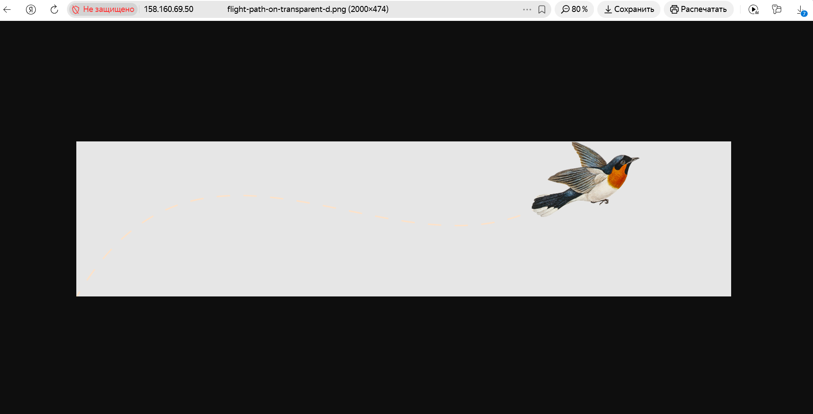
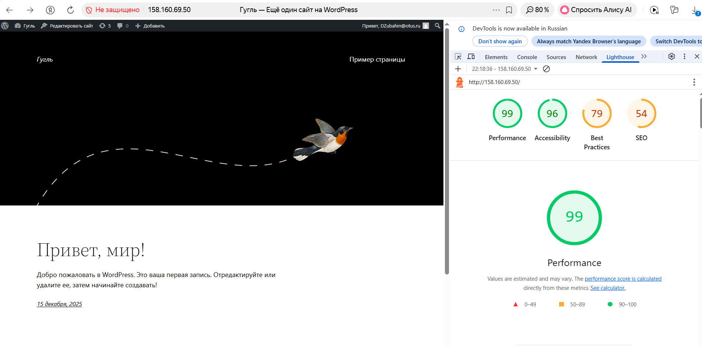

### Подготовительные шаги:

#### Шаг 1:
Создали ВМ в облаке.

#### Шаг 2: Устанавливаем docker,  docker-compose:

```
sudo apt install docker.io
```
Добавим своего пользователя в группу docker чтобы можно было запускать команды без sudo:
```
usermod -aG docker  zubahin
```

Далее можно бы было ставить каждый контейнер вручную.  Например angie:

sudo docker run --name angie -v \
/var/www/html:/usr/share/angie/html:ro -p 80:80 -d \
 docker.angie.software/angie:latest

В этой команде мы пробросили часть хостовой файловой системы в контейнер. То есть директория /var/www/html на хосте будет корнем для конфигурации Angie по умолчанию, в контейнере она будет иметь путь: /usr/share/angie/html. Также в команде указан проброс порта: хостовый 8080, контейнер — 80. Заметим, что в качестве образа указан angie с тэгом latest, что подходит для учебных задач. При боевом использовании стоит указывать точную версию.

Если нет конфликта портов, то контейнер будет запущен, можно проверить его доступность:

curl localhost:80

НО!  Мы будем установливать все через docker-compose:

Для начала установим сам docker-compose
```
apt install docker-compose
```

```
apt install docker-compose
```
```
sudo apt update
```

#### Шаг 3: Копируем файлы из ДЗ по SFTP в домашнюю директорию (данные файлы потребуются для установки через docker-compose):

Создал папку project в домашней директории и скопировал туда файлы:
```
.dockerignore
.env
docker-compose.yml
```
здесь же создадим папку angie-conf и скопируем файл angie.conf в нее - на нее будет ориентироваться контейнер в докере


```
zubahin@compute-vm-angie01:~/project$ ls -la
total 36
drwxrwxr-x 3 zubahin zubahin  4096 Dec 15 15:49 .
drwxr-x--- 6 zubahin zubahin  4096 Dec 15 17:09 ..
-rw-rw-r-- 1 zubahin zubahin     5 Dec 15 13:34 .dockerignore
-rw-rw-r-- 1 zubahin zubahin    83 Dec 15 13:34 .env
drwxrwxr-x 3 zubahin zubahin  4096 Dec 15 16:57 angie-conf
-rw-rw-r-- 1 zubahin zubahin  1107 Dec 15 15:49 docker-compose.yml

```
#### Шаг 4: Правим YAML файл, чтобы ставить Angie а не nginx

###### Исходный YAML
<details>
    
```
version: '3'

services:
  db:
    image: mysql:8.0
    container_name: db
    restart: unless-stopped
    env_file: .env
    environment:
      - MYSQL_DATABASE=wordpress
    volumes:
      - dbdata:/var/lib/mysql
    command: '--default-authentication-plugin=mysql_native_password'
    networks:
      - app-network

  wordpress:
    depends_on:
      - db
    image: wordpress:6.0.1-php8.0-fpm-alpine
    container_name: wordpress
    restart: unless-stopped
    env_file: .env
    environment:
      - WORDPRESS_DB_HOST=db:3306
      - WORDPRESS_DB_USER=$MYSQL_USER
      - WORDPRESS_DB_PASSWORD=$MYSQL_PASSWORD
      - WORDPRESS_DB_NAME=wordpress
    volumes:
      - wordpress:/var/www/html
    networks:
      - app-network

  webserver:
    depends_on:
      - wordpress
    image: nginx:1.22.0-alpine
    container_name: webserver
    restart: unless-stopped
    ports:
      - "80:80"
    volumes:
      - wordpress:/var/www/html
      - ./nginx-conf:/etc/nginx/conf.d
    networks:
      - app-network
volumes:
  wordpress:
  dbdata:

networks:
  app-network:
    driver: bridge


```

</details>

###### Модифицированный YAML
<details>
    
```
version: '3'

services:
  db:
    image: mysql:8.0
    container_name: db
    restart: unless-stopped
    env_file: .env
    environment:
      - MYSQL_DATABASE=wordpress
    volumes:
      - dbdata:/var/lib/mysql
    command: '--default-authentication-plugin=mysql_native_password'
    networks:
      - app-network

  wordpress:
    depends_on:
      - db
    image: wordpress:6.0.1-php8.0-fpm-alpine
    container_name: wordpress
    restart: unless-stopped
    env_file: .env
    environment:
      - WORDPRESS_DB_HOST=db:3306
      - WORDPRESS_DB_USER=$MYSQL_USER
      - WORDPRESS_DB_PASSWORD=$MYSQL_PASSWORD
      - WORDPRESS_DB_NAME=wordpress
    volumes:
      - wordpress:/var/www/html
    networks:
      - app-network

  webserver:
    depends_on:
      - wordpress
    image: docker.angie.software/angie:latest
    container_name: webserver
    restart: unless-stopped
    ports:
      - "80:80"
    volumes:
      - wordpress:/var/www/html
      - ./angie-conf:/etc/angie/http.d:ro
    networks:
      - app-network
volumes:
  wordpress:
  dbdata:

networks:
  app-network:
    driver: bridge

```

</details>

Меняли только раздел volumes и image в разделе webserver:
```
 webserver:
    depends_on:
      - wordpress
    image: docker.angie.software/angie:latest
    container_name: webserver
    restart: unless-stopped
    ports:
      - "80:80"
    volumes:
      - wordpress:/var/www/html
      - ./angie-conf:/etc/angie/http.d:ro
    networks:
      - app-network
```

#### Шаг 5: Устанавливаем контейнеры в соответствии с YAML файлом:
```
docker-compose up -d
```

Как итог получаем:

```
zubahin@compute-vm-angie01:~/project$ docker ps -a
CONTAINER ID   IMAGE                                COMMAND                  CREATED       STATUS       PORTS                                 NAMES
045f06c2aa13   docker.angie.software/angie:latest   "angie -g 'daemon of…"   2 hours ago   Up 2 hours   0.0.0.0:80->80/tcp, [::]:80->80/tcp   webserver
2f79a024d203   wordpress:6.0.1-php8.0-fpm-alpine    "docker-entrypoint.s…"   2 hours ago   Up 2 hours   9000/tcp                              wordpress
381eaef0e8b4   mysql:8.0                            "docker-entrypoint.s…"   2 hours ago   Up 2 hours   3306/tcp, 33060/tcp                   db
```

#### Шаг 6: Заходим в настройку WordPress по адресу: HTTP://адрес сервера:80 

Настраиваем имя пользователя, пароль (запоминаем), имя сайта и прочее:








#### Шаг 7: Настраиваем конфигурационный файл Angie (Приложен)

[angie.conf](angie.conf.conf)

Ниже приложена конфигурация:

```
server {
        listen 80;
        listen [::]:80;

        server_name example.com www.example.com;

        index index.php index.html index.htm;

        root /var/www/html;

        location ~ /.well-known/acme-challenge {
                allow all;
                root /var/www/html;
        }

        location / {
                try_files $uri $uri/ /index.php$is_args$args;
        }

        location ~ \.php$ {
                try_files $uri =404;
                fastcgi_split_path_info ^(.+\.php)(/.+)$;
                fastcgi_pass wordpress:9000;
                fastcgi_index index.php;
                include fastcgi_params;
                fastcgi_param SCRIPT_FILENAME $document_root$fastcgi_script_name;
                fastcgi_param PATH_INFO $fastcgi_path_info;
        }

        location ~ /\.ht {
                deny all;
        }

        location = /favicon.ico {
                log_not_found off; access_log off;
        }
        location = /robots.txt {
                log_not_found off; access_log off; allow all;
        }
        location ~* \.(css|gif|ico|jpeg|jpg|js|png)$ {
                expires max;
                log_not_found off;
        }
}

```
файл храним в папке проекта (на нее ссылается volumes в YAML файле:

```
/home/zubahin/project/angie-conf
```

#### Шаг 8: Смотрим статический контент:







